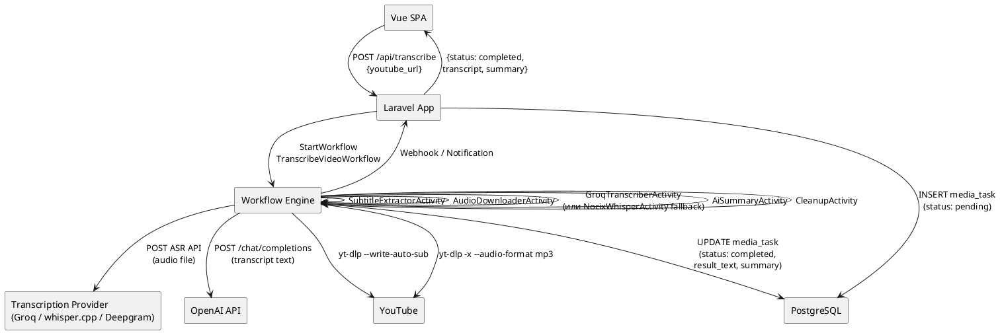
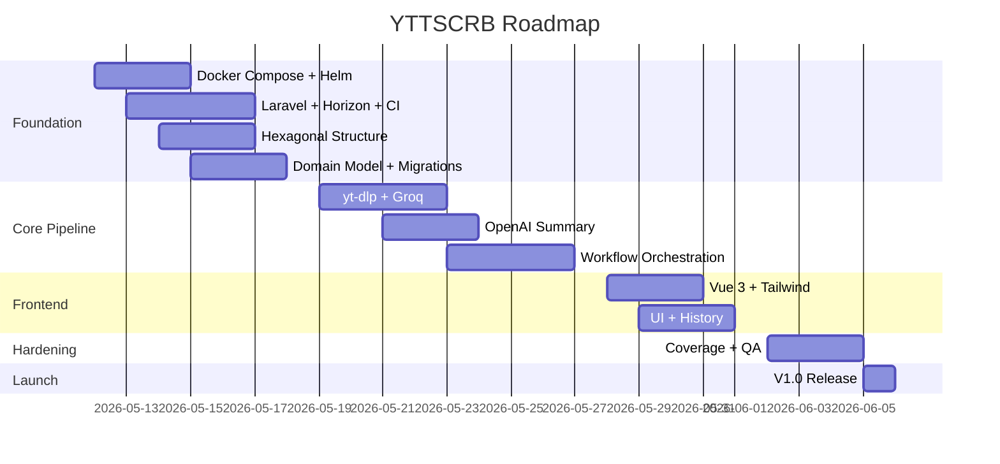

# PRD: YouTube Transcriber & Summarizer Micro-SaaS

> **Статус:** Ready for Development  
> **Версия:** 1.0  
> **Дата:** 2026-05-07

---

## 1. Vision & Product Goals

### 1.1 Elevator Pitch

YouTube-видео становятся всё длиннее, а времени у пользователей всё меньше. **YTTSCRB** — сервис, который за 1–2 минуты превращает любое YouTube-видео в чистую расшифровку (транскрипцию) и краткий конспект (суммаризацию). Пользователь вставляет ссылку — получает текст и выжимку.

> **v1.0:** только английский язык. Поддержка других языков — v2.0.

### 1.2 Jobs To Be Done (JTBD)

1. **«У меня нет 40 минут смотреть видео — дай текст и суть за минуту.»**
2. **«Нужно процитировать фрагмент из видео в статье/посте — дай таймкоды и текст.»**
3. **«Хочу сохранить контент видео для офлайн-чтения — дай текст (v1.0) / PDF/SRT (v1.1+).»**
4. **«Я создаю курсы/контент — дай расшифровку для переработки в статью.»**

### 1.3 Целевая аудитория (ICP)

- **Студенты и исследователи** — конспектируют лекции, доклады, конференции.
- **Контент-мейкеры** — перерабатывают видео в статьи, посты, шоу-ноты.
- **Менеджеры и предприниматели** — быстро получают суть длинных интервью и вебинаров.
- **Медиа-редакции** — расшифровывают интервью для публикаций.

### 1.4 Границы v1.0 vs v1.1

| Фича | v1.0 MVP | v1.1 |
|---|---|---|
| Транскрипция YouTube (Groq Whisper API / whisper.cpp) | ✅ | ✅ |
| AI-суммаризация (GPT-4o-mini) | ✅ | ✅ |
| Экспорт TXT | ✅ | ✅ |
| Экспорт PDF/SRT | ❌ | ✅ |
| Лимиты (free tier) | ✅ (10/мес) | ✅ |
| Подписки (Stripe/Paddle) | ❌ | ✅ |
| Webhooks / API | ❌ | ✅ |
| Дашборд статистики | ❌ | ✅ |
| История запросов | ✅ | ✅ |
| Многоязычность | ❌ | ❌ (v2.0) |

---

## 2. Tech Stack (утверждён)

| Компонент | Технология | Обоснование |
|---|---|---|
| **Backend Framework** | Laravel 13.x (PHP 8.5) | Современный DI, контейнер, события, очереди без фасадов |
| **PHP** | 8.5 | JIT-компиляция, асинхронные возможности, type system |
| **Database** | PostgreSQL 16+ | JSON, индексы, CTE, аналитика |
| **Queue Driver** | Redis 7+ | Бэкенд для очередей Laravel Horizon и кэширования |
| **Queue Manager** | Laravel Horizon | Мониторинг очередей, балансировка воркеров, дашборд |
| **Workflow Orchestration** | `durable-workflow/workflow` | Долгие процессы, retry, idempotency, saga |
| **Workflow UI** | `durable-workflow/waterline` | Web-интерфейс для просмотра workflow, replay, stack traces |
| **Transcription API (Fast Track, V1)** | **Groq Whisper API** | $0.03/час — экстремально дёшево и быстро |
| **Transcription API (Slow Track, V2)** | Self-hosted `whisper.cpp` на **Nocix (Phenom II X4 840)** | Бесплатно после развёртывания; сборка с `LLAMA_NO_AVX=1 LLAMA_NO_AVX2=1` |
| **Subtitle Extraction (Zero-Cost)** | yt-dlp `--write-auto-sub --skip-download` | Бесплатно; если субтитры есть — транскрибация не нужна |
| **AI Summary** | OpenAI GPT-4o-mini *(default)* | За интерфейсом `SummaryProviderInterface`; легко заменить на self-hosted LLM |
| **Audio Download** | yt-dlp (бинарник) | Промышленный стандарт, малый вес (96K mp3) |
| **Frontend** | Vue 3 (Composition API) + TailwindCSS | SPA, реактивность, быстрый UI |
| **Testing** | PHPUnit + Pest | TDD-цикл |
| **Static Analysis** | PHPStan level 9 | Строжайший уровень |
| **Code Style** | PHPCS (PSR-12) | Единый кодстайл |
| **Architecture Validation** | Deptrac | Запрет нарушений слоёв |
| **CI/CD** | GitLab CI | Пайплайны, артефакты, деплой |
| **Local Dev** | Docker Compose | app, postgres, redis, worker, nginx |
| **Production** | Kubernetes + Helm Charts | app, postgres, redis, worker, ingress, HPA |

### 2.1 Provider Abstraction Strategy (ключевой принцип)

> **Проект намеренно не привязан к конкретным AI/ASR провайдерам.**  
> Все внешние сервисы скрыты за интерфейсами-портами в слое `Application`.  
> Смена провайдера = добавление нового адаптера + изменение одной строки в DI-контейнере.

**Мотивация:**
- Рынок AI-инференса быстро меняется: цены и качество в постоянной динамике.
- Self-hosted CPU-инференс (`whisper.cpp`) может быть полностью бесплатным после развёртывания.
- Vendor lock-in с провайдером ASR/LLM — критический операционный риск.

**Карта провайдеров — каскадный выбор (workflow logic):**

| Порт | Default (V1) | Альтернативы |
|---|---|---|
| `SubtitleProviderInterface` | yt-dlp `--write-auto-sub` | **Zero-cost**, если сабы есть — транскрибация не нужна |
| `TranscriptionProviderInterface` | **Groq Whisper API** ($0.03/ч) | Deepgram Nova-2 ($0.26/ч), self-hosted `whisper.cpp` **(free)** |
| `SummaryProviderInterface` | OpenAI GPT-4o-mini | Anthropic Claude Haiku, self-hosted LLM (vLLM, Ollama) |
| `AudioExtractorInterface` | yt-dlp (local binary) | yt-dlp в Docker sidecar |

**Конфигурация провайдера через `.env` (без изменения кода):**
```env
# Выбор ASR-провайдера
TRANSCRIPTION_PROVIDER=groq             # groq | deepgram | whisper_api | runpod_whisper | assemblyai

# Выбор LLM-провайдера
SUMMARY_PROVIDER=openai                 # openai | anthropic | groq | runpod_llm | ollama

# Deepgram
DEEPGRAM_API_KEY=...

# OpenAI
OPENAI_API_KEY=...

# RunPod / Vast.ai (v1.1+ only)
RUNPOD_API_KEY=...
RUNPOD_ENDPOINT_WHISPER=https://api.runpod.ai/v2/{endpoint-id}/runsync
RUNPOD_ENDPOINT_LLM=https://api.runpod.ai/v2/{endpoint-id}/runsync
CUSTOM_LLM_BASE_URL=http://your-vastai-node:8000/v1
CUSTOM_LLM_MODEL=meta-llama/Meta-Llama-3.1-8B-Instruct
```

**Интерфейсы портов (абстракции):**
```php
// Application/Ports/Output/SubtitleProviderInterface.php

interface SubtitleProviderInterface
{
    /**
     * @return string|null  Subtitle text, or null if no subtitles available
     * @throws SubtitleExtractionFailedException
     */
    public function extract(string $youtubeUrl): ?string;
}

// Application/Ports/Output/TranscriptionProviderInterface.php

interface TranscriptionProviderInterface
{
    /**
     * @throws TranscriptionFailedException
     */
    public function transcribe(AudioFile $audioFile): TranscriptionResult;
}

// Application/Ports/Output/SummaryProviderInterface.php

interface SummaryProviderInterface
{
    /**
     * @throws SummaryFailedException
     */
    public function summarize(TranscriptionText $transcriptText, SummaryOptions $options): SummaryResult;
}
```

> **Правило моделирования данных:** на границах слоёв и в публичных контрактах нельзя опираться на «сырые» массивы как на основную модель данных. Предпочтение отдаётся **DTO**, **Value Object** и **Entity**. Массивы допустимы только как низкоуровневый транспорт/декодированный payload внутри адаптера с немедленным преобразованием в типизированные объекты.

**Регистрация провайдера через DI (AppServiceProvider) — v1.0 с готовой архитектурой для v1.1+:**
```php
$this->app->bind(TranscriptionProviderInterface::class, function () {
    return match(config('providers.transcription')) {
        'groq'            => new GroqWhisperAdapter(...),        // V1 default
        'deepgram'        => new DeepgramTranscriptionAdapter(...),
        'whisper_api'     => new OpenAiWhisperAdapter(...),     // v1.1+
        'runpod_whisper'  => new RunPodWhisperAdapter(...),     // v1.1+
        'assemblyai'      => new AssemblyAiAdapter(...),         // v1.1+
        default           => throw new InvalidProviderException(config('providers.transcription')),
    };
});
```

**Self-hosted на RunPod/Vast.ai — архитектурная схема (v1.1+):**
```
┌─────────────────────────────────────────────┐
│             YTTSCRB Backend                 │
│         TranscriptionProviderInterface      │
└────────────────────┬────────────────────────┘
                     │ POST /runsync
          ┌──────────▼────────────┐
          │   RunPod Serverless   │     ← платишь только за GPU-секунды
          │   (Whisper Large v3)  │
          │   или Vast.ai node    │     ← ещё дешевле, но менее надёжно
          └──────────┬────────────┘
                     │ JSON response
          ┌──────────▼────────────┐
          │  RunPodWhisperAdapter │     ← реализует TranscriptionProviderInterface
          │  (Infrastructure)     │
          └───────────────────────┘
```

---

### 2.2 Очереди: Laravel Horizon + Redis

Для короткоживущих задач (отправка email, сброс лимитов, уведомления) используется **Laravel Horizon** на базе **Redis**:

- **Redis 7+** — бэкенд очередей и кэширования.
- **Laravel Horizon** — мониторинг, балансировка воркеров, дашборд (`/horizon`), auto-scaling воркеров.
- Все короткие задачи (до 5 мин) идут через Horizon, долгие workflow-процессы (транскрипция) — через `durable-workflow/workflow`.

**Конфигурация очередей (config/queue.php):**
```php
'default' => env('QUEUE_CONNECTION', 'redis'),

'connections' => [
    'redis' => [
        'driver' => 'redis',
        'connection' => 'default',
        'queue' => env('REDIS_QUEUE', 'default'),
        'retry_after' => 90,
        'block_for' => null,
        'after_commit' => true,
    ],
],
```

### 2.3 Оркестрация долгих процессов: durable-workflow/workflow

**Workflow Engine:** [`durable-workflow/workflow`](https://github.com/durable-workflow/workflow) — основной механизм оркестрации долгих процессов.
**UI:** [`durable-workflow/waterline`](https://github.com/durable-workflow/waterline) — встроенный веб-интерфейс для просмотра workflow, replay и stack traces, подключаемый как библиотека в Laravel-приложение.

**Workflow engine и Horizon — разделение ответственности:**

| Характеристика | Laravel Horizon (Redis) | `durable-workflow/workflow` |
|---|---|---|
| Время задачи | ≤ 5 минут | Часы |
| Retry | Конфигурируется вручную | Экспоненциальный, встроенный |
| Heartbeat | Нет | Есть (для долгих активностей) |
| Состояние | Не сохраняется | Полная история выполнения |
| Idempotency | Через код | WorkflowId гарантирует |
| Cleanup | Через код | Saga-паттерн встроен |
| Observable | Дашборд Horizon | Waterline |

**Что идёт в Horizon:** отправка email, сброс лимитов, генерация PDF, webhook-уведомления, очистка временных данных.

**Что идёт в workflow engine:** `TranscribeVideoWorkflow` (скачивание → транскрипция → суммаризация → сохранение), Saga cleanup.

---

## 3. Архитектура: Hexagonal (Ports & Adapters)

### 3.1 Структура директорий

```
app/
├── Application/
│   ├── Ports/                    # Интерфейсы (входящие/исходящие порты)
│   │   ├── Input/                # Use Case интерфейсы
│   │   │   └── TranscribeVideoUseCase.php
│   │   ├── Output/               # Интерфейсы портов (выходных)
│   │   │   ├── SubtitleProviderInterface.php
│   │   │   ├── TranscriptionProviderInterface.php
│   │   │   ├── SummaryProviderInterface.php
│   │   │   ├── AudioExtractorInterface.php
│   │   │   └── MediaTaskRepositoryInterface.php
│   │   └── Events/               # Domain Events
│   │       └── VideoTranscribedEvent.php
│   ├── UseCases/                 # Реализация бизнес-сценариев
│   │   ├── TranscribeVideoHandler.php
│   │   └── SummarizeTranscriptionHandler.php
│   └── DTO/                      # Data Transfer Objects
│       ├── TranscribeVideoRequest.php
│       ├── TranscribeVideoResponse.php
│       ├── TranscriptionResult.php
│       └── SummaryResult.php
│
├── Domain/
│   ├── Entities/
│   │   └── MediaTask.php         # Rich Domain Model
│   ├── ValueObjects/
│   │   ├── YouTubeUrl.php
│   │   ├── VideoId.php
│   │   ├── TranscriptionStatus.php  # Enum
│   │   ├── TranscriptionText.php
│   │   ├── AudioFile.php
│   │   ├── SummaryOptions.php
│   │   └── TranscriptWord.php
│   └── Services/
│       └── TranscriptionService.php  # Domain Service
│
├── Infrastructure/
│   ├── Adapters/                 # Адаптеры к внешним системам
│   │   ├── Input/                # Контроллеры (входящие адаптеры)
│   │   │   ├── Web/
│   │   │   │   └── TranscribeVideoController.php
│   │   │   └── Console/
│   │   │       └── ProcessPendingVideosCommand.php
│   │   ├── Output/               # Исходящие адаптеры
│   │   │   ├── Persistence/
│   │   │   │   └── MediaTaskEloquentRepository.php
│   │   │   ├── Transcription/    # Все ASR-провайдеры за одним интерфейсом
│   │   │   │   ├── SubtitleExtractorAdapter.php   # Zero-cost (yt-dlp subs)
│   │   │   │   ├── GroqWhisperAdapter.php         # Fast Track (V1 default)
│   │   │   │   ├── DeepgramTranscriptionAdapter.php
│   │   │   │   ├── NocixWhisperCppAdapter.php     # Slow Track (V2, self-hosted)
│   │   │   │   ├── OpenAiWhisperAdapter.php
│   │   │   │   └── RunPodWhisperAdapter.php
│   │   │   ├── Summary/          # Все LLM-провайдеры за одним интерфейсом
│   │   │   │   ├── OpenAiSummaryAdapter.php
│   │   │   │   ├── AnthropicSummaryAdapter.php
│   │   │   │   ├── GroqSummaryAdapter.php
│   │   │   │   └── OpenAiCompatibleSummaryAdapter.php  # RunPod/Vast.ai vLLM
│   │   │   ├── YoutubeDl/
│   │   │   │   └── YoutubeDlAudioExtractor.php
│   │   │   └── Workflow/
│   │   │       ├── Activities/
│   │   │       │   ├── SubtitleExtractorActivity.php  # Zero-cost (yt-dlp subs, Step 0)
│   │   │       │   ├── DownloadAudioActivity.php
│   │   │       │   ├── GroqTranscriberActivity.php    # Fast Track (V1 default)
│   │   │       │   ├── NocixWhisperActivity.php       # Slow Track (V2)
│   │   │       │   ├── PersistResultActivity.php
│   │   │       │   ├── AiSummaryActivity.php
│   │   │       │   └── CleanupActivity.php
│   │   │       └── Workflows/
│   │   │           └── TranscribeVideoWorkflow.php
│   │   └── Queue/
│   │       └── WorkflowDispatcher.php
│   └── Config/
│       ├── groq.php               # V1 default provider config
│       ├── deepgram.php           # Альтернативный провайдер
│       ├── workflow.php
│       └── youtube-dl.php
│
└── Shared/
    └── Exceptions/
        ├── TranscriptionFailedException.php
        └── YouTubeDownloadFailedException.php
```

### 3.2 Hybrid Transcription Strategy (Cost Optimization)

⚠️ **КРИТИЧЕСКОЕ ТРЕБОВАНИЕ:** Система должна минимизировать затраты на API. Логика выполнения транскрипции строится по принципу каскадного фоллбэка.

**Алгоритм выбора источника (Workflow Logic):**

```mermaid
flowchart TD
    A[Start: youtube_url] --> B{Step 0: Try yt-dlp subs\n--write-auto-sub --skip-download}
    B -->|"Found subtitles"| C[Use subtitles as transcript\n→ Zero Cost]
    B -->|"No subtitles"| D{Step 1: Send to\nGroq Whisper API}
    D -->|"Success"| E[Use Groq transcript\n→ $0.03/hr]
    D -->|"Rate limited / free user"| F{Step 2: Route to\nself-hosted whisper.cpp\n(Nocix, Phenom II X4 840)}
    F --> G[Queue → Process → Return\n→ Zero Cost (slow)]
    C & E & G --> H[Generate Summary\nGPT-4o-mini]
    H --> I[Done]
```

| Step | Название | Стоимость | Скорость | V1/V2 |
|---|---|---|---|---|
| **0** | `SubtitleExtractor` — yt-dlp `--write-auto-sub --skip-download` | **$0** | Мгновенно | V1 |
| **1** | `GroqTranscriber` — Groq Whisper API | **$0.03/час** | Быстро (~1-2 мин) | V1 |
| **2** | `NocixWhisperActivity` — self-hosted `whisper.cpp` | **$0** | Медленно (очередь) | V2 |

**Технические детали self-hosted whisper.cpp (Nocix, Phenom II X4 840):**
- Сервер **не поддерживает AVX/AVX2** (старый CPU).
- Сборка `whisper.cpp` с флагами: `LLAMA_NO_AVX=1 LLAMA_NO_AVX2=1`.
- Режим работы: HTTP-сервер (`whisper-server`), принимающий аудиофайлы.
- Workflow-активность `NocixWhisperActivity` отправляет HTTP-запрос на сервер.
- `ScheduleToCloseTimeout` = 2 часа (для длинных видео).
- **UX:** Фронтенд отображает статус `"In Free Queue (Slow Processing)"` для задач, направленных на Step 2.

### 3.3 Визуализация потока данных (PlantUML)



### 3.4 Правила зависимостей (Deptrac)

```yaml
# deptrac.yaml
layers:
  - name: Domain
    collectors:
      - type: directory
        value: app/Domain/.*
  - name: Application
    collectors:
      - type: directory
        value: app/Application/.*
  - name: Infrastructure
    collectors:
      - type: directory
        value: app/Infrastructure/.*

ruleset:
  # Domain — верхнеуровневый слой, не знает ни о ком
  Domain:
  Application:
    - Domain          # ✅ Может зависеть только от Domain
  Infrastructure:
    - Application     # ✅ Может зависеть от Application и Domain
    - Domain
```

---

## 4. Domain Model

### 4.1 Entity: `MediaTask`

```php
// Domain/Entities/MediaTask.php

final class MediaTask
{
    private readonly string $id;
    private readonly YouTubeUrl $youtubeUrl;
    private ?VideoId $videoId;
    private ?string $title;
    private TranscriptionStatus $status;
    private ?string $workflowId;
    private ?TranscriptionText $resultText;
    private ?string $summary;
    private ?string $errorMessage;
    private ?DateTimeImmutable $completedAt;
    private ?DateTimeImmutable $failedAt;
    private ?int $duration;
    private DateTimeImmutable $createdAt;
    private ?DateTimeImmutable $updatedAt;

    // Конструктор через named constructor
    public static function create(YouTubeUrl $youtubeUrl): self;

    // Бизнес-методы (не сеттеры!)
    public function startProcessing(string $workflowId): void;
    public function complete(string $transcript, ?string $summary): void;
    public function fail(string $reason): void;
}
```

### 4.2 Value Objects

| VO | Правила валидации |
|---|---|
| `YouTubeUrl` | Регулярка `^(https?://)?(www\.)?(youtube\.com|youtu\.be)/.+$` |
| `VideoId` | 11 символов `[A-Za-z0-9_-]{11}` |
| `TranscriptionStatus` | Enum: `pending`, `processing`, `completed`, `failed` |
| `TranscriptionText` | Immutable value, min 1 символ |
| `AudioFile` | Гарантирует существование файла, MIME/extension policy, доступность для чтения |
| `SummaryOptions` | Immutable набор настроек суммаризации без associative arrays |
| `TranscriptWord` | Immutable VO для слова и таймингов (`word`, `start`, `end`) |

### 4.2.1 Правило типизации моделей

- DTO используются для передачи данных между слоями и use case boundary.
- Value Objects используются для инкапсуляции валидируемых примитивов и маленьких immutable-структур.
- Entity используется там, где есть идентичность и жизненный цикл.
- **Ассоциативные массивы не должны быть основным контрактом** для `UseCase`, `Repository`, `Provider`, `Activity`, `Controller Response Mapper`.
- Если внешний API возвращает JSON-массив, адаптер обязан сразу преобразовать его в DTO/VO до передачи в Application/Domain.

### 4.3 Enum: `TranscriptionStatus`

```php
enum TranscriptionStatus: string
{
    case Pending = 'pending';
    case Processing = 'processing';
    case Completed = 'completed';
    case Failed = 'failed';

    public function isTerminal(): bool;
    public function canTransitionTo(self $target): bool;
}
```

---

## 5. Database Schema (PostgreSQL 16+)

### 5.1 Таблицы

```sql
-- Таблица задач на транскрипцию
CREATE TABLE media_tasks (
    id              UUID PRIMARY KEY DEFAULT gen_random_uuid(),
    youtube_url     TEXT NOT NULL,
    video_id        VARCHAR(20),
    title           VARCHAR(255),
    status          VARCHAR(20) NOT NULL DEFAULT 'pending',
    workflow_id     VARCHAR(100),
    result_text     TEXT,
    summary         TEXT,
    duration_sec    INTEGER,
    error_message   TEXT,
    user_id         BIGINT REFERENCES users(id) ON DELETE SET NULL,
    created_at      TIMESTAMPTZ NOT NULL DEFAULT NOW(),
    updated_at      TIMESTAMPTZ,
    completed_at    TIMESTAMPTZ,
    failed_at       TIMESTAMPTZ
);

CREATE INDEX idx_media_tasks_status ON media_tasks(status);
CREATE INDEX idx_media_tasks_user_id ON media_tasks(user_id);
CREATE INDEX idx_media_tasks_created_at ON media_tasks(created_at);
CREATE UNIQUE INDEX idx_media_tasks_video_user_completed ON media_tasks(video_id, user_id) WHERE status = 'completed';

-- Пользователи (минимально для v1.0)
CREATE TABLE users (
    id              BIGSERIAL PRIMARY KEY,
    email           VARCHAR(255) NOT NULL UNIQUE,
    name            VARCHAR(255),
    monthly_limit   INTEGER NOT NULL DEFAULT 10,
    used_this_month INTEGER NOT NULL DEFAULT 0,
    created_at      TIMESTAMPTZ NOT NULL DEFAULT NOW(),
    updated_at      TIMESTAMPTZ
);

-- Токены API (v1.1+)
CREATE TABLE api_tokens (
    id              BIGSERIAL PRIMARY KEY,
    user_id         BIGINT NOT NULL REFERENCES users(id) ON DELETE CASCADE,
    token           VARCHAR(64) NOT NULL UNIQUE,
    name            VARCHAR(255),
    last_used_at    TIMESTAMPTZ,
    expires_at      TIMESTAMPTZ,
    created_at      TIMESTAMPTZ NOT NULL DEFAULT NOW()
);
```

### 5.2 Миграции Laravel

Миграции — единственный источник правды для схемы. Все миграции должны быть идемпотентными и обратно-совместимыми (не удалять колонки без deprecation-периода).

### 5.3 Business Rules

#### Лимиты (Rate Limiting)

| Правило | Значение | Примечание |
|---|---|---|
| Лимит free tier | 10 транскрипций/месяц | Сбрасывается первого числа каждого месяца |
| Что считается использованием | Успешное завершение транскрипции (status=completed) | Failed/processing не учитываются |
| Что НЕ считается использованием | Повторная обработка того же `video_id` | Deduplication по `video_id + user_id` |
| HTTP-код при превышении | 429 Too Many Requests | + заголовок `Retry-After` |

#### Deduplication

- Повторная отправка одного и того же `youtube_url` одним пользователем: возвращается существующий `task_id`, если задача уже была успешно завершена.
- Повторная отправка для failed-задачи: создаётся новая задача.
- `video_id` извлекается из URL и проверяется уникальный partial index `media_tasks(video_id, user_id) WHERE status = 'completed'`.

#### Анонимные пользователи

- v1.0 не поддерживает анонимный доступ. Все запросы требуют аутентификации (API-ключ).
- Регистрация через email (пока без OAuth).

#### Retention Policy

| Тип данных | Retention |
|---|---|
| Временные аудиофайлы (storage/temp) | Удаляются сразу после завершения workflow (cleanup activity) |
| Транскрипции и суммаризации | Хранятся бессрочно, пока пользователь не удалит |
| Учётные записи | Хранятся до запроса на удаление (GDPR compliance) |

#### Поведение при ошибках

- Failed задача: пользователь видит `error_message` и может нажать "Retry".
- Retry создаёт новый workflow с тем же `task_id`.

---

## 6. Business Pipeline: TranscribeVideoWorkflow

### 6.1 Workflow

```php
// Infrastructure/Adapters/Output/Workflow/Workflows/TranscribeVideoWorkflow.php

interface TranscribeVideoWorkflow
{
    public function transcribe(string $taskId, string $youtubeUrl): WorkflowTranscriptionResult;
}

class TranscribeVideoWorkflowImpl implements TranscribeVideoWorkflow
{
    public function transcribe(string $taskId, string $youtubeUrl): WorkflowTranscriptionResult
    {
        // Step 0: Zero-cost subtitles — if found, skip audio entirely
        $subtitles = yield $this->subtitleExtractorActivity->extract($youtubeUrl);
        if ($subtitles !== null) {
            return yield from $this->summariseAndPersist($taskId, $subtitles, 0);
        }

        // Step 1-2: Download audio → Transcribe (Fast Track or Slow Track fallback)
        $audioPath = yield $this->audioDownloaderActivity->download($youtubeUrl);
        try {
            $transcription = yield from $this->transcribeWithFallback($audioPath);
        } finally {
            yield $this->cleanupActivity->deleteFile($audioPath);
        }

        // Step 3: Summarise and persist
        return yield from $this->summariseAndPersist(
            $taskId,
            $transcription->text()->value(),
            $transcription->durationSec()
        );
    }

    private function transcribeWithFallback(string $audioPath): TranscriptionResult
    {
        try {
            return yield $this->groqTranscriberActivity->transcribe($audioPath);
        } catch (GroqUnavailableException) {
            return yield $this->nocixWhisperActivity->transcribe($audioPath);
        }
    }

    private function summariseAndPersist(string $taskId, string $text, int $durationSec): WorkflowTranscriptionResult
    {
        $summary = yield $this->summaryActivity->summarize(new TranscriptionText($text));
        yield $this->persistActivity->saveResult($taskId, $text, $summary->text(), $durationSec);

        return new WorkflowTranscriptionResult(
            transcript: new TranscriptionText($text),
            summary: $summary,
        );
    }
}
```

### 6.2 Activities

| Activity | Таймаут | Retry | Heartbeat | Описание |
|---|---|---|---|---|
| `SubtitleExtractorActivity` | 2 min | 1 (5s) | Нет | yt-dlp `--write-auto-sub --skip-download`; возвращает текст или null |
| `AudioDownloaderActivity` | 5 min | 3 (5s, 30s, 2min) | Нет | yt-dlp скачивает аудио (96K mp3) |
| `GroqTranscriberActivity` | 30 min | 2 (10s, 60s) | Да (каждые 10s) | Groq Whisper API — Fast Track (V1 default) |
| `NocixWhisperActivity` | 2 hours | 2 (30s, 5min) | Да (каждые 30s) | Self-hosted whisper.cpp на Nocix — Slow Track (V2) |
| `AiSummaryActivity` | 2 min | 2 (5s, 30s) | Нет | GPT-4o-mini суммаризация |
| `CleanupActivity` | 30 sec | 3 (1s, 5s, 10s) | Нет | Удаление временного файла |
| `PersistResultActivity` | 10 sec | 3 (1s, 3s, 5s) | Нет | Сохранение в БД |

### 6.3 Idempotency & Deduplication

- **WorkflowId** = `transcribe-{taskId}` — workflow engine гарантирует уникальность исполнения в рамках зарегистрированного workflow.
- **На уровне БД**: `video_id + user_id` — уникальный индекс для предотвращения дублей.
- **Провайдер транскрипции**: идемпотентность через уникальный `request_id` (поддерживается Groq и Deepgram).

### 6.4 Failure Policy

1. **Временная ошибка провайдера транскрипции** (429, 503): retry с exponential backoff (Activity).
2. **Постоянная ошибка** (невалидный URL, видео недоступно): fail workflow → статус `failed` + `error_message`.
3. **Превышение лимита**: fail до workflow → HTTP 429 на уровне контроллера.
4. **Timeout скачивания**: retry, если 3-я попытка — fail.
5. **Saga cleanup**: при любой ошибке на шаге 3 → откат (удалить файл, отметить failed).
6. **Провайдер полностью недоступен**: через конфигурацию логируется алерт; при наличии fallback-провайдера в `.env` (`TRANSCRIPTION_PROVIDER_FALLBACK`) — Activity автоматически переключается на него.
> **v1.1+**

### 6.5 Observability

- **Waterline UI**: просмотр workflow, replay, stack traces.
- **Laravel Log**: структурированные логи (JSON) через Monolog.
- **Health endpoint**: `GET /health` — проверка workflow worker, PostgreSQL, TranscriptionProvider, SummaryProvider.
- **Metrics** — Prometheus метрики: длительность workflow, кол-во ошибок, latency провайдера.
> **v1.1+**

---

## 7. REST API Design (Laravel Routes)

| Method | Path | Controller | Описание | Auth |
|---|---|---|---|---|
| `POST` | `/api/transcribe` | `TranscribeVideoController` | Создать задачу транскрипции | ✅ |
| `GET` | `/api/transcribe/{id}` | `TranscribeVideoController` | Статус задачи | ✅ |
| `GET` | `/api/transcribe/{id}/download` | `ExportController` | Скачать TXT | ✅ |
| `GET` | `/api/transcribe/{id}/download/pdf` | `ExportController` | Скачать PDF (v1.1) | ✅ |
| `POST` | `/api/auth/register` | `AuthController` | Регистрация пользователя (email) — возвращает `api_key` | ❌ |
| `GET` | `/api/history` | `HistoryController` | История пользователя (пагинация, sorted by `created_at DESC`) | ✅ |
| `GET` | `/api/history/latest` | `HistoryController` | Последняя выполненная транскрипция пользователя | ✅ |

> **Аутентификация (v1.0):** Все endpoint'ы защищены. Аутентификация через API-ключ в header `X-API-Key`. Ключ выдаётся при регистрации. `GET /api/history` и `GET /api/history/latest` возвращают только задачи текущего пользователя.

### 7.1 Создание задачи

`POST /api/transcribe` — создаёт новую задачу транскрипции.

**Request:**
```json
{
    "youtube_url": "https://youtube.com/watch?v=dQw4w9WgXcQ"
}
```

**Response (202 Accepted):**
```json
{
    "task_id": "550e8400-e29b-41d4-a716-446655440000",
    "status": "pending",
    "youtube_url": "https://youtube.com/watch?v=dQw4w9WgXcQ",
    "created_at": "2026-05-07T12:00:00Z",
    "_links": {
        "status": "/api/transcribe/550e8400-e29b-41d4-a716-446655440000"
    }
}
```

**Response при дубликате (409 Conflict / 200 OK):**
Если задача для этого `video_id` уже была успешно завершена — возвращается существующий `task_id`:
```json
{
    "task_id": "550e8400-e29b-41d4-a716-446655440000",
    "status": "completed",
    "message": "This video has already been transcribed.",
    "_links": {
        "download": "/api/transcribe/550e8400-e29b-41d4-a716-446655440000/download"
    }
}
```

### 7.2 Получение статуса задачи

`GET /api/transcribe/{id}` — возвращает текущее состояние задачи. Возможные статусы: `pending`, `processing`, `completed`, `failed`.

**Пример: задача выполнена (200 OK):**
```json
{
    "task_id": "550e8400-e29b-41d4-a716-446655440000",
    "status": "completed",
    "youtube_url": "https://youtube.com/watch?v=dQw4w9WgXcQ",
    "video_id": "dQw4w9WgXcQ",
    "title": "Rick Astley - Never Gonna Give You Up",
    "duration_sec": 212,
    "result": {
        "transcript": "We're no strangers to love...",
        "summary": "A classic 80s pop song about devotion and commitment.",
        "word_count": 283
    },
    "created_at": "2026-05-07T12:00:00Z",
    "completed_at": "2026-05-07T12:02:15Z",
    "_links": {
        "self": "/api/transcribe/550e8400-e29b-41d4-a716-446655440000",
        "download_txt": "/api/transcribe/550e8400-e29b-41d4-a716-446655440000/download"
    }
}
```

**Пример: задача в обработке (200 OK):**
```json
{
    "task_id": "550e8400-e29b-41d4-a716-446655440000",
    "status": "processing",
    "youtube_url": "https://youtube.com/watch?v=dQw4w9WgXcQ",
    "created_at": "2026-05-07T12:00:00Z",
    "estimated_completion_sec": 90,
    "_links": {
        "self": "/api/transcribe/550e8400-e29b-41d4-a716-446655440000"
    }
}
```

**Пример: ошибка (200 OK):**
```json
{
    "task_id": "550e8400-e29b-41d4-a716-446655440000",
    "status": "failed",
    "error_message": "Video is age-restricted and cannot be accessed.",
    "youtube_url": "https://youtube.com/watch?v=dQw4w9WgXcQ",
    "created_at": "2026-05-07T12:00:00Z",
    "failed_at": "2026-05-07T12:01:00Z",
    "_links": {
        "self": "/api/transcribe/550e8400-e29b-41d4-a716-446655440000"
    }
}
```

### 7.2 Формат ошибок

```json
{
    "error": {
        "code": "INVALID_YOUTUBE_URL",
        "message": "The provided URL is not a valid YouTube video URL.",
        "details": {
            "field": "youtube_url",
            "constraint": "format"
        }
    }
}
```

| HTTP | Code | Описание |
|---|---|---|
| 400 | `INVALID_YOUTUBE_URL` | Неверный формат URL |
| 400 | `VIDEO_UNAVAILABLE` | Видео недоступно/приватное/age-restricted |
| 401 | `UNAUTHORIZED` | Отсутствует или неверный API-ключ |
| 404 | `TASK_NOT_FOUND` | Задача с таким ID не найдена |
| 409 | `TASK_ALREADY_EXISTS` | Задача для этого video_id уже существует (deduplication) |
| 429 | `RATE_LIMIT_EXCEEDED` | Превышен месячный лимит (10/мес) |
| 500 | `INTERNAL_ERROR` | Внутренняя ошибка сервера |

### 7.3 Polling (v1.0)

Клиент опрашивает `GET /api/transcribe/{id}` со следующим интервалом:
- Первые 5 секунд: каждые 1 секунду
- После 5 секунд: каждые 5 секунд
- После 60 секунд: каждые 15 секунд

Максимальное время polling: 120 секунд. После этого клиент должен прекратить опрос и показать ссылку для ручной проверки.

> **Slow Track (Nocix):** Если задача ушла в Slow Track (self-hosted whisper.cpp), статус меняется на `"processing (slow queue)"` и клиент получает `estimated_completion_sec: 7200`. Polling в этом случае сокращается до каждых 30 секунд после первых 2 минут. UI отображает баннер "Your video is being processed on our free infrastructure — this may take up to 2 hours."

### 7.4 Export TXT

`GET /api/transcribe/{id}/download`

- Response: `Content-Type: text/plain; charset=utf-8`
- Header: `Content-Disposition: attachment; filename="transcript-{video_id}.txt"`
- Body: чистый текст транскрипции (без summary)

### 7.5 История пользователя

**`GET /api/history`** — возвращает список задач текущего пользователя, отсортированный по `created_at DESC` (самые новые — первые).

**Параметры запроса (query string):**
| Параметр | Тип | По умолчанию | Описание |
|---|---|---|---|
| `page` | int | 1 | Номер страницы |
| `per_page` | int | 15 | Элементов на странице (max 50) |
| `status` | string | — | Фильтр по статусу (`pending`, `processing`, `completed`, `failed`) |

**Пример ответа:**
```json
{
    "data": [
        {
            "task_id": "550e8400-e29b-41d4-a716-446655440000",
            "youtube_url": "https://youtube.com/watch?v=dQw4w9WgXcQ",
            "title": "Rick Astley - Never Gonna Give You Up",
            "status": "completed",
            "duration_sec": 212,
            "created_at": "2026-05-07T12:00:00Z",
            "completed_at": "2026-05-07T12:02:15Z"
        }
    ],
    "meta": {
        "current_page": 1,
        "last_page": 5,
        "per_page": 15,
        "total": 72
    },
    "_links": {
        "first": "/api/history?page=1",
        "prev": null,
        "next": "/api/history?page=2",
        "last": "/api/history?page=5"
    }
}
```

**`GET /api/history/latest`** — возвращает последнюю выполненную транскрипцию пользователя (по `created_at DESC`, status = `completed`).

**Пример ответа (200 OK):**
```json
{
    "task_id": "550e8400-e29b-41d4-a716-446655440000",
    "youtube_url": "https://youtube.com/watch?v=dQw4w9WgXcQ",
    "title": "Rick Astley - Never Gonna Give You Up",
    "status": "completed",
    "duration_sec": 212,
    "result": {
        "transcript": "We're no strangers to love...",
        "summary": "A classic 80s pop song about devotion and commitment.",
        "word_count": 283
    },
    "created_at": "2026-05-07T12:00:00Z",
    "completed_at": "2026-05-07T12:02:15Z",
    "_links": {
        "download_txt": "/api/transcribe/550e8400-e29b-41d4-a716-446655440000/download"
    }
}
```

**Пример ответа, если транскрипций ещё нет (200 OK):**
```json
{
    "task_id": null,
    "status": null,
    "message": "No completed transcriptions yet."
}
```

**Использование на фронтенде:** `GET /api/history/latest` вызывается при загрузке страницы для отображения виджета "Latest Video". Если ответ содержит `task_id`, показывается превью последнего видео.

---

## 8. Quality Gates

### 8.1 PHPStan Level 9

Строжайший анализ. Запрещены:
- `mixed` (кроме абсолютно необходимых случаев).
- `missing return type`.
- Необработанные исключения.
- `@property`, `@method` аннотации без реальных методов.

**Команда**: `vendor/bin/phpstan analyse --level=9`

### 8.2 PHPCS (PSR-12)

- Пробелы, отступы, нейминг — строго PSR-12.
- **Команда**: `vendor/bin/phpcs --standard=PSR12 app/ tests/`

### 8.3 Deptrac

- Запрещены зависимости Domain → Infrastructure и Application → Infrastructure (Dependency Rule).
- Infrastructure разрешено зависеть от Application и Domain (но не наоборот).
- Запрещены фасады Laravel (кроме `\Support\Facades\*` в Bootstrap-файлах).
- **Команда**: `vendor/bin/deptrac analyze`

### 8.4 Тестовое покрытие (по слоям)

**Правила для v1.0 MVP:**

| Слой | Требование | Инструмент |
|---|---|---|
| **Domain** (Entities, VOs, Enums) | **100%** unit-тестов | Pest + Mockery |
| **Application** (Use Cases) | **100%** unit-тестов всех сценариев | Pest + Mockery |
| **Infrastructure** (Activities) | ≥70% контрактных тестов (1 success + 1 failure на Activity) | Pest |
| **Infrastructure** (Controllers) | Feature-тесты critical path (HTTP 202, 400, 404, 429) | Pest + Laravel HTTP Test |
| **Workflow** | 1 интеграционный тест на полный цикл (mocked-адаптеры) | Pest + интеграционный набор для workflow |

**CI-валидация v1.0:** `vendor/bin/pest --coverage --min=80`

> **Обоснование:** 100% на всём проекте в v1.0 неоправданно замедлит итерации. Domain и Application — core бизнес-логика, там 100% обязательно. Infrastructure — адаптеры к внешним системам, которые меняются реже и тестируются контрактно.

### 8.5 Без статических фасадов Laravel

**Запрещены**: `\DB`, `\Cache`, `\Queue`, `\Storage`, `\Log` и т.д.  
**Разрешены**: Только Dependency Injection через конструктор.

```php
// ❌ Запрещено
$users = \DB::table('users')->get();

// ✅ Разрешено
class TranscribeVideoHandler
{
    public function __construct(
        private readonly MediaTaskRepositoryInterface $repository,
        private readonly WorkflowDispatcher $dispatcher,
    ) {}
}
```

---

## 9. GitLab CI Pipeline

```yaml
# .gitlab-ci.yml
stages:
  - validate
  - test
  - analyze
  - build

variables:
  PHP_IMAGE: "php:8.5-cli"

cache:
  key: "$CI_COMMIT_REF_SLUG"
  paths:
    - vendor/
    - node_modules/

.validate: &validate
  stage: validate
  script:
    - composer install --no-progress --prefer-dist
    - vendor/bin/phpcs --standard=PSR12 app/ tests/
  except:
    - main

.test: &test
  stage: test
  services:
    - postgres:16
  variables:
    DB_CONNECTION: pgsql
    DB_HOST: postgres
    DB_DATABASE: test
    DB_USERNAME: postgres
    DB_PASSWORD: ""
  script:
    - composer install --no-progress --prefer-dist
    - php artisan migrate --env=testing --force
    - vendor/bin/pest --coverage --min=80

.analyze: &analyze
  stage: analyze
  script:
    - composer install --no-progress --prefer-dist
    - vendor/bin/phpstan analyse --level=9
    - vendor/bin/deptrac analyze

.build: &build
  stage: build
  script:
    - docker build -t $CI_REGISTRY_IMAGE:$CI_COMMIT_SHA .
    - docker push $CI_REGISTRY_IMAGE:$CI_COMMIT_SHA
  only:
    - main
```

---

## 10. Execution Plan (План реализации)

### Эпик 1: Foundation (Спринт 1 — 5 дней)

| Задача | DoD | Зависимости |
|---|---|---|
| Инициализация Laravel 13 + Docker (app, postgres, redis, worker) | `docker compose up` поднимает всё | — |
| Настройка PHPStan level 9, PHPCS, Deptrac | Все анализаторы проходят на пустом проекте | #1 |
| Структура директорий Hexagonal | Папки созданы, `composer.json` autoload PSR-4 | #2 |
| `MediaTask` Domain Entity + Value Objects | Тесты на создание, статусные переходы | #3 |
| Базовые DTO/VO вместо raw arrays в контрактах | `TranscriptionResult`, `SummaryResult`, `TranscriptWord` покрыты unit-тестами | #4 |
| Миграция `media_tasks`, `users` | `php artisan migrate` проходит | #3 |
| `MediaTaskRepositoryInterface` + Eloquent реализация | Тесты CRUD через репозиторий | #4, #5 |
| Базовый CI-пайплайн | Pipeline проходит lint + phpstan | #2 |

### Phase 1: MVP — Groq Fast Track (Спринт 2 — 7 дней)

> **Цель:** Запуск с Groq Whisper API как единственным методом транскрибации (максимальная скорость запуска).

| Задача | DoD | Зависимости |
|---|---|---|
| `YouTubeUrl` VO + валидация | Тесты на корректные/некорректные URL | Эпик 1 |
| `SubtitleExtractorActivity` — yt-dlp subs (Step 0) | Возвращает текст или null | #1 |
| `AudioDownloaderActivity` — yt-dlp audio (Step 1) | Контрактный тест с mocked-файловой системой | #2 |
| `GroqTranscriberActivity` — Groq Whisper API (Fast Track) | Контрактный тест через mocked HTTP-клиент | #3 |
| `AiSummaryActivity` — GPT-4o-mini | Контрактный тест через mocked HTTP-клиент | #4 |
| Маппинг ответов провайдеров в DTO/VO | Ни один use case / workflow не возвращает ассоциативные массивы | #3, #4 |
| `TranscribeVideoWorkflow` (каскад: subs → Groq → summary) | Интеграционный workflow-тест (полный цикл, mocked-адаптеры) | #2–#5 |
| `CleanupActivity` | Файл удалён после workflow | #6 |
| `TranscribeVideoUseCase` + `TranscribeVideoHandler` | Unit-тесты всех сценариев (subs found / Groq success / Groq fail) | #7 |
| `TranscribeVideoController` (POST) + `GET /api/transcribe/{id}` | Feature-тест HTTP 202 + статус | #8 |
| Polling UI + история | SPA отображает статус, историю, latest video | #9 |

### Phase 2: Cost-Free Scaling — Self-hosted whisper.cpp (V2, отдельный спринт)

> **Цель:** Подключение бесплатного self-hosted whisper.cpp на Nocix (Phenom II X4 840) для фоновой обработки.

| Задача | DoD | Зависимости |
|---|---|---|
| Развёртывание `whisper.cpp` на Nocix в режиме HTTP-сервера | `whisper-server` отвечает на POST /inference | Phase 1 |
| Сборка с `LLAMA_NO_AVX=1 LLAMA_NO_AVX2=1` | Сервер работает на Phenom II X4 840 | #1 |
| `NocixWhisperActivity` — отправка аудио на Nocix | Контрактный тест, timeout 2ч, heartbeat 30s | #2 |
| Обновление Workflow: fallback Groq → Nocix | Каскадный фоллбэк работает | #3 |
| UX: статус "In Free Queue (Slow Processing)" | Фронтенд отображает медленный статус | #4 |
| Система очередей: free users → Nocix, paid → Groq | Разделение по типу пользователя | #5 |

### Эпик 3: User Interface (Спринт 3 — 5 дней)

| Задача | DoD | Зависимости |
|---|---|---|
| Vue 3 + TailwindCSS шаблон | Страница / отдаётся, SPA работает | Эпик 1 |
| Форма ввода URL | Валидация на клиенте, отправка | Эпик 2 |
| Страница статуса задачи | Polling / SSE статус | #2 |
| Страница истории | Список задач пользователя | #3 |
| Кнопка "Скачать TXT" | Файл скачивается | #4 |

### Эпик 4: Hardening (Спринт 4 — 3 дня)

| Задача | DoD | Зависимости |
|---|---|---|
| Error handling (все исключения) | Все ошибки имеют user-friendly сообщение | Эпик 2 |
| Rate limiting (10/мес для free) | После 10 — 429 Too Many Requests | Эпик 2 |
| PHPStan level 9 — zero warnings | 0 errors | Всё |
| Тестовое покрытие по слоям | `pest --coverage --min=80` проходит | Всё |
| Deptrac — zero violations | 0 violations | Всё |
| Load testing (K6) — 50 concurrent | p95 < 5s на транскрипцию | Всё |

---

## 11. Тестирование (TDD — Red/Green/Refactor)

### 11.1 Процесс TDD

1. **Красный**: написать тест под новую функциональность.
2. **Зелёный**: минимальная реализация для прохождения теста.
3. **Рефакторинг**: улучшение кода без изменения поведения.

### 11.2 Типы тестов

| Тип | Инструмент | Что тестируем | Минимум |
|---|---|---|---|
| Unit | Pest + Mockery | Domain Entities, Value Objects, Use Cases | 100% |
| Feature | Pest + Laravel HTTP Test | Контроллеры, маршруты, middleware | 100% critical path |
| Integration | Pest + Testbench | Workflow Activities, репозитории | Все внешние адаптеры |
| Workflow | Pest + интеграционный набор для workflow | Полный цикл TranscribeVideoWorkflow | 1 сценарий |

### 11.3 Пример Unit-теста

```php
// tests/Unit/Domain/Entities/MediaTaskTest.php

test('media task is created with pending status', function () {
    $url = new YouTubeUrl('https://youtube.com/watch?v=dQw4w9WgXcQ');
    $task = MediaTask::create($url);

    expect($task->status)->toBe(TranscriptionStatus::Pending);
    expect($task->youtubeUrl)->equals($url);
});

test('media task transitions to processing', function () {
    $task = MediaTask::create(new YouTubeUrl('https://youtu.be/dQw4w9WgXcQ'));
    $task->startProcessing('wf-123');

    expect($task->status)->toBe(TranscriptionStatus::Processing);
    expect($task->workflowId)->toBe('wf-123');
});

test('cannot transition from completed to processing', function () {
    $task = MediaTask::create(new YouTubeUrl('https://youtu.be/dQw4w9WgXcQ'));
    $task->startProcessing('wf-123');
    $task->complete('transcript', 'summary');

    expect(fn () => $task->startProcessing('wf-456'))
        ->toThrow(InvalidTransitionException::class);
});
```

---

## 12. Ограничения и допущения (Assumptions & Constraints)

### 12.1 Ограничения

1. **YouTube только публичные видео**. Приватные и age-restricted не поддерживаются.
2. **Максимальная длина**: 2 часа (операционное ограничение; Groq API и whisper.cpp поддерживают до 2ч без проблем, свыше — временной дисконнект вероятен).
3. **Язык**: только английский в v1.0 (Groq Whisper и whisper.cpp поддерживают множество языков, но суммаризация GPT-4o-mini оптимизирована для английского).
4. **No real-time streaming**: только асинхронная обработка.
5. **Docker-окружение обязательно**: worker, Redis и PostgreSQL должны быть доступны в dev.

### 12.2 Безопасность

- Все API-ключи (Groq, OpenAI) в `.env`, не в коде.
- Rate limiting на уровне Nginx + Laravel throttle middleware.
- Валидация URL до вызова yt-dlp (предотвращение SSRF).
- Временные файлы хранятся в недоступном извне storage.

### 12.3 Cost Estimation (на 1000 транскрипций, видео ~30 мин)

**Вариант A — Cloud APIs (default, v1.0):**

| Ресурс | Цена | На 1000 |
|---|---|---|
| Groq Whisper API | $0.03/час (~$0.0005/мин) | ~$15 |
| OpenAI GPT-4o-mini | $0.15/1M input токенов | ~$5 |
| Сервер (4 vCPU, 8GB RAM) | ~$40/мес | $40 |
| PostgreSQL (managed) | ~$15/мес | $15 |
| **Total A** | | **~$75 / мес** |

**Вариант B — Self-hosted Whisper на RunPod (v1.1+):**

| Ресурс | Цена | На 1000 |
|---|---|---|
| RunPod Serverless (A40, Whisper Large v3) | ~$0.0002/сек GPU | ~$36 |
| Groq API (LLaMA 3.1 8B, суммаризация) | $0.05/1M токенов | ~$1.5 |
| Сервер (без GPU) | ~$20/мес | $20 |
| PostgreSQL (managed) | ~$15/мес | $15 |
| **Total B** | | **~$72 / мес** (~62% дешевле) |

**Вариант C — Fully self-hosted на Vast.ai (v1.1+, high volume):**

| Ресурс | Цена | На 1000 |
|---|---|---|
| Vast.ai GPU (RTX 3090, Whisper + vLLM) | ~$0.25/час | ~$25 |
| Всё включено (если GPU постоянно занята) | — | — |
| **Total C** | | **~$40 / мес** (при постоянной нагрузке) |

> **Важно**: переключение между вариантами A/B/C — только изменение `TRANSCRIPTION_PROVIDER` и `SUMMARY_PROVIDER` в `.env`. Код при этом не меняется.

---

## 13. Infrastructure & Deployment

### 13.1 Local Development: Docker Compose

**docker-compose.yml (dev):**
```yaml
version: '3.8'
services:
  app:
    build:
      context: .
      dockerfile: Dockerfile.dev
    volumes:
      - .:/var/www/html
    ports:
      - "8080:80"
    environment:
      DB_HOST: "postgres"
      REDIS_HOST: "redis"
      WORKFLOW_CONNECTION: "redis"
    depends_on:
      - postgres
      - redis
      - worker

  horizon:
    build:
      context: .
      dockerfile: Dockerfile.dev
    command: php artisan horizon
    volumes:
      - .:/var/www/html
    environment:
      DB_HOST: "postgres"
      REDIS_HOST: "redis"
    depends_on:
      - postgres
      - redis

  worker:
    build:
      context: .
      dockerfile: Dockerfile.dev
    command: php artisan workflow:work
    volumes:
      - .:/var/www/html
    environment:
      DB_HOST: "postgres"
      REDIS_HOST: "redis"
      WORKFLOW_CONNECTION: "redis"
    depends_on:
      - postgres
      - redis

  postgres:
    image: postgres:16
    environment:
      POSTGRES_DB: yttscrb
      POSTGRES_PASSWORD: secret
    ports:
      - "5432:5432"
    volumes:
      - pgdata:/var/lib/postgresql/data

  redis:
    image: redis:7-alpine
    ports:
      - "6379:6379"
    volumes:
      - redisdata:/data

volumes:
  pgdata:
  redisdata:
```

> `waterline` не требует отдельного Docker-сервиса в dev-конфигурации и подключается на уровне приложения после установки библиотеки.

**Dockerfile.dev:**
```dockerfile
FROM php:8.5-cli

RUN apt-get update && apt-get install -y \
    libpq-dev libzip-dev unzip git yt-dlp \
    && docker-php-ext-install pdo_pgsql zip pcntl

COPY --from=composer:latest /usr/bin/composer /usr/bin/composer

WORKDIR /var/www/html
```

### 13.2 Production: Kubernetes + Helm Charts

Проект поставляется с Helm-чартами для деплоя в Kubernetes.

**Структура чартов:**
```
helm/
├── yttscrb/                  # Главный чарт
│   ├── Chart.yaml
│   ├── values.yaml
│   ├── templates/
│   │   ├── deployment-app.yaml     # PHP-FPM + Nginx
│   │   ├── deployment-horizon.yaml # Laravel Horizon workers
│   │   ├── deployment-worker.yaml  # Workflow workers
│   │   ├── service.yaml
│   │   ├── ingress.yaml
│   │   ├── configmap.yaml          # .env через ConfigMap
│   │   ├── hpa.yaml                # HPA для app/horizon
│   │   └── pdb.yaml                # PodDisruptionBudget
│   └── charts/
│       ├── postgresql/             # bitnami/postgresql subchart
│       ├── redis/                  # bitnami/redis subchart
│       └── worker/                 # workflow worker manifests / subchart
```

**Deployment стратегия:**
- **app** (PHP-FPM + Nginx): HPA `min=2, max=10` по CPU (70%)
- **horizon** (Laravel Horizon workers): HPA `min=1, max=5` по queue length
- **worker** (workflow activity workers): HPA `min=1, max=3` по workflow count
- **postgresql/redis**: StatefulSets с PVC

**Ingress:**
```yaml
apiVersion: networking.k8s.io/v1
kind: Ingress
metadata:
  name: yttscrb-ingress
  annotations:
    cert-manager.io/cluster-issuer: letsencrypt-prod
spec:
  rules:
    - host: yttscrb.example.com
      http:
        paths:
          - path: /
            pathType: Prefix
            backend:
              service:
                name: yttscrb-app
                port:
                  number: 80
  tls:
    - hosts:
        - yttscrb.example.com
      secretName: yttscrb-tls
```

### 13.3 CI/CD Pipeline

**GitLab CI stages (дополнение к секции 9):**

```yaml
stages:
  - validate
  - test
  - analyze
  - build
  - deploy        # Новый stage

deploy-staging:
  stage: deploy
  script:
    - helm upgrade --install yttscrb ./helm/yttscrb
      --namespace yttscrb-staging
      --values ./helm/yttscrb/values-staging.yaml
  environment:
    name: staging
  only:
    - main

deploy-production:
  stage: deploy
  script:
    - helm upgrade --install yttscrb ./helm/yttscrb
      --namespace yttscrb-production
      --values ./helm/yttscrb/values-production.yaml
  environment:
    name: production
  when: manual
  only:
    - tags
```

---

## 14. Roadmap



---

## 15. Definition of Done (DoD)

Для каждого тикета/задачи:

- [ ] Код написан по TDD (тест → реализация → рефакторинг).
- [ ] Тесты покрывают critical path (Domain/Application — 100%, Infrastructure — ≥70%).
- [ ] PHPStan level 9 — 0 errors.
- [ ] PHPCS PSR-12 — 0 violations.
- [ ] Deptrac — 0 violations (нет нарушений слоёв).
- [ ] Нет статических фасадов Laravel (кроме исключений).
- [ ] CI pipeline проходит все stages.
- [ ] Code Review проведён (минимум 1 аппрув).

---

## 16. Запреты (Hard Rules)

1. **❌ Никаких `Facades`** — только DI через конструктор.
2. **❌ Никаких `Helpers`** — никаких `app/helpers.php` или глобальных функций.
3. **❌ Никаких `mixed`** — строгая типизация, PHPStan level 9.
4. **❌ Никаких God-объектов** — каждый класс имеет единственную ответственность (SRP).
5. **❌ Никаких `Query Builder` в сервисах** — только через Repository.
6. **❌ Никакого `dd()`/`dump()` в коде** — даже в коммитах.
7. **❌ Никаких Eloquent-моделей вне Infrastructure слоя**.
8. **❌ Никаких hardcoded secrets** — только через `.env` + `config/`.
9. **❌ Никакого хардкода конкретных провайдеров (Deepgram, OpenAI) вне Infrastructure** — только интерфейсы `TranscriptionProviderInterface` / `SummaryProviderInterface`. Use Cases и Domain не должны знать, кто за ними стоит.
10. **❌ Никаких прямых HTTP-вызовов к внешним API в Activity** — только через порты. Activity вызывает интерфейс, адаптер решает как.
11. **❌ Нарушения SOLID** — Single Responsibility строго обязателен. Открытость/закрытость (OCP) через интерфейсы. Подстановка Лисков (LSP) — наследники не должны ломать контракты предков.
12. **❌ DRY violations** — любое дублирование кода должно быть извлечено в общий метод/класс. Исключение: тесты (DRY может снижать читаемость тестов).
13. **❌ YAGNI violations** — никакой архитектуры «на вырост» без текущей необходимости. Абстракции создаются только когда есть ≥2 реализации. Не добавлять порты/интерфейсы «на будущее».
14. **❌ KISS violations** — предпочтение простых решений сложным. Если задачу можно решить без паттерна — решаем без паттерна.
15. **❌ Clean Code violations** — осмысленные имена (не `$data`, `$result`), маленькие методы (≤20 строк), никаких комментариев «как» (только «почему»).
16. **❌ Нарушения Clean Architecture** — Domain не знает о существовании Infrastructure. Все зависимости направлены внутрь (Dependency Rule).
17. **❌ Минимизировать raw arrays** — не использовать чистые массивы как основной способ передачи данных между слоями, в return type, публичных методах и контрактах провайдеров/репозиториев/workflow. Вместо этого использовать `DTO`, `ValueObject`, `Entity`, а массивы оставлять только как краткоживущий формат чтения внешнего payload с немедленным маппингом.

## 17. Команда разработки

| Роль | Ответственность |
|---|---|
| **Архитектор** | Принятие решений по workflow orchestration, Hexagonal, структуре |
| **Backend-разработчик** | Domain, Application, Infrastructure слои |
| **Frontend-разработчик** | Vue 3 + TailwindCSS |
| **QA** | Автоматизация тестов, нагрузочное тестирование |
| **DevOps** | Docker, workers, CI/CD, деплой |

---

*Документ является живым. Все изменения архитектуры — через MR с обновлением этого файла.*
