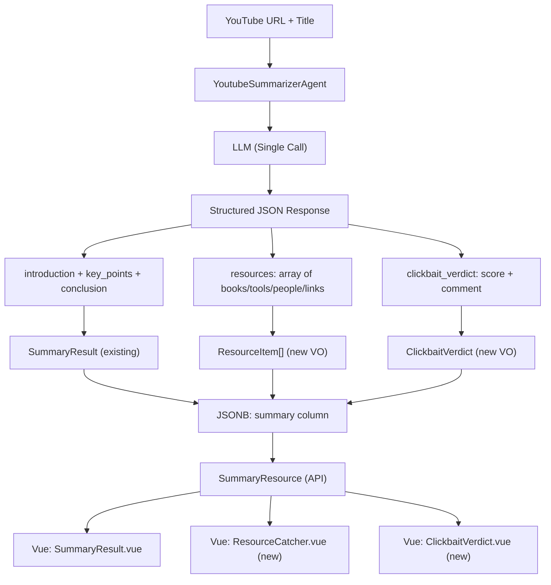

# Resource Catcher + Clickbait Reality Check — Implementation Plan

> **For agentic workers:** REQUIRED SUB-SKILL: Use superpowers:subagent-driven-development (recommended) or superpowers:executing-plans to implement this plan task-by-task. Steps use checkbox (`- [ ]`) syntax for tracking.

**Goal:** Extend the AI summarization pipeline with two zero-extra-API-call features: Resource Catcher (extract mentioned tools/books/people/links) and Clickbait Reality Check (score how clickbaity the title is versus actual content), by extending the structured JSON output schema of `YoutubeSummarizerAgent`.

**Architecture:** Both features are implemented by extending the single LLM call's JSON schema — no additional API requests. The `YoutubeSummarizerAgent` gets expanded `instructions()` and `schema()` to output `resources` array and `clickbait_verdict` object alongside existing `introduction`, `key_points`, `conclusion`. The `SummaryResult` value object extends to hold these new fields, persistence stores them in the same JSONB column, and the frontend renders new UI components.

**Tech Stack:** Laravel AI SDK (Agent + HasStructuredOutput), PHP 8.5 Value Objects, Vue 3 Composition API + TailwindCSS, PostgreSQL JSONB.

---

## Architecture Overview



## Data Flow: How Title Reaches the LLM

Currently `AiSummaryActivity` only has access to `taskId` → fetches transcript from DB → calls `SummaryProviderInterface::summarize()`. For Clickbait, the LLM also needs the video title. The title is already stored in DB by the time `AiSummaryActivity` runs (via `storeTitle` sideEffect before `summariseAndPersist`).

```
TranscribeVideoWorkflow:
  1. SubtitleExtractorActivity → {subtitles, title, duration_sec}
  2. sideEffect: storeTranscript(taskId, transcript)     ← stores in DB
  3. sideEffect: storeTitle(taskId, title)               ← stores in DB
  4. summariseAndPersist(taskId, durationSec):
     a. AiSummaryActivity(taskId)                        ← reads transcript + title from DB
     b. PersistResultActivity(taskId, summary, duration)
```

The `SummaryOptions` value object gains an optional `videoTitle` field, which the adapter passes into the prompt.

---

## File Map

| File | Action | Responsibility |
|------|--------|----------------|
| `app/Domain/ValueObjects/ResourceItem.php` | **Create** | VO for a single mentioned resource (type, name, url) |
| `app/Domain/ValueObjects/ClickbaitVerdict.php` | **Create** | VO for clickbait score (0-100) + one-line verdict |
| `app/Domain/ValueObjects/SummaryResult.php` | **Modify** | Add `resources` and `clickbaitVerdict` fields |
| `app/Domain/ValueObjects/SummaryOptions.php` | **Modify** | Add optional `videoTitle` |
| `app/Ai/Agents/YoutubeSummarizerAgent.php` | **Modify** | Extend `instructions()` and `schema()` |
| `app/Infrastructure/Adapters/Output/Summary/LaravelAiSummaryAdapter.php` | **Modify** | Parse new fields from structured response; conditional clickbait when title is null |
| `app/Infrastructure/Workflow/Activities/AiSummaryActivity.php` | **Modify** | Fetch title via findById, pass to SummaryOptions |
| `app/Infrastructure/Workflow/Activities/PersistResultActivity.php` | **Modify** | Handle new fields in `SummaryResult::fromArray()` |
| `app/Infrastructure/Adapters/Input/Web/Resources/SummaryResource.php` | **Modify** | Serialize `resources` and `clickbait_verdict` |
| `app/Infrastructure/Adapters/Input/Web/OpenApi/Schemas/SummarySchema.php` | **Modify** | Update OpenAPI schema |
| `app/Infrastructure/Adapters/Output/Persistence/MediaTaskEloquentRepository.php` | **Modify** | Update `toEntity()` docblock for new summary shape |
| `resources/js/components/ResourceCatcher.vue` | **Create** | "Mentioned in this video" widget |
| `resources/js/components/ClickbaitVerdict.vue` | **Create** | Clickbait score gauge widget |
| `resources/js/components/TaskStatusCard.vue` | **Modify** | Add Resources tab, embed ClickbaitVerdict in Summary tab only |
| `database/migrations/` | **No migration needed** | `summary` is JSONB, new keys coexist with old |

---

### Task 1: Domain Value Objects — ResourceItem and ClickbaitVerdict

**Files:**
- Create: `app/Domain/ValueObjects/ResourceItem.php`
- Create: `app/Domain/ValueObjects/ClickbaitVerdict.php`
- Create: `tests/Unit/Domain/ValueObjects/ResourceItemTest.php`
- Create: `tests/Unit/Domain/ValueObjects/ClickbaitVerdictTest.php`

- [ ] **Step 1: Write ResourceItemTest**

```php
<?php

declare(strict_types=1);

namespace Tests\Unit\Domain\ValueObjects;

use App\Domain\ValueObjects\ResourceItem;
use PHPUnit\Framework\TestCase;

final class ResourceItemTest extends TestCase
{
    public function test_creates_valid_resource_item(): void
    {
        $item = new ResourceItem(
            type: 'book',
            name: 'Clean Architecture',
            url: 'https://example.com',
        );

        $this->assertSame('book', $item->type);
        $this->assertSame('Clean Architecture', $item->name);
        $this->assertSame('https://example.com', $item->url);
    }

    public function test_url_can_be_null(): void
    {
        $item = new ResourceItem(
            type: 'person',
            name: 'Robert C. Martin',
            url: null,
        );

        $this->assertNull($item->url);
    }

    public function test_to_array_output(): void
    {
        $item = new ResourceItem('tool', 'Laravel', 'https://laravel.com');

        $this->assertSame([
            'type' => 'tool',
            'name' => 'Laravel',
            'url'  => 'https://laravel.com',
        ], $item->toArray());
    }

    public function test_from_array_hydration(): void
    {
        $data = ['type' => 'book', 'name' => 'Domain-Driven Design', 'url' => null];
        $item = ResourceItem::fromArray($data);

        $this->assertSame('book', $item->type);
        $this->assertSame('Domain-Driven Design', $item->name);
        $this->assertNull($item->url);
    }
}
```

- [ ] **Step 2: Run test to verify it fails**

Run: `vendor/bin/pest tests/Unit/Domain/ValueObjects/ResourceItemTest.php`
Expected: FAIL — class not found

- [ ] **Step 3: Write ResourceItem value object**

```php
<?php

declare(strict_types=1);

namespace App\Domain\ValueObjects;

final readonly class ResourceItem
{
    /**
     * @param 'book'|'tool'|'service'|'person'|'link' $type
     */
    public function __construct(
        public string $type,
        public string $name,
        public ?string $url,
    ) {
    }

    /**
     * @return array{type: string, name: string, url: string|null}
     */
    public function toArray(): array
    {
        return [
            'type' => $this->type,
            'name' => $this->name,
            'url'  => $this->url,
        ];
    }

    /**
     * @param array{type: string, name: string, url?: string|null} $data
     */
    public static function fromArray(array $data): self
    {
        return new self(
            type: $data['type'],
            name: $data['name'],
            url: $data['url'] ?? null,
        );
    }
}
```

- [ ] **Step 4: Run test to verify it passes**

Run: `vendor/bin/pest tests/Unit/Domain/ValueObjects/ResourceItemTest.php`
Expected: PASS

- [ ] **Step 5: Write ClickbaitVerdictTest**

```php
<?php

declare(strict_types=1);

namespace Tests\Unit\Domain\ValueObjects;

use App\Domain\ValueObjects\ClickbaitVerdict;
use PHPUnit\Framework\TestCase;

final class ClickbaitVerdictTest extends TestCase
{
    public function test_creates_valid_verdict(): void
    {
        $verdict = new ClickbaitVerdict(score: 85, comment: 'The title accurately reflects the content.');

        $this->assertSame(85, $verdict->score);
        $this->assertSame('The title accurately reflects the content.', $verdict->comment);
    }

    public function test_score_clamped_to_zero(): void
    {
        $verdict = new ClickbaitVerdict(score: -5, comment: 'test');
        $this->assertSame(0, $verdict->score);
    }

    public function test_score_clamped_to_hundred(): void
    {
        $verdict = new ClickbaitVerdict(score: 150, comment: 'test');
        $this->assertSame(100, $verdict->score);
    }

    public function test_to_array_output(): void
    {
        $verdict = new ClickbaitVerdict(42, 'Mostly legit.');

        $this->assertSame([
            'score'   => 42,
            'comment' => 'Mostly legit.',
        ], $verdict->toArray());
    }

    public function test_from_array_hydration(): void
    {
        $verdict = ClickbaitVerdict::fromArray(['score' => 95, 'comment' => 'Legit.']);

        $this->assertSame(95, $verdict->score);
        $this->assertSame('Legit.', $verdict->comment);
    }
}
```

- [ ] **Step 6: Run test to verify it fails**

Run: `vendor/bin/pest tests/Unit/Domain/ValueObjects/ClickbaitVerdictTest.php`
Expected: FAIL — class not found

- [ ] **Step 7: Write ClickbaitVerdict value object**

```php
<?php

declare(strict_types=1);

namespace App\Domain\ValueObjects;

final readonly class ClickbaitVerdict
{
    public int $score;
    public string $comment;

    public function __construct(int $score, string $comment)
    {
        $this->score = max(0, min(100, $score));
        $this->comment = $comment;
    }

    /**
     * @return array{score: int, comment: string}
     */
    public function toArray(): array
    {
        return [
            'score'   => $this->score,
            'comment' => $this->comment,
        ];
    }

    /**
     * @param array{score: int, comment: string} $data
     */
    public static function fromArray(array $data): self
    {
        return new self(
            score: $data['score'],
            comment: $data['comment'],
        );
    }
}
```

- [ ] **Step 8: Run test to verify it passes**

Run: `vendor/bin/pest tests/Unit/Domain/ValueObjects/ClickbaitVerdictTest.php`
Expected: PASS

- [ ] **Step 9: Commit**

```bash
git add app/Domain/ValueObjects/ResourceItem.php app/Domain/ValueObjects/ClickbaitVerdict.php tests/Unit/Domain/ValueObjects/ResourceItemTest.php tests/Unit/Domain/ValueObjects/ClickbaitVerdictTest.php
git commit -m "feat: add ResourceItem and ClickbaitVerdict value objects"
```

---

### Task 2: Extend SummaryResult with Resources and Clickbait

**Files:**
- Modify: `app/Domain/ValueObjects/SummaryResult.php`
- Modify: `tests/Unit/Domain/ValueObjects/SummaryResultTest.php` (if exists, else create)

- [ ] **Step 1: Update SummaryResult**

Search for the constructor and replace with extended version. The `toArray()` and `fromArray()` methods gain `resources` and `clickbait_verdict`.

```php
<?php

declare(strict_types=1);

namespace App\Domain\ValueObjects;

final readonly class SummaryResult
{
    /**
     * @param SummaryKeyPoint[] $keyPoints
     * @param ResourceItem[]    $resources
     */
    public function __construct(
        private string $introduction,
        private array $keyPoints,
        private ?string $conclusion = null,
        private array $resources = [],
        private ?ClickbaitVerdict $clickbaitVerdict = null,
    ) {
    }

    public function introduction(): string
    {
        return $this->introduction;
    }

    /**
     * @return SummaryKeyPoint[]
     */
    public function keyPoints(): array
    {
        return $this->keyPoints;
    }

    public function conclusion(): ?string
    {
        return $this->conclusion;
    }

    /**
     * @return ResourceItem[]
     */
    public function resources(): array
    {
        return $this->resources;
    }

    public function clickbaitVerdict(): ?ClickbaitVerdict
    {
        return $this->clickbaitVerdict;
    }

    /**
     * @return array{
     *     introduction: string,
     *     key_points: array<int, array{timecode: string, title: string, details: string}>,
     *     conclusion: string|null,
     *     resources: array<int, array{type: string, name: string, url: string|null}>,
     *     clickbait_verdict: array{score: int, comment: string}|null
     * }
     */
    public function toArray(): array
    {
        return [
            'introduction'      => $this->introduction,
            'key_points'        => array_map(fn (SummaryKeyPoint $kp) => $kp->toArray(), $this->keyPoints),
            'conclusion'        => $this->conclusion,
            'resources'         => array_map(fn (ResourceItem $r) => $r->toArray(), $this->resources),
            'clickbait_verdict' => $this->clickbaitVerdict?->toArray(),
        ];
    }

    /**
     * @param array{
     *     introduction: string,
     *     key_points: array<int,array{timecode: string, title: string, details: string}>,
     *     conclusion?: string|null,
     *     resources?: array<int, array{type: string, name: string, url?: string|null}>,
     *     clickbait_verdict?: array{score: int, comment: string}|null
     * } $data
     */
    public static function fromArray(array $data): self
    {
        return new self(
            introduction: $data['introduction'],
            keyPoints: array_map(
                fn (array $kp) => SummaryKeyPoint::fromArray($kp),
                $data['key_points'],
            ),
            conclusion: $data['conclusion'] ?? null,
            resources: array_map(
                fn (array $r) => ResourceItem::fromArray($r),
                $data['resources'] ?? [],
            ),
            clickbaitVerdict: isset($data['clickbait_verdict'])
                ? ClickbaitVerdict::fromArray($data['clickbait_verdict'])
                : null,
        );
    }
}
```

- [ ] **Step 2: Update SummaryResultTest for new toArray() fields**

Two existing tests need updating because `toArray()` now includes `resources` and `clickbait_verdict`:

**Test "serializes to array via toArray()" (line 24-35)** — add new keys to expected array:

```php
it('serializes to array via toArray()', function (): void {
    $kp = new SummaryKeyPoint('03:15', 'Setup', 'How to set up.');
    $result = new SummaryResult('Introduction text', [$kp], 'Closing remark');

    expect($result->toArray())->toBe([
        'introduction'      => 'Introduction text',
        'key_points'        => [
            ['timecode' => '03:15', 'title' => 'Setup', 'details' => 'How to set up.'],
        ],
        'conclusion'        => 'Closing remark',
        'resources'         => [],
        'clickbait_verdict' => null,
    ]);
});
```

**Test "round-trips through toArray and fromArray" (line 71-81)** — add assertions for new fields:

```php
it('round-trips through toArray and fromArray', function (): void {
    $kp = new SummaryKeyPoint('10:00', 'Chapter', 'Long detail.');
    $original = new SummaryResult('Into text', [$kp], 'Summary end');

    $roundTrip = SummaryResult::fromArray($original->toArray());

    expect($roundTrip->introduction())->toBe($original->introduction())
        ->and($roundTrip->conclusion())->toBe($original->conclusion())
        ->and($roundTrip->keyPoints()[0]->timecode)->toBe('10:00')
        ->and($roundTrip->keyPoints()[0]->title)->toBe('Chapter')
        ->and($roundTrip->resources())->toBe([])
        ->and($roundTrip->clickbaitVerdict())->toBeNull();
});
```

- [ ] **Step 3: Run tests to confirm they pass after updates**

Run: `vendor/bin/pest tests/Unit/Domain/ValueObjects/ --compact`
Expected: All SummaryResult tests PASS (including updated assertions)

- [ ] **Step 4: Update toEntity() docblock in MediaTaskEloquentRepository**

In [`app/Infrastructure/Adapters/Output/Persistence/MediaTaskEloquentRepository.php`](app/Infrastructure/Adapters/Output/Persistence/MediaTaskEloquentRepository.php), line 293 — update the `$summaryData` PHPDoc type to include new fields:

```php
/** @var array{introduction: string, key_points: array<int, array{timecode: string, title: string, details: string}>, conclusion?: string|null, resources?: array<int, array{type: string, name: string, url?: string|null}>, clickbait_verdict?: array{score: int, comment: string}|null} $summaryData */
$summaryData = $model->summary;
$this->setPrivate($task, 'summary', SummaryResult::fromArray($summaryData));
```

- [ ] **Step 5: Commit**

```bash
git add app/Domain/ValueObjects/SummaryResult.php tests/Unit/Domain/ValueObjects/SummaryResultTest.php app/Infrastructure/Adapters/Output/Persistence/MediaTaskEloquentRepository.php
git commit -m "feat: extend SummaryResult with resources and clickbait_verdict fields"
```

---

### Task 3: Extend SummaryOptions with videoTitle

**Files:**
- Modify: `app/Domain/ValueObjects/SummaryOptions.php`

- [ ] **Step 1: Add videoTitle to SummaryOptions**

Read current file at [`app/Domain/ValueObjects/SummaryOptions.php`](app/Domain/ValueObjects/SummaryOptions.php) and modify:

```php
<?php

declare(strict_types=1);

namespace App\Domain\ValueObjects;

final readonly class SummaryOptions
{
    public function __construct(
        private int $maxWords = 250,
        private string $style = 'concise',
        private ?string $videoTitle = null,
    ) {
    }

    public function maxWords(): int
    {
        return $this->maxWords;
    }

    public function style(): string
    {
        return $this->style;
    }

    public function videoTitle(): ?string
    {
        return $this->videoTitle;
    }
}
```

- [ ] **Step 2: Verify no downstream breakage**

Run: `vendor/bin/pest tests/ --compact`
Expected: All tests pass (existing callers use `new SummaryOptions()` without title — still valid)

- [ ] **Step 3: Commit**

```bash
git add app/Domain/ValueObjects/SummaryOptions.php
git commit -m "feat: add optional videoTitle to SummaryOptions"
```

---

### Task 4: Extend YoutubeSummarizerAgent — Instructions + Schema

**Files:**
- Modify: `app/Ai/Agents/YoutubeSummarizerAgent.php`

- [ ] **Step 1: Update instructions() method**

Replace the existing `instructions()`:

```php
public function instructions(): string
{
    return <<<'PROMPT'
    You are an expert assistant that summarizes YouTube video transcripts.

    Rules:
    - Write a concise introduction paragraph (2-4 sentences).
    - The transcript contains real timecodes in [MM:SS] or [HH:MM:SS] format embedded at the
      start of each paragraph. You MUST use ONLY these exact timecodes when referencing moments
      in the video. Never invent, approximate, or interpolate timecodes.
    - Extract 5-10 key points that represent the most important moments in the transcript.
      For each key point, copy the nearest timecode that precedes the relevant content.
      For videos under 1 hour use MM:SS format (e.g. "03:45").
      For videos 1 hour or longer use HH:MM:SS format (e.g. "01:15:30").
    - Each key point must have: timecode (MM:SS or HH:MM:SS), a short title, and a 1-2 sentence detail.
    - Write a brief conclusion if the transcript has a clear takeaway.
    - Respond entirely in English.
    - Do not invent content not present in the transcript.

    ## Resource Extraction
    - Scan the transcript for mentions of books, tools, libraries, services, software, people
      (authors, speakers, experts), and external links. Extract each into the "resources" array.
    - For each resource, classify it as one of: "book", "tool", "service", "person", "link".
    - If a URL is explicitly mentioned or strongly implied (e.g. "github.com/foo"), include it
      in the "url" field. Otherwise set url to null.
    - Only include resources explicitly referenced by the speakers. Do not invent.

    ## Clickbait Assessment (only if a video title is provided below)
    - If a "Video Title" is present in the prompt, compare it against the actual transcript content.
    - Score from 0 to 100: 0 = total clickbait / title lies completely, 100 = title perfectly
      matches content. If no title is provided, omit the clickbait_verdict field entirely.
    - Write a one-sentence verdict comment that is sharp and specific. If the title is misleading,
      explain why in a witty, quotable way. If the title is honest, acknowledge it.
    - The verdict comment should be under 150 characters and suitable for sharing as a screenshot.
    PROMPT;
}
```

- [ ] **Step 2: Update schema() method**

Replace the existing `schema()`:

```php
public function schema(JsonSchema $schema): array
{
    return [
        'introduction' => $schema->string()->required(),
        'key_points'   => $schema->array()->items(
            $schema->object(fn (JsonSchema $s): array => [
                'timecode' => $s->string()->description(
                    'Format MM:SS (e.g. "03:45") for videos under 1 hour, '
                    . 'or HH:MM:SS (e.g. "01:15:30") for longer videos',
                )->required(),
                'title'    => $s->string()->required(),
                'details'  => $s->string()->required(),
            ]),
        )->required(),
        'conclusion' => $schema->string(),
        'resources'  => $schema->array()->items(
            $schema->object(fn (JsonSchema $s): array => [
                'type' => $s->string()->description(
                    'One of: book, tool, service, person, link',
                )->required(),
                'name' => $s->string()->required(),
                'url'  => $s->string()->nullable(),
            ]),
        )->required(),
        'clickbait_verdict' => $schema->object(fn (JsonSchema $s): array => [
            'score'   => $s->integer()->minimum(0)->maximum(100)
                ->description('0 = pure clickbait, 100 = title perfectly matches content')
                ->required(),
            'comment' => $s->string()->maxLength(150)
                ->description('One-sentence verdict, witty and shareable')
                ->required(),
        ]),
    ];
}
```

- [ ] **Step 3: Commit**

```bash
git add app/Ai/Agents/YoutubeSummarizerAgent.php
git commit -m "feat: extend agent prompt for resource extraction and clickbait assessment"
```

---

### Task 5: Update LaravelAiSummaryAdapter to Pass Title and Parse New Fields

**Files:**
- Modify: `app/Infrastructure/Adapters/Output/Summary/LaravelAiSummaryAdapter.php`

- [ ] **Step 1: Update adapter to include title in prompt and parse new fields**

Replace the `summarize()` method:

```php
public function summarize(TranscriptionText $transcriptText, SummaryOptions $options): SummaryResult
{
    try {
        $prompt = sprintf(
            "Summarize the following transcript in maximum %d words. Style: %s.\n\nTranscript:\n%s",
            $options->maxWords(),
            $options->style(),
            $transcriptText->value(),
        );

        if ($options->videoTitle() !== null) {
            $prompt .= "\n\nVideo Title: " . $options->videoTitle();
        }

        $response = YoutubeSummarizerAgent::make()->prompt($prompt);

        Assert::isInstanceOf(
            $response,
            StructuredAgentResponse::class,
            'Expected StructuredAgentResponse from YoutubeSummarizerAgent.',
        );

        /** @var array<string, mixed> $data */
        $data = $response->toArray();
        Assert::keyExists($data, 'introduction', 'Missing key: introduction.');
        Assert::string($data['introduction'], 'introduction must be a string.');
        Assert::keyExists($data, 'key_points', 'Missing key: key_points.');
        Assert::isArray($data['key_points'], 'key_points must be an array.');

        $keyPoints = [];

        foreach ($data['key_points'] as $index => $kp) {
            Assert::isArray($kp, sprintf('key_points[%d] must be an array.', $index));
            Assert::keyExists($kp, 'timecode', sprintf('key_points[%d] missing timecode.', $index));
            Assert::keyExists($kp, 'title', sprintf('key_points[%d] missing title.', $index));
            Assert::keyExists($kp, 'details', sprintf('key_points[%d] missing details.', $index));
            Assert::string($kp['timecode'], sprintf('key_points[%d].timecode must be a string.', $index));
            Assert::string($kp['title'], sprintf('key_points[%d].title must be a string.', $index));
            Assert::string($kp['details'], sprintf('key_points[%d].details must be a string.', $index));

            $keyPoints[] = new SummaryKeyPoint(
                timecode: $kp['timecode'],
                title: $kp['title'],
                details: $kp['details'],
            );
        }

        $conclusion = $data['conclusion'] ?? null;

        if ($conclusion !== null) {
            Assert::string($conclusion, 'conclusion must be a string or null.');
        }

        // Parse resources
        Assert::keyExists($data, 'resources', 'Missing key: resources.');
        Assert::isArray($data['resources'], 'resources must be an array.');

        $resources = [];

        foreach ($data['resources'] as $index => $r) {
            Assert::isArray($r, sprintf('resources[%d] must be an array.', $index));
            Assert::keyExists($r, 'type', sprintf('resources[%d] missing type.', $index));
            Assert::keyExists($r, 'name', sprintf('resources[%d] missing name.', $index));
            Assert::string($r['type'], sprintf('resources[%d].type must be a string.', $index));
            Assert::string($r['name'], sprintf('resources[%d].name must be a string.', $index));

            $resources[] = new ResourceItem(
                type: $r['type'],
                name: $r['name'],
                url: isset($r['url']) && is_string($r['url']) ? $r['url'] : null,
            );
        }

        // Parse clickbait verdict (optional — only present when title was provided)
        $clickbaitVerdict = null;

        if (isset($data['clickbait_verdict'])) {
            Assert::isArray($data['clickbait_verdict'], 'clickbait_verdict must be an array.');
            Assert::keyExists($data['clickbait_verdict'], 'score', 'clickbait_verdict missing score.');
            Assert::keyExists($data['clickbait_verdict'], 'comment', 'clickbait_verdict missing comment.');
            Assert::integer($data['clickbait_verdict']['score'], 'clickbait_verdict.score must be an integer.');
            Assert::string($data['clickbait_verdict']['comment'], 'clickbait_verdict.comment must be a string.');

            $clickbaitVerdict = new ClickbaitVerdict(
                score: $data['clickbait_verdict']['score'],
                comment: $data['clickbait_verdict']['comment'],
            );
        }

        return new SummaryResult(
            introduction: $data['introduction'],
            keyPoints: $keyPoints,
            conclusion: $conclusion,
            resources: $resources,
            clickbaitVerdict: $clickbaitVerdict,
        );
    } catch (RuntimeException $e) {
        throw new SummaryFailedException(
            'LaravelAiSummaryAdapter failed: ' . $e->getMessage(),
            previous: $e,
        );
    }
}
```

Add the import at the top (alongside existing imports):

```php
use App\Domain\ValueObjects\ClickbaitVerdict;
use App\Domain\ValueObjects\ResourceItem;
```

- [ ] **Step 2: Commit**

```bash
git add app/Infrastructure/Adapters/Output/Summary/LaravelAiSummaryAdapter.php
git commit -m "feat: parse resources and clickbait_verdict from structured AI response"
```

---

### Task 6: Update AiSummaryActivity to Pass Title via findById

**Files:**
- Modify: `app/Infrastructure/Workflow/Activities/AiSummaryActivity.php`

**Design note:** `getTitle()` is NOT added to `MediaTaskRepositoryInterface`. The interface already has `findById(string $id): ?MediaTask`, and `MediaTask` already exposes `title()`. Adding a single-purpose `getTitle()` violates YAGNI. Instead, `AiSummaryActivity` calls `findById()` and reads the title from the entity.

- [ ] **Step 1: Fetch title via findById and pass to SummaryOptions**

Replace the `execute()` method:

```php
public function execute(string $taskId): string
{
    /** @var MediaTaskRepositoryInterface $repository */
    $repository = Container::getInstance()->make(MediaTaskRepositoryInterface::class);

    $transcript = $repository->getTranscript($taskId);

    if ($transcript === null) {
        throw new RuntimeException("Transcript not found for task: {$taskId}");
    }

    $task = $repository->findById($taskId);
    $title = $task?->title();

    /** @var SummaryProviderInterface $provider */
    $provider = Container::getInstance()->make(SummaryProviderInterface::class);

    $result = $provider->summarize(
        new TranscriptionText($transcript),
        new SummaryOptions(videoTitle: $title),
    );

    return json_encode($result->toArray(), JSON_THROW_ON_ERROR);
}
```

- [ ] **Step 2: Commit**

```bash
git add app/Infrastructure/Workflow/Activities/AiSummaryActivity.php
git commit -m "feat: pass video title to summary provider for clickbait assessment"
```

---

### Task 8: Update SummaryResource (API Serialization)

**Files:**
- Modify: `app/Infrastructure/Adapters/Input/Web/Resources/SummaryResource.php`

- [ ] **Step 1: Add resources and clickbait_verdict to serialization**

Replace `toArray()`:

```php
/**
 * @return array{
 *     introduction: string,
 *     key_points: array<int, array{timecode: string, title: string, details: string}>,
 *     conclusion: string|null,
 *     resources: array<int, array{type: string, name: string, url: string|null}>,
 *     clickbait_verdict: array{score: int, comment: string}|null
 * }
 */
public function toArray(Request $request): array
{
    return [
        'introduction' => $this->resource->introduction(),
        'key_points' => array_map(
            fn (\App\Domain\ValueObjects\SummaryKeyPoint $kp) => [
                'timecode' => $kp->timecode,
                'title'    => $kp->title,
                'details'  => $kp->details,
            ],
            $this->resource->keyPoints(),
        ),
        'conclusion'       => $this->resource->conclusion(),
        'resources'        => array_map(
            fn (\App\Domain\ValueObjects\ResourceItem $r) => [
                'type' => $r->type,
                'name' => $r->name,
                'url'  => $r->url,
            ],
            $this->resource->resources(),
        ),
        'clickbait_verdict' => $this->resource->clickbaitVerdict()?->toArray(),
    ];
}
```

- [ ] **Step 2: Commit**

```bash
git add app/Infrastructure/Adapters/Input/Web/Resources/SummaryResource.php
git commit -m "feat: expose resources and clickbait_verdict in API summary serialization"
```

---

### Task 9: Update OpenAPI SummarySchema

**Files:**
- Modify: `app/Infrastructure/Adapters/Input/Web/OpenApi/Schemas/SummarySchema.php`

- [ ] **Step 1: Add new properties to schema**

```php
<?php

declare(strict_types=1);

namespace App\Infrastructure\Adapters\Input\Web\OpenApi\Schemas;

use OpenApi\Attributes as OA;

#[OA\Schema(
    schema: 'Summary',
    required: ['introduction', 'key_points', 'conclusion', 'resources'],
    properties: [
        new OA\Property(property: 'introduction', type: 'string'),
        new OA\Property(
            property: 'key_points',
            type: 'array',
            items: new OA\Items(
                required: ['timecode', 'title', 'details'],
                properties: [
                    new OA\Property(property: 'timecode', type: 'string', example: '00:02:30'),
                    new OA\Property(property: 'title', type: 'string'),
                    new OA\Property(property: 'details', type: 'string'),
                ],
                type: 'object',
            ),
        ),
        new OA\Property(property: 'conclusion', type: 'string', nullable: true),
        new OA\Property(
            property: 'resources',
            type: 'array',
            items: new OA\Items(
                required: ['type', 'name'],
                properties: [
                    new OA\Property(property: 'type', type: 'string', example: 'book'),
                    new OA\Property(property: 'name', type: 'string', example: 'Clean Code'),
                    new OA\Property(property: 'url', type: 'string', nullable: true, example: 'https://example.com'),
                ],
                type: 'object',
            ),
        ),
        new OA\Property(
            property: 'clickbait_verdict',
            required: ['score', 'comment'],
            properties: [
                new OA\Property(property: 'score', type: 'integer', example: 85),
                new OA\Property(property: 'comment', type: 'string', example: 'Title matches content well.'),
            ],
            type: 'object',
            nullable: true,
        ),
    ],
)]
final class SummarySchema
{
}
```

- [ ] **Step 2: Commit**

```bash
git add app/Infrastructure/Adapters/Input/Web/OpenApi/Schemas/SummarySchema.php
git commit -m "feat: update OpenAPI schema for resources and clickbait_verdict"
```

---

### Task 10: Frontend — ResourceCatcher Component

**Files:**
- Create: `resources/js/components/ResourceCatcher.vue`

- [ ] **Step 1: Create ResourceCatcher.vue**

```vue
<template>
  <div v-if="resources.length" class="space-y-3">
    <h3 class="text-xs font-semibold text-gray-400 uppercase tracking-wider flex items-center gap-2">
      <svg class="w-3.5 h-3.5 text-emerald-400" fill="none" viewBox="0 0 24 24" stroke="currentColor">
        <path stroke-linecap="round" stroke-linejoin="round" stroke-width="2" d="M5 3v4M3 5h4M6 17v4m-2-2h4m5-16l2.286 6.857L21 12l-5.714 2.143L13 21l-2.286-6.857L5 12l5.714-2.143L13 3z"/>
      </svg>
      Mentioned in this Video
    </h3>

    <div class="grid grid-cols-1 sm:grid-cols-2 gap-2">
      <a
        v-for="(item, index) in resources"
        :key="index"
        :href="item.url || undefined"
        :target="item.url ? '_blank' : undefined"
        :rel="item.url ? 'noopener noreferrer' : undefined"
        :class="[
          'flex items-center gap-2.5 rounded-lg p-2.5 border transition-all text-sm',
          item.url
            ? 'bg-gray-800/60 border-gray-700 hover:border-emerald-500/40 hover:bg-gray-800 cursor-pointer'
            : 'bg-gray-800/40 border-gray-700/50'
        ]"
      >
        <!-- Icon by type -->
        <span class="shrink-0 w-7 h-7 flex items-center justify-center rounded-md bg-gray-700/60 text-xs">
          <svg v-if="item.type === 'book'" class="w-3.5 h-3.5 text-amber-400" fill="none" stroke="currentColor" viewBox="0 0 24 24"><path stroke-linecap="round" stroke-linejoin="round" stroke-width="2" d="M12 6.253v13m0-13C10.832 5.477 9.246 5 7.5 5S4.168 5.477 3 6.253v13C4.168 18.477 5.754 18 7.5 18s3.332.477 4.5 1.253m0-13C13.168 5.477 14.754 5 16.5 5c1.747 0 3.332.477 4.5 1.253v13C19.832 18.477 18.247 18 16.5 18c-1.746 0-3.332.477-4.5 1.253"/></svg>
          <svg v-else-if="item.type === 'tool'" class="w-3.5 h-3.5 text-blue-400" fill="none" stroke="currentColor" viewBox="0 0 24 24"><path stroke-linecap="round" stroke-linejoin="round" stroke-width="2" d="M10.325 4.317c.426-1.756 2.924-1.756 3.35 0a1.724 1.724 0 002.573 1.066c1.543-.94 3.31.826 2.37 2.37a1.724 1.724 0 001.066 2.573c1.756.426 1.756 2.924 0 3.35a1.724 1.724 0 00-1.066 2.573c.94 1.543-.826 3.31-2.37 2.37a1.724 1.724 0 00-2.573 1.066c-.426 1.756-2.924 1.756-3.35 0a1.724 1.724 0 00-2.573-1.066c-1.543.94-3.31-.826-2.37-2.37a1.724 1.724 0 00-1.066-2.573c-1.756-.426-1.756-2.924 0-3.35a1.724 1.724 0 001.066-2.573c-.94-1.543.826-3.31 2.37-2.37.996.608 2.296.07 2.572-1.065z"/><path stroke-linecap="round" stroke-linejoin="round" stroke-width="2" d="M15 12a3 3 0 11-6 0 3 3 0 016 0z"/></svg>
          <svg v-else-if="item.type === 'service'" class="w-3.5 h-3.5 text-purple-400" fill="none" stroke="currentColor" viewBox="0 0 24 24"><path stroke-linecap="round" stroke-linejoin="round" stroke-width="2" d="M3 15a4 4 0 004 4h9a5 5 0 10-.1-9.999 5.002 5.002 0 10-9.78 2.096A4.001 4.001 0 003 15z"/></svg>
          <svg v-else-if="item.type === 'person'" class="w-3.5 h-3.5 text-pink-400" fill="none" stroke="currentColor" viewBox="0 0 24 24"><path stroke-linecap="round" stroke-linejoin="round" stroke-width="2" d="M16 7a4 4 0 11-8 0 4 4 0 018 0zM12 14a7 7 0 00-7 7h14a7 7 0 00-7-7z"/></svg>
          <svg v-else-if="item.type === 'link'" class="w-3.5 h-3.5 text-cyan-400" fill="none" stroke="currentColor" viewBox="0 0 24 24"><path stroke-linecap="round" stroke-linejoin="round" stroke-width="2" d="M13.828 10.172a4 4 0 00-5.656 0l-4 4a4 4 0 105.656 5.656l1.102-1.101m-.758-4.899a4 4 0 005.656 0l4-4a4 4 0 00-5.656-5.656l-1.1 1.1"/></svg>
        </span>
        <div class="min-w-0">
          <p class="text-gray-200 font-medium truncate">{{ item.name }}</p>
          <p class="text-gray-500 text-xs capitalize">{{ item.type }}</p>
        </div>
        <svg v-if="item.url" class="w-3 h-3 text-gray-600 shrink-0 ml-auto" fill="none" stroke="currentColor" viewBox="0 0 24 24"><path stroke-linecap="round" stroke-linejoin="round" stroke-width="2" d="M10 6H6a2 2 0 00-2 2v10a2 2 0 002 2h10a2 2 0 002-2v-4M14 4h6m0 0v6m0-6L10 14"/></svg>
      </a>
    </div>
  </div>
</template>

<script setup>
defineProps({
  resources: { type: Array, required: true },
});
</script>
```

- [ ] **Step 2: Commit**

```bash
git add resources/js/components/ResourceCatcher.vue
git commit -m "feat: add ResourceCatcher Vue component"
```

---

### Task 11: Frontend — ClickbaitVerdict Component

**Files:**
- Create: `resources/js/components/ClickbaitVerdict.vue`

- [ ] **Step 1: Create ClickbaitVerdict.vue**

```vue
<template>
  <div v-if="verdict" class="bg-gray-800/60 rounded-xl p-4 border border-gray-700">
    <div class="flex items-center gap-3 mb-2">
      <h4 class="text-xs font-semibold text-gray-400 uppercase tracking-wider">Clickbait Check</h4>
      <span
        :class="scoreColorClass"
        class="text-xs font-bold px-2 py-0.5 rounded-full"
      >
        {{ verdict.score }}% Legit
      </span>
    </div>

    <!-- Health-bar style gauge -->
    <div class="h-2 bg-gray-700 rounded-full overflow-hidden mb-3">
      <div
        :class="gaugeColorClass"
        class="h-full rounded-full transition-all duration-700"
        :style="{ width: verdict.score + '%' }"
      ></div>
    </div>

    <!-- Verdict comment -->
    <p class="text-gray-300 text-sm leading-relaxed italic">
      "{{ verdict.comment }}"
    </p>
  </div>
</template>

<script setup>
import { computed } from 'vue';

const props = defineProps({
  verdict: { type: Object, default: null },
});

const scoreColorClass = computed(() => {
  if (!props.verdict) return '';
  if (props.verdict.score >= 80) return 'bg-green-900/60 text-green-400 border border-green-700/40';
  if (props.verdict.score >= 50) return 'bg-yellow-900/60 text-yellow-400 border border-yellow-700/40';
  return 'bg-red-900/60 text-red-400 border border-red-700/40';
});

const gaugeColorClass = computed(() => {
  if (!props.verdict) return '';
  if (props.verdict.score >= 80) return 'bg-gradient-to-r from-green-600 to-green-400';
  if (props.verdict.score >= 50) return 'bg-gradient-to-r from-yellow-600 to-yellow-400';
  return 'bg-gradient-to-r from-red-600 to-red-400';
});
</script>
```

- [ ] **Step 2: Commit**

```bash
git add resources/js/components/ClickbaitVerdict.vue
git commit -m "feat: add ClickbaitVerdict Vue component with health-bar gauge"
```

---

### Task 12: Integrate New Components into TaskStatusCard

**Files:**
- Modify: `resources/js/components/TaskStatusCard.vue`

- [ ] **Step 1: Add Resources tab and ClickbaitVerdict widget**

In the template, after the "Transcript" tab button, add a "Resources" tab. Embed ClickbaitVerdict at the top of the Summary panel only (clickbait verdict is about title vs content, not about the transcript text).

Find the tab bar section (around line 70-73) and replace:

```vue
<!-- Tab bar -->
<div class="flex gap-1 mb-5 bg-gray-700/40 rounded-lg p-1" role="tablist">
  <button @click="activeTab = 'summary'" :class="activeTab === 'summary' ? 'bg-blue-600 text-white shadow-md' : 'text-gray-400 hover:text-gray-200 hover:bg-gray-700/50'" class="flex-1 flex items-center justify-center gap-1.5 px-4 py-2.5 rounded-md text-sm font-medium transition-all duration-150" role="tab" :aria-selected="activeTab === 'summary'" aria-controls="panel-summary"><svg class="w-4 h-4" fill="none" stroke="currentColor" viewBox="0 0 24 24"><path stroke-linecap="round" stroke-linejoin="round" stroke-width="2" d="M13 10V3L4 14h7v7l9-11h-7z"/></svg> AI Summary</button>
  <button @click="activeTab = 'transcript'" :class="activeTab === 'transcript' ? 'bg-blue-600 text-white shadow-md' : 'text-gray-400 hover:text-gray-200 hover:bg-gray-700/50'" class="flex-1 flex items-center justify-center gap-1.5 px-4 py-2.5 rounded-md text-sm font-medium transition-all duration-150" role="tab" :aria-selected="activeTab === 'transcript'" aria-controls="panel-transcript"><svg class="w-4 h-4" fill="none" stroke="currentColor" viewBox="0 0 24 24"><path stroke-linecap="round" stroke-linejoin="round" stroke-width="2" d="M9 12h6m-6 4h6m2 5H7a2 2 0 01-2-2V5a2 2 0 012-2h5.586a1 1 0 01.707.293l5.414 5.414a1 1 0 01.293.707V19a2 2 0 01-2 2z"/></svg> Transcript</button>
  <button v-if="renderedSummary?.resources?.length" @click="activeTab = 'resources'" :class="activeTab === 'resources' ? 'bg-blue-600 text-white shadow-md' : 'text-gray-400 hover:text-gray-200 hover:bg-gray-700/50'" class="flex-1 flex items-center justify-center gap-1.5 px-4 py-2.5 rounded-md text-sm font-medium transition-all duration-150" role="tab" :aria-selected="activeTab === 'resources'" aria-controls="panel-resources"><svg class="w-4 h-4" fill="none" stroke="currentColor" viewBox="0 0 24 24"><path stroke-linecap="round" stroke-linejoin="round" stroke-width="2" d="M5 3v4M3 5h4M6 17v4m-2-2h4m5-16l2.286 6.857L21 12l-5.714 2.143L13 21l-2.286-6.857L5 12l5.714-2.143L13 3z"/></svg> Mentioned</button>
</div>
```

Then, in the Summary tab panel (around line 76), add ClickbaitVerdict before the summary:

```vue
<!-- Summary tab -->
<div v-show="activeTab === 'summary'" id="panel-summary" role="tabpanel">
  <ClickbaitVerdict :verdict="renderedSummary?.clickbait_verdict ?? null" class="mb-5" />
  <SummaryResult
    v-if="renderedSummary && typeof renderedSummary === 'object'"
    :summary="renderedSummary"
    :on-seek="seekToSeconds"
    class="mb-5"
  />
  <p v-else class="text-gray-400 text-sm mb-5">No summary available.</p>
  <button @click="$emit('copySummary')" class="w-full sm:w-auto inline-flex items-center justify-center gap-2 bg-blue-600 hover:bg-blue-700 active:bg-blue-800 text-white font-medium px-5 py-3 sm:py-2.5 rounded-lg transition-colors" :aria-label="copySummaryLabel"><svg class="w-4 h-4" fill="none" stroke="currentColor" viewBox="0 0 24 24"><path stroke-linecap="round" stroke-linejoin="round" stroke-width="2" d="M8 16H6a2 2 0 01-2-2V6a2 2 0 012-2h8a2 2 0 012 2v2m-6 12h8a2 2 0 002-2v-8a2 2 0 00-2-2h-8a2 2 0 00-2 2v8a2 2 0 002 2z"/></svg> {{ copySummaryLabel }}</button>
</div>
```

After the Transcript tab panel, add the Resources tab panel:

```vue
<!-- Resources tab -->
<div v-show="activeTab === 'resources'" id="panel-resources" role="tabpanel">
  <ResourceCatcher :resources="renderedSummary?.resources ?? []" class="mb-5" />
</div>
```

In the `<script setup>` imports, add:

```js
import ResourceCatcher from './ResourceCatcher.vue';
import ClickbaitVerdict from './ClickbaitVerdict.vue';
```

- [ ] **Step 2: Commit**

```bash
git add resources/js/components/TaskStatusCard.vue
git commit -m "feat: integrate ResourceCatcher and ClickbaitVerdict into TaskStatusCard"
```

---

### Task 13: Integration Testing and composer check

- [ ] **Step 1: Run full test suite**

```bash
vendor/bin/pest --compact
```

Expected: All tests pass. New VOs covered, existing tests not broken.

- [ ] **Step 2: Run static analysis**

```bash
vendor/bin/phpstan analyse --level=9 --no-progress
```

Expected: No new errors. If `LaravelAiSummaryAdapter` or `AiSummaryActivity` trigger new issues, fix them.

- [ ] **Step 3: Run architecture checks**

```bash
vendor/bin/deptrac analyze
```

Expected: No new violations. `ClickbaitVerdict` and `ResourceItem` are in Domain — no dependencies on Application/Infrastructure.

- [ ] **Step 4: Run coding standards**

```bash
vendor/bin/phpcs --standard=PSR12 app/ tests/
```

Expected: No new violations.

- [ ] **Step 5: Final composer check**

```bash
composer check
```

Expected: GREEN across all gates.

- [ ] **Step 6: Commit**

```bash
git add -A
git commit -m "chore: final integration — all quality gates green"
```

---

## Self-Review

### 1. Spec Coverage

| Spec Requirement | Covered By |
|-----------------|------------|
| Resource Catcher: extract books, tools, services, people, links into `resources` array | Task 4 (Agent schema), Task 2 (SummaryResult), Task 5 (Adapter parsing) |
| Resource Catcher: UI "Mentioned in this video" with icons | Task 9 (ResourceCatcher.vue) |
| Clickbait: score 0-100 comparing title vs content | Task 4 (Agent schema), Task 1 (ClickbaitVerdict VO) |
| Clickbait: one-sentence verdict comment | Task 4 (Agent schema), Task 1 (ClickbaitVerdict VO) |
| Clickbait: UI health-bar gauge with color zones | Task 10 (ClickbaitVerdict.vue) |
| Clickbait: handle null title gracefully (skip verdict) | Task 4 (conditional instructions), Task 5 (conditional parsing) |
| Title passed to LLM via findById (no new port method) | Task 3 (SummaryOptions), Task 6 (AiSummaryActivity) |
| toEntity() docblock updated for new summary shape | Task 2 Step 4 |
| No extra API calls | Architecture — single LLM call with extended schema |
| Backward compatible (old summary JSON still works) | Task 2 (defaults for new fields), no migration needed |
| Existing SummaryResultTest updated for new toArray() keys | Task 2 Step 2 |
| OpenAPI schema updated (clickbait_verdict nullable, not required) | Task 8 |

### 2. Placeholder Scan

No TBDs, TODOs, or "implement later" found. All code blocks are complete.

### 3. Type Consistency

- `ClickbaitVerdict` properties: `score: int`, `comment: string` — consistent across VO, toArray, fromArray, Agent schema, Vue component
- `ResourceItem` properties: `type: string`, `name: string`, `url: ?string` — consistent across VO, toArray, fromArray, Agent schema, Vue component
- `SummaryOptions::$videoTitle` — `?string`, consistent through interface, adapter, workflow
- `SummaryResult` new fields: `resources: ResourceItem[]`, `clickbaitVerdict: ?ClickbaitVerdict` — consistent through all layers

---

## Execution Handoff

Plan complete and saved to [`docs/superpowers/plans/2026-05-23-resource-catcher-clickbait-check.md`](docs/superpowers/plans/2026-05-23-resource-catcher-clickbait-check.md). Two execution options:

1. **Subagent-Driven (recommended)** — I dispatch a fresh subagent per task, review between tasks, fast iteration
2. **Inline Execution** — Execute tasks in this session using executing-plans, batch execution with checkpoints

**Which approach?**
