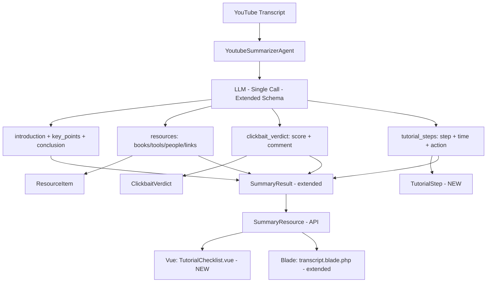

# Tutorial Step-by-Step Checklist — Implementation Plan

> **Goal:** Add automatic tutorial step extraction from YouTube transcripts. The LLM detects whether a video is a tutorial/how-to and, if so, extracts sequential actionable steps with timecodes. Results render as an interactive checklist in the UI — all within the existing single LLM call.

**Architecture:** Follows the exact same pattern as Resource Catcher + Clickbait: extend `YoutubeSummarizerAgent` instructions + schema, extend `SummaryResult` with `tutorialSteps`, parse in `LaravelAiSummaryAdapter`, expose via `SummaryResource`/`SummarySchema`, render in Vue + Blade.

**Cost:** Zero extra API calls. Single LLM call with extended JSON schema.

---

## Architecture Overview



## LLM Response Schema Extension

```json
{
  "introduction": "...",
  "key_points": [...],
  "conclusion": "...",
  "resources": [...],
  "clickbait_verdict": {"score": 85, "comment": "..."},
  "tutorial_steps": [
    {"step": 1, "time": "03:45", "action": "composer require laravel/horizon"},
    {"step": 2, "time": "05:10", "action": "Publish config: php artisan horizon:install"}
  ]
}
```

`tutorial_steps` is ALWAYS present. Empty array for non-tutorials. LLM decides.

---

## File Map

| File | Action |
|------|--------|
| `app/Domain/ValueObjects/TutorialStep.php` | Create VO |
| `app/Domain/ValueObjects/SummaryResult.php` | Add tutorialSteps field |
| `app/Ai/Agents/YoutubeSummarizerAgent.php` | Extend instructions + schema |
| `app/Infrastructure/Adapters/Output/Summary/LaravelAiSummaryAdapter.php` | Parse tutorial_steps |
| `app/Infrastructure/Adapters/Input/Web/Resources/SummaryResource.php` | Serialize |
| `app/Infrastructure/Adapters/Input/Web/OpenApi/Schemas/SummarySchema.php` | OpenAPI |
| `app/Infrastructure/Adapters/Output/Persistence/MediaTaskEloquentRepository.php` | Docblock |
| `resources/js/components/TutorialChecklist.vue` | Create - interactive checklist |
| `resources/js/components/TaskStatusCard.vue` | Add Tutorial tab |
| `resources/views/transcript.blade.php` | Blade checklist section |
| `tests/Unit/Domain/ValueObjects/TutorialStepTest.php` | Create tests |

---

## Task 1: TutorialStep Value Object

**File:** `app/Domain/ValueObjects/TutorialStep.php`

```php
final readonly class TutorialStep
{
    public function __construct(
        public int $step,
        public string $time,
        public string $action,
    ) {
    }

    /** @return array{step: int, time: string, action: string} */
    public function toArray(): array
    {
        return ['step' => $this->step, 'time' => $this->time, 'action' => $this->action];
    }

    /** @param array{step: int, time: string, action: string} $data */
    public static function fromArray(array $data): self
    {
        return new self(step: (int) $data['step'], time: $data['time'], action: $data['action']);
    }
}
```

**File:** `tests/Unit/Domain/ValueObjects/TutorialStepTest.php`

Test: creates valid step, toArray output, fromArray hydration.

---

## Task 2: Extend SummaryResult

Add `private array $tutorialSteps = []` to constructor.
Add `tutorialSteps()` getter returning `TutorialStep[]`.
Add `tutorial_steps` to `toArray()` and `fromArray()`.
Update tests for new key in toArray.

---

## Task 3: Extend YoutubeSummarizerAgent

Add to `instructions()`:
```
## Tutorial Step Extraction
- If the video is a tutorial/how-to, extract sequential steps into tutorial_steps.
- Each step: step number, nearest timecode, concise action description.
- Include exact commands, config keys, URLs.
- If conversational (podcast, interview), return EMPTY tutorial_steps array.
```

Add to `schema()`:
```php
'tutorial_steps' => $schema->array()->items(
    $schema->object(fn (JsonSchema $s): array => [
        'step' => $s->integer()->required(),
        'time' => $s->string()->required(),
        'action' => $s->string()->required(),
    ]),
)->required(),
```

---

## Task 4: Update LaravelAiSummaryAdapter

Parse `tutorial_steps` with Assert validations, create `TutorialStep` objects.
Pass to `SummaryResult` constructor.

---

## Task 5: Update API + OpenAPI

`SummaryResource`: serialize `tutorial_steps`.
`SummarySchema`: add `tutorial_steps` array property.
`MediaTaskEloquentRepository`: update docblock.

---

## Task 6: TutorialChecklist.vue

Interactive checklist with:
- Checkboxes persisted in localStorage per taskId
- Completed steps get strikethrough + dimmed
- Clickable timecodes call onSeek
- Progress counter: "3/12 done"

---

## Task 7: Integrate into TaskStatusCard

Add "Checklist" tab (conditional on tutorial_steps.length).
Add TutorialChecklist component in tab panel.

---

## Task 8: Integrate into transcript.blade.php

Add Tutorial Checklist Blade section after Resources.
Each step: step number, timecode link, action text.

---

## Task 9: composer check

Run: phpstan, phpcs, deptrac, pest. All green.
