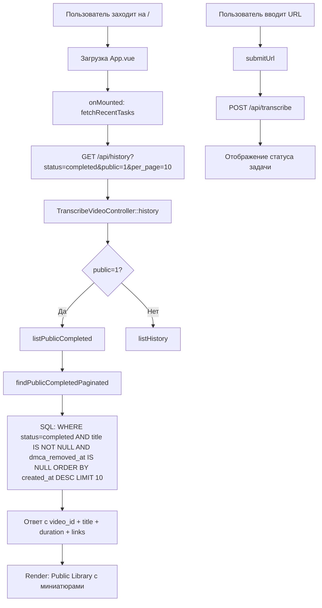

# План рефакторинга главной страницы TubeSum

## Текущее состояние (AS-IS)

### Порядок блоков в [`App.vue`](resources/js/App.vue:31):
1. Hero (заголовок + бейджи)
2. **Recently Transcribed** (горизонтальный скролл карточек) — строка 33
3. **Форма ввода URL + Transcribe** — строка 68
4. **Поиск** (отдельный блок) — строка 102
5. Результаты поиска — строка 120
6. Карточка статуса задачи — строка 191

### Проблемы:

#### 1. Баг «Untitled»
Проанализировав цепочку сохранения данных, обнаружена коренная причина:

- [`SubtitleExtractorActivity`](app/Infrastructure/Workflow/Activities/SubtitleExtractorActivity.php:16) возвращает `{subtitles, title}` из `yt-dlp`
- В [`TranscribeVideoWorkflow`](app/Infrastructure/Workflow/Workflows/TranscribeVideoWorkflow.php:33-35) title сохраняется через `sideEffect` → `storeTitle()` ПЕРЕД вызовом `PersistResultActivity`
- [`PersistResultActivity`](app/Infrastructure/Workflow/Activities/PersistResultActivity.php:39) загружает сущность из БД (title уже там), вызывает `$task->complete()`, затем `$repository->save($task)`
- **НО**: если `SubtitleExtractorActivity::extractTitle()` возвращает `null` (yt-dlp не смог извлечь заголовок), то `storeTitle` НЕ вызывается (строка 34: `if ($subtitleResult['title'] !== null)`)
- **Дополнительно**: [`findAllPaginated`](app/Infrastructure/Adapters/Output/Persistence/MediaTaskEloquentRepository.php:79) НЕ фильтрует по `dmca_removed_at IS NULL` — DMCA-удалённые задачи могут попасть в публичную выдачу

#### 2. Отсутствие `video_id` в ответе [`history()`](app/Infrastructure/Adapters/Input/Web/TranscribeVideoController.php:186)
Фронтенду нужен `video_id` для построения URL миниатюры (`https://img.youtube.com/vi/{video_id}/mqdefault.jpg`), но метод `history()` не включает его в ответ (в отличие от `status()` на строке 129).

#### 3. Неоптимальный порядок блоков
Главное действие (вставка URL) находится ниже второстепенного контента (история), что снижает конверсию.

---

## Целевое состояние (TO-BE)

### Новый порядок блоков:
```
┌──────────────────────────────────────────────┐
│  Hero: TubeSum + бейджи (No Signup, etc.)    │
├──────────────────────────────────────────────┤
│  🔴 ФОРМА ВВОДА (главный фокус)              │
│  [https://youtube.com/...] [Transcribe]       │
│  ─── виджет с focus-within подсветкой ───    │
├──────────────────────────────────────────────┤
│  Public Library           [🔍 Search 100+...] │
│  ┌─────────┐ ┌─────────┐ ┌─────────┐         │
│  │ 🖼️      │ │ 🖼️      │ │ 🖼️      │         │
│  │ Title.. │ │ Title.. │ │ Title.. │         │
│  └─────────┘ └─────────┘ └─────────┘         │
│         [Browse all summaries →]              │
├──────────────────────────────────────────────┤
│  Результаты поиска (появляются при поиске)   │
├──────────────────────────────────────────────┤
│  Статус текущей задачи (после submit)        │
└──────────────────────────────────────────────┘
```

---

## Пошаговый план реализации

### Шаг 1: Бэкенд — Интерфейс репозитория

**Файл:** [`app/Application/Ports/Output/MediaTaskRepositoryInterface.php`](app/Application/Ports/Output/MediaTaskRepositoryInterface.php)

Добавить новый метод:

```php
/**
 * Paginated listing for public display (main page).
 * Filters: status=completed, dmca not removed, title present.
 * Ordered newest-first.
 *
 * @return LengthAwarePaginator<int, MediaTask>
 */
public function findPublicCompletedPaginated(int $perPage, int $page): LengthAwarePaginator;
```

---

### Шаг 2: Бэкенд — Реализация репозитория

**Файл:** [`app/Infrastructure/Adapters/Output/Persistence/MediaTaskEloquentRepository.php`](app/Infrastructure/Adapters/Output/Persistence/MediaTaskEloquentRepository.php)

2a. Исправить `findAllPaginated` — добавить DMCA-фильтр:

```php
// Было:
$query = MediaTaskModel::query()->orderByDesc('created_at');

// Стало:
$query = MediaTaskModel::query()
    ->whereNull('dmca_removed_at')
    ->orderByDesc('created_at');
```

2b. Реализовать новый метод `findPublicCompletedPaginated`:

```php
public function findPublicCompletedPaginated(int $perPage, int $page): LengthAwarePaginator
{
    $query = MediaTaskModel::query()
        ->where('status', TranscriptionStatus::Completed->value)
        ->whereNotNull('title')
        ->whereNull('dmca_removed_at')
        ->orderByDesc('created_at');

    $paginator = $query->paginate($perPage, ['*'], 'page', $page);

    $entities = $paginator->getCollection()->map(
        fn (mixed $item): MediaTask => $this->toEntity($item)
    );

    return new LengthAwarePaginator(
        $entities,
        $paginator->total(),
        $paginator->perPage(),
        $paginator->currentPage(),
    );
}
```

---

### Шаг 3: Бэкенд — Use Case

**Файл:** [`app/Application/UseCases/TranscribeVideoHandler.php`](app/Application/UseCases/TranscribeVideoHandler.php)

Добавить метод:

```php
/**
 * @return LengthAwarePaginator<int, MediaTask>
 */
public function listPublicCompleted(int $perPage, int $page): LengthAwarePaginator
{
    return $this->repository->findPublicCompletedPaginated($perPage, $page);
}
```

---

### Шаг 4: Бэкенд — Контроллер

**Файл:** [`app/Infrastructure/Adapters/Input/Web/TranscribeVideoController.php`](app/Infrastructure/Adapters/Input/Web/TranscribeVideoController.php)

4a. В методе `history()` добавить `video_id` в ответ:

```php
$data[] = [
    'task_id'      => $task->id(),
    'youtube_url'  => $task->youtubeUrl()->value(),
    'video_id'     => $task->youtubeUrl()->videoId()->value(),  // ← НОВОЕ
    'title'        => $task->title(),
    'status'       => $task->status()->value,
    'duration_sec' => $task->durationSec(),
    'created_at'   => $task->createdAt()->format('c'),
    'completed_at' => $task->completedAt()?->format('c'),
    '_links'       => array_filter([...]),
];
```

4b. Добавить новый метод для публичного listing (если нужен отдельный эндпоинт) или модифицировать `history()` с учётом `title IS NOT NULL` фильтра.

**Решение:** фронтенд уже передаёт `status=completed` в `fetchRecentTasks()`. Достаточно:
- В `history()` при `status=completed` автоматически применять DMCA-фильтр и title-фильтр
- Либо добавить query-параметр `public=1` для явного включения публичного режима

**Рекомендация:** модифицировать логику `history()` — если передан `status=completed`, также применять `whereNotNull('title')` и `whereNull('dmca_removed_at')` через новый метод `listPublicCompleted`.

Однако это ломает обратную совместимость для `/history` страницы. Лучше: добавить опциональный параметр `?public=1` или отдельный эндпоинт.

**Финальное решение:** фронтенд вызывает `/api/history?status=completed&public=1&per_page=10`. Контроллер:
- Если `public=1` — использовать `listPublicCompleted()`
- Иначе — использовать существующий `listHistory()` (с уже добавленным DMCA-фильтром)

---

### Шаг 5: Фронтенд — Инверсия блоков

**Файл:** [`resources/js/App.vue`](resources/js/App.vue) (шаблон, строки 31-117)

Переместить форму ввода (строки 68-99) на позицию СРАЗУ после hero-секции (после строки 29), ПЕРЕД блоком "Recently Transcribed".

**Было:**
```html
</header>
<div class="max-w-3xl ...">
  <!-- Recently Transcribed -->
  <section v-if="recentTasks.length > 0">...</section>

  <!-- Input Form -->
  <div class="bg-gray-800/80 ...">...</div>

  <!-- Search Section -->
  <div class="bg-gray-800/80 ...">...</div>
```

**Стало:**
```html
</header>
<div class="max-w-3xl ...">
  <!-- Input Form (ПОДНЯТ НАВЕРХ!) -->
  <div class="bg-gray-800/80 ... focus-within:ring-2 focus-within:ring-blue-500 ...">
    <form>...</form>
  </div>

  <!-- Public Library (бывший Recently Transcribed + Search) -->
  <section v-if="recentTasks.length > 0">
    <div class="flex items-center justify-between mb-3">
      <h2>Public Library</h2>
      <div class="relative w-64"> <!-- Поиск здесь -->
        <input v-model="searchQuery" placeholder="Search 100+ summaries..." />
      </div>
    </div>
    <!-- Карточки с миниатюрами -->
  </section>
```

---

### Шаг 6: Фронтенд — Миниатюры и стилизация карточек

**Файл:** [`resources/js/App.vue`](resources/js/App.vue) (шаблон + script)

6a. Обновить карточку в секции "Recently Transcribed" → "Public Library":

```html
<div
  v-for="t in recentTasks"
  :key="t.task_id"
  class="flex-shrink-0 w-64 bg-gray-800/70 rounded-lg border border-gray-700/40 hover:border-gray-600/60 transition-colors overflow-hidden"
>
  <!-- Миниатюра -->
  <div class="aspect-video bg-gray-700 overflow-hidden">
    
  </div>
  <!-- Контент -->
  <div class="p-3">
    <a
      v-if="t._links?.public_page"
      :href="t._links.public_page"
      class="text-sm font-medium text-blue-400 hover:text-blue-300 line-clamp-2 mb-1.5 block"
    >{{ t.title || 'Untitled' }}</a>
    <span v-else class="text-sm font-medium text-gray-400 line-clamp-2 mb-1.5 block">{{ t.title || 'Untitled' }}</span>
    <div class="flex items-center gap-2 text-xs text-gray-500">
      <span v-if="t.duration_sec">{{ formatDuration(t.duration_sec) }}</span>
      <span v-if="t.completed_at" class="truncate">{{ formatDate(t.completed_at) }}</span>
    </div>
  </div>
</div>
```

6b. Обновить `fetchRecentTasks()` — использовать новый параметр `public=1`:

```js
async function fetchRecentTasks() {
  try {
    const { data } = await axios.get('/api/history', {
      params: { status: 'completed', public: 1, per_page: 10, page: 1 },
    });
    recentTasks.value = data.data || [];
  } catch {
    // Silently ignore
  }
}
```

---

### Шаг 7: Фронтенд — Нейминг

7a. Заголовок секции: `"Recently Transcribed"` → `"Public Library"`
7b. Иконка: часы → книга/библиотека
7c. Ссылка: `"View all history"` → `"Browse all summaries"`
7d. Плейсхолдер поиска: `"Search transcripts by title..."` → `"Search 100+ summaries..."`

---

### Шаг 8: Фронтенд — Перемещение поиска

Поиск (строки 102-117) переносится из отдельного блока в заголовок секции Public Library. Компактный inline-вариант:

```html
<div class="flex items-center justify-between mb-3 flex-wrap gap-2">
  <h2 class="text-lg font-semibold text-white flex items-center gap-2">
    <svg class="w-5 h-5 text-blue-400">...</svg>
    Public Library
  </h2>
  <div class="relative w-full sm:w-64">
    <svg class="absolute left-3 top-1/2 -translate-y-1/2 w-4 h-4 text-gray-400">...</svg>
    <input
      v-model="searchQuery"
      type="text"
      placeholder="Search summaries..."
      class="w-full bg-gray-700/80 border border-gray-600 rounded-lg pl-9 pr-4 py-2 text-sm text-white placeholder-gray-400 focus:outline-none focus:ring-2 focus:ring-blue-500"
      @input="onSearchInput"
    />
  </div>
</div>
```

Результаты поиска остаются под секцией Public Library.

---

### Шаг 9: Обновление history.blade.php

**Файл:** [`resources/views/history.blade.php`](resources/views/history.blade.php)

9a. Добавить миниатюры в карточки:

```php
@php
    $videoId = $task->youtubeUrl()->videoId()->value();
    $thumbnailUrl = "https://img.youtube.com/vi/{$videoId}/mqdefault.jpg";
@endphp
<a href="{{ $cardLink }}" class="block bg-gray-800/70 rounded-lg overflow-hidden border ...">
    <div class="flex gap-3">
        <div class="w-40 flex-shrink-0">
            
        </div>
        <div class="min-w-0 flex-1 p-3 pl-0">
            ... title, duration, date ...
        </div>
    </div>
</a>
```

9b. Обновить заголовок страницы: `"Transcription History"` → `"Public Library"` или `"Recent Summaries"`
9c. Обновить `<title>`: `"Transcription History — TubeSum"` → `"Public Library — TubeSum"`
9d. Обновить `meta description`
9e. В футере: `"History"` → `"Public Library"`

---

### Шаг 10: Обновление тестов

**Файлы для обновления:**

1. [`tests/Feature/Feature/Transcribe/CreateTranscriptionTaskTest.php`](tests/Feature/Feature/Transcribe/CreateTranscriptionTaskTest.php) — проверить, что `video_id` появился в ответе `GET /api/history`
2. [`tests/Feature/Feature/Seo/RepositoryDmcaFilterTest.php`](tests/Feature/Feature/Seo/RepositoryDmcaFilterTest.php) — убедиться, что `findAllPaginated` фильтрует DMCA
3. [`tests/Unit/Application/UseCases/TranscribeVideoHandlerSearchTest.php`](tests/Unit/Application/UseCases/TranscribeVideoHandlerSearchTest.php) — актуализировать
4. [`tests/Feature/Unit/Application/UseCases/TranscribeVideoHandlerTest.php`](tests/Feature/Unit/Application/UseCases/TranscribeVideoHandlerTest.php) — добавить тесты для `listPublicCompleted`

**Новые тесты:**
- Тест: `findPublicCompletedPaginated` возвращает только completed + title not null + не DMCA
- Тест: `GET /api/history?status=completed&public=1` возвращает корректные данные с `video_id`
- Тест: карточки без title не появляются в публичном listing

---

### Шаг 11: Валидация

```bash
vendor/bin/phpstan analyse --level=9
vendor/bin/phpcs --standard=PSR12 app/ tests/
vendor/bin/deptrac analyze
vendor/bin/pest --coverage --min=80
```

---

## Диаграмма потока данных (новый порядок)



---

## Сводка изменений по файлам

| Файл | Тип изменений |
|------|--------------|
| `app/Application/Ports/Output/MediaTaskRepositoryInterface.php` | Новый метод `findPublicCompletedPaginated` |
| `app/Infrastructure/Adapters/Output/Persistence/MediaTaskEloquentRepository.php` | DMCA-фильтр в `findAllPaginated` + реализация `findPublicCompletedPaginated` |
| `app/Application/UseCases/TranscribeVideoHandler.php` | Новый метод `listPublicCompleted` |
| `app/Infrastructure/Adapters/Input/Web/TranscribeVideoController.php` | `video_id` в `history()` + поддержка `public=1` |
| `resources/js/App.vue` | Инверсия блоков, миниатюры, нейминг, inline-поиск |
| `resources/views/history.blade.php` | Миниатюры, нейминг |
| `tests/Feature/Feature/Transcribe/CreateTranscriptionTaskTest.php` | Обновление ассертов |
| `tests/Feature/Feature/Seo/RepositoryDmcaFilterTest.php` | Актуализация |
| `tests/Unit/Application/UseCases/*` | Новые тесты |
