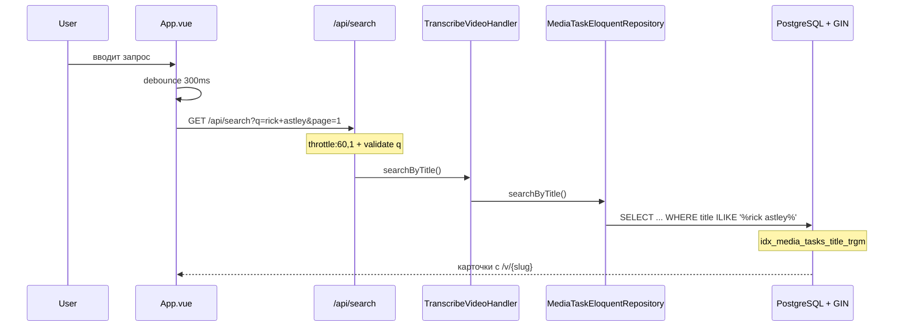

# План v2: Поиск по названиям видео + ссылка на историю

> **Ревизия 2** — учтены замечания ревью: ILIKE вместо LOWER/LIKE, GIN-индекс, ссылка на историю как UI-секция, wildcard-защита, slug-nullable, rate limiting, unit-тест handler.

## Обзор
Добавить поиск по названиям завершённых видео (в публичном индексе) с результатами на главной SPA-странице, а также UI-секцию истории.

## Соблюдение архитектуры
Следуем гексагональной архитектуре:
- **Domain**: без изменений
- **Application**: новый порт в `MediaTaskRepositoryInterface`, новый метод в `TranscribeVideoHandler`
- **Infrastructure**: реализация в `MediaTaskEloquentRepository`, endpoint в `TranscribeVideoController`, маршрут в `routes/api.php`, **миграция с GIN-индексом**
- **Frontend**: Vue 3 компонент в `App.vue`

---

## Список задач

### 0. Миграция: GIN-индекс для `title`
**Новый файл:** `database/migrations/2026_05_10_000007_add_title_trgm_index.php`

```sql
CREATE EXTENSION IF NOT EXISTS pg_trgm;
CREATE INDEX idx_media_tasks_title_trgm ON media_tasks USING GIN (title gin_trgm_ops);
```

`down()`: `DROP INDEX IF EXISTS idx_media_tasks_title_trgm;`

Без этого индекса `ILIKE '%query%'` делает full table scan. `pg_trgm` позволяет использовать GIN-индекс для префиксных/инфиксных поисков.

---

### 1. `MediaTaskRepositoryInterface` — добавить метод поиска
**Файл:** `app/Application/Ports/Output/MediaTaskRepositoryInterface.php`

```php
/**
 * Search completed (non-DMCA) tasks by title (case-insensitive partial match).
 * Uses PostgreSQL ILIKE with pg_trgm GIN index for performance.
 *
 * @return LengthAwarePaginator<int, MediaTask>
 */
public function searchByTitle(string $query, int $perPage, int $page): LengthAwarePaginator;
```

---

### 2. `MediaTaskEloquentRepository` — реализовать поиск
**Файл:** `app/Infrastructure/Adapters/Output/Persistence/MediaTaskEloquentRepository.php`

Ключевые решения:
- **`ILIKE`** вместо `LOWER(title) LIKE` — нативный PostgreSQL оператор, совместим с GIN-индексом `pg_trgm`
- **`addcslashes($query, '%_\\')`** — защита от wildcard flooding (`q=%%%%%%%%%%`)
- **Пагинация**: тот же паттерн, что и `findAllPaginated` — `LengthAwarePaginator` с маппингом через `toEntity()`
- Фильтры: `status = 'completed'`, `dmca_removed_at IS NULL`
- Сортировка: `created_at DESC`

```php
public function searchByTitle(string $query, int $perPage, int $page): LengthAwarePaginator
{
    $escaped = addcslashes($query, '%_\\');

    $queryBuilder = MediaTaskModel::query()
        ->where('status', TranscriptionStatus::Completed->value)
        ->whereNull('dmca_removed_at')
        ->whereRaw('title ILIKE ?', ['%' . $escaped . '%'])
        ->orderByDesc('created_at');

    /** @var LengthAwarePaginator<int, MediaTaskModel> $paginator */
    $paginator = $queryBuilder->paginate($perPage, ['*'], 'page', $page);

    $entities = $paginator->getCollection()->map(function (mixed $item): MediaTask {
        return $this->toEntity($item);
    });

    return new LengthAwarePaginator(
        $entities,
        $paginator->total(),
        $paginator->perPage(),
        $paginator->currentPage(),
    );
}
```

---

### 3. `TranscribeVideoHandler` — добавить метод
**Файл:** `app/Application/UseCases/TranscribeVideoHandler.php`

```php
/**
 * @return LengthAwarePaginator<int, MediaTask>
 */
public function searchByTitle(string $query, int $perPage, int $page): LengthAwarePaginator
{
    return $this->repository->searchByTitle($query, $perPage, $page);
}
```

> **Tech debt (не блокирует):** Handler растёт (7 публичных методов). В будущем можно выделить `MediaTaskQueryHandler` для read-операций.

---

### 4. `TranscribeVideoController` — добавить `search` endpoint
**Файл:** `app/Infrastructure/Adapters/Input/Web/TranscribeVideoController.php`

Endpoint: `GET /api/search?q=...&page=...&per_page=...`

- **Валидация `q`**: минимум 2 символа, максимум 100, запрет wildcard-only запросов (regex содержит хотя бы одну букву/цифру)
- **`per_page`**: default 15 (унифицировано с history), max 50
- **`page`**: min 1

**Пагинация с сохранением `q`** — ручное формирование `_links`:

```php
$baseUrl = '/api/search?q=' . urlencode($query) . '&per_page=' . $perPage;
'_links' => [
    'first' => $baseUrl . '&page=1',
    'prev'  => $currentPage > 1 ? $baseUrl . '&page=' . ($currentPage - 1) : null,
    'next'  => $hasMorePages ? $baseUrl . '&page=' . ($currentPage + 1) : null,
    'last'  => $baseUrl . '&page=' . $lastPage,
],
```

**slug может быть null** — `array_filter` в ответе:

```php
$data[] = array_filter([
    'task_id'      => $task->id(),
    'title'        => $task->title(),
    'youtube_url'  => $task->youtubeUrl()->value(),
    'duration_sec' => $task->durationSec(),
    'completed_at' => $task->completedAt()?->format('c'),
    '_links'       => array_filter([
        'public_page' => $task->slug() !== null ? '/v/' . $task->slug() : null,
    ]),
]);
```

---

### 5. `routes/api.php` — добавить маршрут
**Файл:** `routes/api.php`

```php
Route::get('/search', [TranscribeVideoController::class, 'search'])
    ->middleware('throttle:60,1');
```

Rate limiting 60 req/min — защита от DDoS-а. Консистентно с остальными эндпоинтами.

---

### 6. `App.vue` — добавить UI поиска и секцию истории
**Файл:** `resources/js/App.vue`

#### 6a. Секция истории (вместо ссылки на `/api/history`)
- После hero, перед формой транскрибации
- Заголовок "Recently Transcribed"
- Горизонтальный скролл карточек: название, длительность, ссылка `/v/{slug}`
- Данные через `GET /api/history/latest` (уже существует)
- Если `slug === null` — карточка без ссылки

#### 6b. Секция поиска
- Поле ввода с иконкой поиска, debounce 300ms
- Минимум 2 символа для активации

#### 6c. Результаты
- Карточки: название (ссылка `/v/{slug}` или текст), длительность, дата, YouTube-ссылка

#### 6d. Состояния
- Загрузка: skeleton
- Пусто: "No transcripts found matching your query."
- Ошибка: alert
- Короткий запрос: подсказка

#### 6e. Пагинация
Кнопка "Load more" внизу.

---

### 7. Тесты

#### 7a. Unit-тест `TranscribeVideoHandler::searchByTitle()`
**Новый файл:** `tests/Unit/Application/UseCases/TranscribeVideoHandlerSearchTest.php`
- Делегирование в репозиторий
- Возврат `LengthAwarePaginator`

#### 7b. Feature-тест `GET /api/search`
**Новый файл:** `tests/Feature/Feature/Seo/SearchControllerTest.php`
- Успешный поиск
- Пустой результат
- `q` < 2 символов -> 400
- Wildcard-only -> 400
- Исключение DMCA-removed
- Slug=null -> `public_page` отсутствует
- `_links` с правильным `q`

---

## Поток данных



---

## Сводка исправлений по ревью

| # | Замечание | Исправление |
|---|-----------|-------------|
| 1 | `LOWER(title) LIKE` | Заменён на `ILIKE` с GIN-индексом |
| 2 | Нет индекса | Миграция `000007` с `pg_trgm` |
| 3 | Ссылка на JSON | UI-секция "Recently Transcribed" |
| 4 | `q` в пагинации | Ручное формирование `_links` |
| 5 | Rate limiting | `throttle:60,1` |
| 6 | `per_page` default | Унифицирован: 15 |
| 7 | Wildcard flooding | `addcslashes` + regex |
| 8 | Unit-тест handler | `TranscribeVideoHandlerSearchTest` |
| 9 | Handler SRP | Tech debt |
| 10 | Slug nullable | `array_filter` в ответе |
