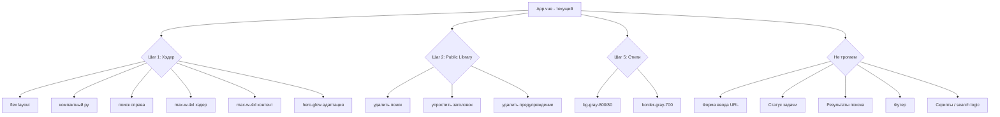

# План рефакторинга: Перенос поиска в глобальный хэдер

> **Дата:** 2026-05-11
> **Статус:** Draft — ожидает утверждения
> **Затрагивает:** только [`resources/js/App.vue`](resources/js/App.vue)
> **Бэкенд-изменения:** не требуются

---

## Задача

Переместить поле поиска из секции «Public Library» (где оно конфликтует со скроллом карточек) в глобальный хэдер страницы. Поиск должен стать dashboard-style элементом справа от бренда TubeSum, образуя единую горизонтальную панель.

---

## Текущее состояние (AS-IS)

### Структура хэдера (строки 4-29)

```html
<header class="relative overflow-hidden">
  <div class="hero-glow absolute inset-0 pointer-events-none"></div>
  <div class="max-w-3xl mx-auto px-4 sm:px-6 lg:px-8 py-12 sm:py-16 text-center relative">
    <h1 class="text-5xl sm:text-6xl ...">TubeSum</h1>
    <p class="text-lg sm:text-xl text-gray-400 mb-5">YouTube Transcriber & Summarizer</p>
    <!-- Бейджи: No Signup, AI Summary, Full Transcript -->
  </div>
</header>
```

**Проблемы текущего хэдера:**
- `text-center` — всё центрировано, нет горизонтального пространства для поиска
- `py-12 sm:py-16` — слишком высокий для navbar-стиля
- `max-w-3xl` — узкий контейнер

### Структура секции Public Library (строки 66-128)

```html
<section v-if="recentTasks.length > 0" class="mb-8">
  <div class="flex items-center justify-between mb-3 flex-wrap gap-2">
    <h2>Public Library</h2>
    <!-- 🔍 Поиск здесь — конфликтует с горизонтальным скроллом карточек -->
    <div class="relative w-full sm:w-56">
      <input v-model="searchQuery" ... @input="onSearchInput" />
    </div>
  </div>
  <!-- Горизонтальный скролл карточек -->
  <!-- Ссылка "Browse all summaries" -->
</section>
```

---

## Целевое состояние (TO-BE)

### Новый хэдер — dashboard-style

```
┌──────────────────────────────────────────────────────────────────┐
│  TubeSum  [No Signup] [AI Summary] [Full Transcript]    🔍 Search│
│  YouTube Transcriber & Summarizer                                 │
├──────────────────────────────────────────────────────────────────┤
│                                                                    │
│  ┌──────────────────────────────────────────────────────────────┐ │
│  │  [https://youtube.com/...                  ] [Transcribe]    │ │
│  └──────────────────────────────────────────────────────────────┘ │
│                                                                    │
│  Public Library                                                   │
│  ┌─────────┐ ┌─────────┐ ┌─────────┐ ┌─────────┐                │
│  │ 🖼️      │ │ 🖼️      │ │ 🖼️      │ │ 🖼️      │  → scroll      │
│  │ Title.. │ │ Title.. │ │ Title.. │ │ Title.. │                │
│  └─────────┘ └─────────┘ └─────────┘ └─────────┘                │
│  [Browse all summaries →]                                         │
│                                                                    │
│  Search Results (при активном поиске)                             │
│  ...                                                               │
└──────────────────────────────────────────────────────────────────┘
```

### Детальный макет хэдера

```
┌──────────────────────────────────────────────────────────────────────┐
│  🌟 hero-glow (фон)                                                  │
│  ┌────────────────────────────────────────────────────────────────┐  │
│  │  max-w-4xl mx-auto px-4 py-3 sm:py-4                           │  │
│  │  ┌──────────────────────────┐  ┌─────────────────────────────┐ │  │
│  │  │  TubeSum                 │  │  🔍 Search summaries...     │ │  │
│  │  │  YouTube Transcriber...  │  │                             │ │  │
│  │  │  [No Signup] [AI Summ.]  │  │                             │ │  │
│  │  │  [Full Transcript]       │  │                             │ │  │
│  │  └──────────────────────────┘  └─────────────────────────────┘ │  │
│  └────────────────────────────────────────────────────────────────┘  │
└──────────────────────────────────────────────────────────────────────┘

Mobile (<640px):
┌──────────────────────┐
│  TubeSum             │
│  [badges]            │
│  ┌──────────────────┐│
│  │ 🔍 Search...     ││
│  └──────────────────┘│
└──────────────────────┘
```

---

## Пошаговый план реализации

### Шаг 1: Реструктуризация хэдера

**Файл:** [`resources/js/App.vue`](resources/js/App.vue), строки 4-29

**Что изменить:**

1.1. Заменить `max-w-3xl` на `max-w-4xl` — дать больше горизонтального пространства.

1.2. Заменить `py-12 sm:py-16` на `py-3 sm:py-4` — сделать хэдер компактным.

1.3. Убрать `text-center` — контент больше не центрируется.

1.4. Добавить `flex items-center justify-between gap-4` на внутренний div.

1.5. Добавить `border-b border-gray-800/50` к хэдеру для визуального отделения.

1.6. Левая часть — бренд (сохраняем семантический `<h1>` для SEO и доступности):
```html
<div class="flex items-center gap-3 flex-wrap min-w-0">
  <div class="flex-shrink-0">
    <h1 class="text-xl sm:text-2xl font-bold bg-gradient-to-r from-blue-400 via-blue-300 to-blue-200 bg-clip-text text-transparent hover:from-blue-300 hover:via-blue-200 hover:to-blue-100 transition-all duration-300">
      <a href="/">TubeSum</a>
    </h1>
    <p class="text-xs text-gray-500 hidden sm:block">YouTube Transcriber & Summarizer</p>
  </div>
  <!-- Бейджи -->
  <div class="flex flex-wrap items-center gap-1.5">
    <span class="inline-flex items-center gap-1 px-2.5 py-0.5 rounded-full text-[11px] font-medium bg-gray-700/30 text-gray-500">
      <svg class="w-3 h-3 text-green-500">...</svg>
      No Signup
    </span>
    <span class="inline-flex items-center gap-1 px-2.5 py-0.5 rounded-full text-[11px] font-medium bg-gray-700/30 text-gray-500">
      <svg class="w-3 h-3 text-blue-400">...</svg>
      AI Summary
    </span>
    <span class="inline-flex items-center gap-1 px-2.5 py-0.5 rounded-full text-[11px] font-medium bg-gray-700/30 text-gray-500">
      <svg class="w-3 h-3 text-purple-400">...</svg>
      Full Transcript
    </span>
  </div>
</div>
```

1.7. Правая часть — поиск (новый блок):
```html
<div class="relative w-full sm:w-56 md:w-64 lg:w-72 flex-shrink-0">
  <svg class="absolute left-2.5 top-1/2 -translate-y-1/2 w-4 h-4 text-gray-500 pointer-events-none" fill="none" stroke="currentColor" viewBox="0 0 24 24"><path stroke-linecap="round" stroke-linejoin="round" stroke-width="2" d="M21 21l-6-6m2-5a7 7 0 11-14 0 7 7 0 0114 0z"/></svg>
  <input
    v-model="searchQuery"
    type="text"
    placeholder="Search summaries..."
    aria-label="Search summaries by title"
    class="w-full bg-gray-800/80 border border-gray-700 rounded-lg pl-8 pr-3 py-2 text-sm text-white placeholder-gray-500 focus:outline-none focus:ring-2 focus:ring-blue-500 focus:border-blue-500 transition-all duration-200"
    :class="{ 'pr-8': searchLoading }"
    :disabled="searchLoading"
    @input="onSearchInput"
    @keyup.escape="searchQuery = ''; onSearchInput()"
  />
  <p v-if="searchQuery.length === 1" class="mt-1 text-xs text-gray-500 text-right">Enter at least 2 characters</p>
  <svg v-if="searchLoading" class="absolute right-2.5 top-1/2 -translate-y-1/2 w-4 h-4 text-blue-400 animate-spin" fill="none" viewBox="0 0 24 24"><circle class="opacity-25" cx="12" cy="12" r="10" stroke="currentColor" stroke-width="4"/><path class="opacity-75" fill="currentColor" d="M4 12a8 8 0 018-8V0C5.373 0 0 5.373 0 12h4z"/></svg>
</div>
```

1.8. Синхронизировать ширину основного контента — заменить `max-w-3xl` → `max-w-4xl` на строке 31 (div-обёртка формы и карточек), чтобы ширина хэдера и контента совпадала:
```html
<div class="max-w-4xl mx-auto px-4 sm:px-6 lg:px-8 pb-12">
```

1.9. Скорректировать `.hero-glow` под компактную высоту хэдера — при `py-3 sm:py-4` свечение будет обрезано. Добавить `min-height: 80px` к элементу `.hero-glow` в `<style>` секции (или убрать `overflow-hidden` с хэдера и задать glow фиксированную высоту `h-20`).

---

### Шаг 2: Удаление поиска из секции Public Library

**Файл:** [`resources/js/App.vue`](resources/js/App.vue), строки 66-128

**Что изменить:**

2.1. Упростить заголовок секции — убрать `flex items-center justify-between` и поиск:

**Было (строки 67-86):**
```html
<div class="flex items-center justify-between mb-3 flex-wrap gap-2">
  <h2 class="text-lg font-semibold text-white flex items-center gap-2">
    <svg>...</svg>
    Public Library
  </h2>
  <!-- Inline search, compact -->
  <div class="relative w-full sm:w-56">
    <svg>...</svg>
    <input v-model="searchQuery" ... />
    <svg v-if="searchLoading">...</svg>
  </div>
</div>
<p v-if="searchQuery.length === 1" class="mt-1 text-xs text-gray-500">Enter at least 2 characters to search.</p>
```

**Стало:**
```html
<h2 class="text-lg font-semibold text-white flex items-center gap-2 mb-3">
  <svg class="w-5 h-5 text-blue-400" fill="none" stroke="currentColor" viewBox="0 0 24 24"><path stroke-linecap="round" stroke-linejoin="round" stroke-width="2" d="M19 11H5m14 0a2 2 0 012 2v6a2 2 0 01-2 2H5a2 2 0 01-2-2v-6a2 2 0 012-2m14 0V9a2 2 0 00-2-2M5 11V9a2 2 0 012-2m0 0V5a2 2 0 012-2h6a2 2 0 012 2v2M7 7h10"/></svg>
  Public Library
</h2>
```

2.2. Удалить строку `<p v-if="searchQuery.length === 1" ...>` — предупреждение перенесено в хэдер (см. Шаг 1.7).

---

### Шаг 3: Адаптация мобильной вёрстки

**Файл:** [`resources/js/App.vue`](resources/js/App.vue)

3.1. На мобильных (`< sm`):
- Хэдер stack'ается вертикально: сначала бренд + бейджи, затем поиск на всю ширину
- Это естественно достигается через `flex-wrap` на контейнере и `w-full sm:w-56` на поиске

3.2. Бейджи видны на всех разрешениях (`flex` без `hidden sm:flex`) — они компактные (`text-[11px]`, `px-2.5 py-0.5`) и не мешают на мобильных. Решение зафиксировано в Шаге 1.6.

3.3. Убедиться, что `gap-4` между брендом и поиском достаточен на всех разрешениях.

---

### Шаг 4: Проверка сохранения функциональности

**Критические инварианты:**

| # | Функция | Проверка |
|---|---------|----------|
| 1 | Поиск вызывает `/api/search?q=...` с дебаунсом 300ms | `onSearchInput()` не меняется |
| 2 | Минимум 2 символа для поиска | Логика в `onSearchInput()` не меняется |
| 3 | Результаты поиска отображаются в секции Search Results (строки 131-192) | Позиция `searchResults` в DOM не меняется |
| 4 | Load More работает | `searchLoadMore()` не меняется |
| 5 | Очистка поля сбрасывает результаты | `onSearchInput()` обрабатывает пустую строку |
| 6 | Индикатор загрузки (spinner) показывается | `searchLoading` ref не меняется |
| 7 | Ошибки поиска отображаются | `searchError` ref не меняется |
| 8 | Форма ввода URL остаётся на месте (после хэдера) | Не трогаем строки 33-63 |
| 9 | Статус задачи остаётся на месте | Не трогаем строки 203+ |
| 10 | Футер остаётся на месте | Не трогаем строки 399-442 |

---

### Шаг 5: Стилизация поиска (слито с Шагом 1)

Стили поиска уже определены в HTML-сниппете Шага 1.7. Детализация стилей здесь оставлена как справочная.

**Текущий стиль поиска (в Public Library):**
```
w-full bg-gray-700/80 border border-gray-600 rounded-lg pl-8 pr-3 py-2 text-sm
placeholder-gray-400
```

**Новый стиль (в хэдере):**
```
w-full bg-gray-800/80 border border-gray-700 rounded-lg pl-8 py-2 text-sm
placeholder-gray-500
:class="{ 'pr-8': searchLoading }" — динамический правый отступ при загрузке
```

**Отличия:**
- `bg-gray-700/80` → `bg-gray-800/80` (темнее, сливается с хэдером)
- `border-gray-600` → `border-gray-700` (мягче граница)
- `placeholder-gray-400` → `placeholder-gray-500` (менее яркий плейсхолдер)
- Иконка лупы: `text-gray-400` → `text-gray-500`
- Ширина: `w-56` → `sm:w-56 md:w-64 lg:w-72` (чуть шире на десктопе)
- Фокус: такой же `focus:ring-2 focus:ring-blue-500 focus:border-blue-500`
- Добавлен `@keyup.escape` для сброса поиска
- Динамический `pr-3` / `pr-8` в зависимости от `searchLoading`

---

## Диаграмма изменений



---

## Сводка изменений

| Файл | Строки | Тип изменения |
|------|--------|--------------|
| `resources/js/App.vue` | 4-29 | Полная замена хэдера: flex-контейнер, бренд слева, поиск справа, `<h1>` сохранён |
| `resources/js/App.vue` | 31 | `max-w-3xl` → `max-w-4xl` (синхронизация ширины контента с хэдером) |
| `resources/js/App.vue` | 67-86 | Удаление поиска из заголовка Public Library, упрощение до h2 |
| `resources/js/App.vue` | 87 | Удаление `<p>` с предупреждением о длине поискового запроса (перенесено в хэдер) |
| `resources/js/App.vue` | `<style>` | Корректировка `.hero-glow` под компактную высоту хэдера |

**Никакие другие файлы не изменяются.** Бэкенд, API, контроллеры, роуты, history.blade.php, welcome.blade.php — не затрагиваются.

---

## Риски

| Риск | Вероятность | Митигация |
|------|-------------|-----------|
| На мобильных поиск слишком широкий и выталкивает бренд | Низкая | `w-full` только на `< sm`, flex-wrap естественно stack'ает |
| Бейджи на мобильных занимают много места | Низкая | Бейджи компактные (`text-[11px]`, `px-2.5 py-0.5`), видны на всех разрешениях |
| Поиск в хэдере отвлекает от основного действия (форма ввода URL) | Низкая | Поиск — вторичное действие, расположен справа, визуально отделён |
| Hero-glow эффект конфликтует с новым компактным layout | Низкая | Шаг 1.9: добавить `min-height` к `.hero-glow` или убрать `overflow-hidden`; glow — абсолютно позиционированный фон, не влияет на flex-поток |

---

## Критерии приёмки

1. Поиск отображается в хэдере справа от бренда TubeSum и бейджей.
2. Поиск отсутствует в секции Public Library.
3. Заголовок Public Library отображается корректно (только h2 с иконкой).
4. Поиск работает: ввод 2+ символов → дебаунс 300ms → запрос `/api/search` → результаты под Public Library.
5. Очистка поля поиска сбрасывает результаты и возвращает вид library-карточек.
6. На мобильных (<640px) хэдер stack'ается вертикально: бренд → поиск.
7. Форма ввода URL, статус задачи, футер и вся остальная функциональность не затронуты.
8. Внешний вид соответствует dashboard-style: тёмный фон, мягкие границы, иконка лупы.
9. Поиск виден и работает даже когда `recentTasks` пуст (нет карточек Public Library).
10. Семантический `<h1>` сохранён: `<h1><a href="/">TubeSum</a></h1>`.
11. Ширина хэдера и основного контента совпадают (`max-w-4xl`).
12. Подсказка «Enter at least 2 characters» показывается под полем поиска в хэдере при вводе ровно 1 символа.
13. Спиннер загрузки не перекрывает текст в поле ввода (динамический `pr-8` при `searchLoading`).
14. Нажатие Escape очищает поисковый запрос и сбрасывает результаты.
