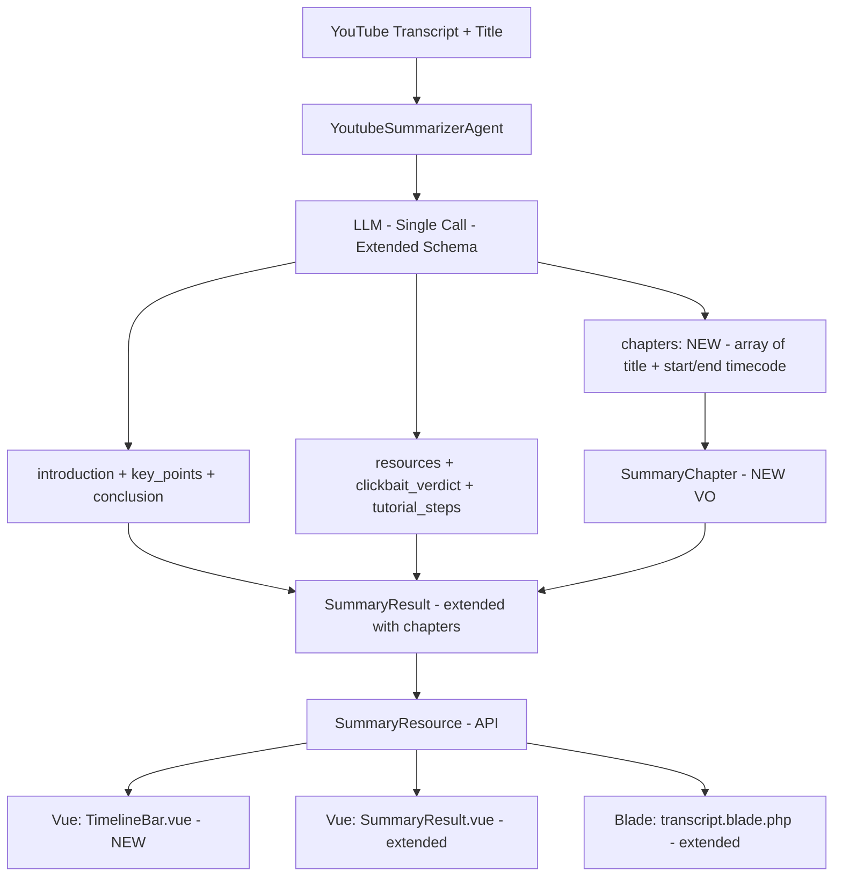
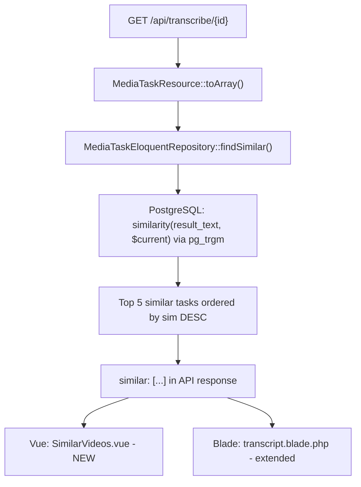

# Auto-Chapters + Timeline & Similar Videos — Implementation Plan

> **Date:** 2026-05-23
> **Status:** Draft
> **Context:** Implementation plan for features #4 (Автоглавы + Таймлайн) and #8 (Похожие видео) from the feature roadmap spec.

---

## Context: What's Already Done

The "Zero-Cost Triad" (Resource Catcher, Clickbait Check, Tutorial Checklist) is fully implemented across all layers: Domain VO → AI Agent schema → Adapter parsing → API serialization → Vue SPA tabs → Blade public page. These two new features follow the exact same architectural patterns.

---

## Feature A: Auto-Chapters + Timeline (Вариант A)

### A.1 What It Does

AI groups the transcript into thematic chapters with titles and time ranges. The frontend renders a horizontal timeline bar with chapter segments and key_point markers. Click → jump to transcript fragment or open YouTube at timecode.

### A.2 Approach: AI-кластеризация key_points

Existing `key_points` already contain timecode + title + details. The AI prompt is extended with a grouping instruction. Chapters are generated in the same single LLM call — **zero extra API cost**.



### A.3 Data Model

#### SummaryChapter (new Value Object)

```php
// app/Domain/ValueObjects/SummaryChapter.php
final readonly class SummaryChapter
{
    public function __construct(
        public string $title,
        public string $startTimecode,  // "00:00:00" or "00:03:20"
        public string $endTimecode,
    ) {}

    /** @return array{title: string, start_timecode: string, end_timecode: string} */
    public function toArray(): array
    {
        return [
            'title'          => $this->title,
            'start_timecode' => $this->startTimecode,
            'end_timecode'   => $this->endTimecode,
        ];
    }

    /** @param array{title: string, start_timecode: string, end_timecode: string} $data */
    public static function fromArray(array $data): self
    {
        return new self(
            title: $data['title'],
            startTimecode: $data['start_timecode'],
            endTimecode: $data['end_timecode'],
        );
    }
}
```

#### SummaryResult — add `chapters` field

```diff
  final readonly class SummaryResult
  {
      public function __construct(
          private string $introduction,
          private array $keyPoints,
          private ?string $conclusion = null,
          private array $resources = [],
          private ?ClickbaitVerdict $clickbaitVerdict = null,
          private array $tutorialSteps = [],
+         private array $chapters = [],
      ) {}
  }
```

Field `chapters` is always present (empty array for old transcriptions). Added to `toArray()` and `fromArray()` under key `chapters`.

### A.4 Super-Prompt (Production-Ready)

The existing [`YoutubeSummarizerAgent::instructions()`](app/Ai/Agents/YoutubeSummarizerAgent.php:25) is replaced with the refined super-prompt below. This single prompt covers ALL features — summary, clickbait, resources, tutorial steps, AND chapters — in one LLM call:

```text
You are an expert content analyzer and technical extractor. Your task is to analyze the provided video transcript and its title, and extract highly structured, actionable information.

You must return a valid JSON object strictly adhering to the requested schema.

### Core Instructions:

1. SUMMARY:
- "introduction": A concise 2-3 sentence overview of the video's core topic.
- "key_points": Extract the most valuable insights. Each point must include the nearest 'timecode', a short 'title', and specific 'details'.
- "conclusion": A 1-2 sentence final takeaway.

2. CLICKBAIT REALITY CHECK:
- Compare the provided "Video Title" with the actual transcript content.
- "clickbait_verdict.score": Rate how misleading the title is from 0 to 100. (0-30 = honest, 31-60 = slightly exaggerated, 61-100 = pure clickbait).
- "clickbait_verdict.comment": A sharp, one-sentence verdict explaining why.

3. RESOURCE CATCHER:
- Extract all mentioned tools, books, services, people, and external links.
- "resources": Array of objects. "type" MUST be one of: ["book", "tool", "service", "person", "link"]. Provide the "name" and the "url" (if explicitly mentioned, otherwise null).

4. TUTORIAL CHECKLIST:
- Determine if the video is an instructional tutorial/how-to.
- If YES: Extract sequential, executable steps into "tutorial_steps" (include step number, nearest timecode, and concise action). Include exact commands or settings if mentioned.
- If NO (e.g., podcast, vlog, opinion piece): Return an empty array [] for "tutorial_steps".

5. AUTO-CHAPTERS:
- Group the "key_points" into 3 to 8 logical, thematic chapters.
- Chapters must cover the entire video sequentially without time gaps.
- "chapters": Array of objects with "title", "start_timecode", and "end_timecode". Use format MM:SS or HH:MM:SS.
```

### A.4b Production Schema Enforcement: `json_schema` + `strict: true`

> **Critical:** The current implementation uses Laravel AI SDK's `HasStructuredOutput` interface which auto-generates JSON Schema from the `schema()` method. However, to guarantee the LLM **never** hallucinates missing keys or wrong types, we should use OpenAI's native `response_format.json_schema` with `strict: true`.

**Decision point — two implementation paths:**

| Path | Approach | Pros | Cons |
|------|----------|------|------|
| **A (current)** | Laravel AI SDK `HasStructuredOutput` | Clean, framework-integrated, provider-agnostic | May not pass `strict: true`; depends on SDK version |
| **B (recommended)** | Raw OpenAI PHP Client with `json_schema` + `strict: true` | Ironclad schema enforcement; no hallucinations | Ties adapter to OpenAI; breaks provider abstraction |

**Recommendation:** Path A for the adapter (keep provider abstraction), but verify that the SDK passes `strict: true`. If it doesn't, add a thin wrapper or configure the SDK to enable strict mode. The `webmozart/assert` validations in [`LaravelAiSummaryAdapter`](app/Infrastructure/Adapters/Output/Summary/LaravelAiSummaryAdapter.php:49) serve as the safety net — they throw `SummaryFailedException` on schema violations regardless of LLM behavior.

**If adopting Path B**, the adapter would bypass the Agent and call OpenAI directly:

```php
$response = $client->chat()->create([
    'model' => 'gpt-4o-mini',
    'messages' => [
        ['role' => 'system', 'content' => $systemPrompt],
        ['role' => 'user', 'content' => "Video Title: {$title}\n\nTranscript: {$transcript}"]
    ],
    'response_format' => [
        'type' => 'json_schema',
        'json_schema' => [
            'name' => 'video_analysis_result',
            'schema' => [
                'type' => 'object',
                'properties' => [
                    'introduction' => ['type' => 'string'],
                    'key_points' => [
                        'type' => 'array',
                        'items' => [
                            'type' => 'object',
                            'properties' => [
                                'timecode' => ['type' => 'string'],
                                'title' => ['type' => 'string'],
                                'details' => ['type' => 'string']
                            ],
                            'required' => ['timecode', 'title', 'details'],
                            'additionalProperties' => false
                        ]
                    ],
                    'conclusion' => ['type' => 'string'],
                    'resources' => [
                        'type' => 'array',
                        'items' => [
                            'type' => 'object',
                            'properties' => [
                                'type' => ['type' => 'string', 'enum' => ['book', 'tool', 'service', 'person', 'link']],
                                'name' => ['type' => 'string'],
                                'url' => ['type' => ['string', 'null']]
                            ],
                            'required' => ['type', 'name', 'url'],
                            'additionalProperties' => false
                        ]
                    ],
                    'clickbait_verdict' => [
                        'type' => 'object',
                        'properties' => [
                            'score' => ['type' => 'integer'],
                            'comment' => ['type' => 'string']
                        ],
                        'required' => ['score', 'comment'],
                        'additionalProperties' => false
                    ],
                    'tutorial_steps' => [
                        'type' => 'array',
                        'items' => [
                            'type' => 'object',
                            'properties' => [
                                'step' => ['type' => 'integer'],
                                'time' => ['type' => 'string'],
                                'action' => ['type' => 'string']
                            ],
                            'required' => ['step', 'time', 'action'],
                            'additionalProperties' => false
                        ]
                    ],
                    'chapters' => [
                        'type' => 'array',
                        'items' => [
                            'type' => 'object',
                            'properties' => [
                                'title' => ['type' => 'string'],
                                'start_timecode' => ['type' => 'string'],
                                'end_timecode' => ['type' => 'string']
                            ],
                            'required' => ['title', 'start_timecode', 'end_timecode'],
                            'additionalProperties' => false
                        ]
                    ]
                ],
                'required' => ['introduction', 'key_points', 'conclusion', 'resources', 'clickbait_verdict', 'tutorial_steps', 'chapters'],
                'additionalProperties' => false
            ],
            'strict' => true
        ]
    ]
]);
```

**Decision to make during implementation:** Path A (keep SDK) or Path B (raw OpenAI). Path B is preferred for production reliability but requires accepting OpenAI vendor lock-in at the adapter level. The `SummaryProviderInterface` abstraction remains — you can always add a second adapter for other providers.

### A.4c Agent Schema Extension (Path A — Laravel AI SDK)

If keeping Path A, extend [`YoutubeSummarizerAgent::schema()`](app/Ai/Agents/YoutubeSummarizerAgent.php:70) with chapters:

```php
'chapters' => $schema->array()->items(
    $schema->object(fn (JsonSchema $s): array => [
        'title'          => $s->string()->required(),
        'start_timecode' => $s->string()->description(
            'Format MM:SS or HH:MM:SS'
        )->required(),
        'end_timecode'   => $s->string()->description(
            'Format MM:SS or HH:MM:SS'
        )->required(),
    ]),
)->required(),
```

> **Note:** The Laravel AI SDK may not support `additionalProperties: false` or `strict: true` depending on the version. The `webmozart/assert` validations in the adapter are the safety net.

### A.4d Prompt Delivery Format

The prompt is assembled in [`LaravelAiSummaryAdapter::summarize()`](app/Infrastructure/Adapters/Output/Summary/LaravelAiSummaryAdapter.php:26):

```php
$prompt = sprintf(
    "Summarize the following transcript in maximum %d words. Style: %s.\n\nTranscript:\n%s",
    $options->maxWords(),
    $options->style(),
    $transcriptText->value(),
);

if ($options->videoTitle() !== null) {
    $prompt .= "\n\nVideo Title: " . $options->videoTitle();
}
```

The `YoutubeSummarizerAgent` appends its `instructions()` as the system prompt via the SDK. The transcript + title are the user message. The LLM sees:

```
System: [instructions() — the super-prompt above]
User:   Summarize the following transcript in maximum 250 words. Style: concise.

        Transcript:
        [full transcript text with timecodes]

        Video Title: How to Build a Laravel SaaS in 2026
```

> **Important:** With the refined super-prompt, the `Summarize the following transcript...` prefix is redundant since the system prompt already contains all instructions. The user message can be simplified to just the transcript + title. This is a minor optimization — the current format works fine as-is.

### A.5 Adapter Parsing

In [`LaravelAiSummaryAdapter::summarize()`](app/Infrastructure/Adapters/Output/Summary/LaravelAiSummaryAdapter.php:136), add after tutorial_steps parsing:

```php
// Parse chapters
Assert::keyExists($data, 'chapters', 'Missing key: chapters.');
Assert::isArray($data['chapters'], 'chapters must be an array.');

$chapters = [];
foreach ($data['chapters'] as $index => $ch) {
    Assert::isArray($ch, sprintf('chapters[%d] must be an array.', $index));
    Assert::keyExists($ch, 'title', sprintf('chapters[%d] missing title.', $index));
    Assert::keyExists($ch, 'start_timecode', sprintf('chapters[%d] missing start_timecode.', $index));
    Assert::keyExists($ch, 'end_timecode', sprintf('chapters[%d] missing end_timecode.', $index));
    Assert::string($ch['title'], sprintf('chapters[%d].title must be a string.', $index));
    Assert::string($ch['start_timecode'], sprintf('chapters[%d].start_timecode must be a string.', $index));
    Assert::string($ch['end_timecode'], sprintf('chapters[%d].end_timecode must be a string.', $index));

    $chapters[] = new SummaryChapter(
        title: $ch['title'],
        startTimecode: $ch['start_timecode'],
        endTimecode: $ch['end_timecode'],
    );
}

return new SummaryResult(
    introduction: $data['introduction'],
    keyPoints: $keyPoints,
    conclusion: $conclusion,
    resources: $resources,
    clickbaitVerdict: $clickbaitVerdict,
    tutorialSteps: $tutorialSteps,
    chapters: $chapters,
);
```

### A.6 API Serialization

#### SummaryResource

Add to `toArray()`:

```php
'chapters' => array_map(
    fn (\App\Domain\ValueObjects\SummaryChapter $ch) => [
        'title'          => $ch->title,
        'start_timecode' => $ch->startTimecode,
        'end_timecode'   => $ch->endTimecode,
    ],
    $this->resource->chapters(),
),
```

#### SummarySchema

Add to OpenAPI schema:

```php
new OA\Property(
    property: 'chapters',
    type: 'array',
    items: new OA\Items(
        required: ['title', 'start_timecode', 'end_timecode'],
        properties: [
            new OA\Property(property: 'title', type: 'string', example: 'Introduction'),
            new OA\Property(property: 'start_timecode', type: 'string', example: '00:00:00'),
            new OA\Property(property: 'end_timecode', type: 'string', example: '00:05:30'),
        ],
        type: 'object',
    ),
),
```

### A.7 Frontend — TimelineBar.vue

**Component:** `resources/js/components/TimelineBar.vue`

```
┌─────────────────────────────────────────────────┐
│ Chapter 1   │ Chapter 2    │ Chapter 3          │
│ ████████████│████████████  │████████████████████ │
│ 00:00    03:20         07:45              15:30 │
│   ● kp_1      ● kp_2        ● kp_3  ● kp_4     │
└─────────────────────────────────────────────────┘
```

Props:
- `chapters`: `Array<{title, start_timecode, end_timecode}>`
- `keyPoints`: `Array<{timecode, title, details}>`
- `durationSec`: `number` — total video duration for proportional widths
- `onSeek`: `(seconds: number) => void`

Behavior:
- Horizontal flex container with segments proportional to duration
- Chapter labels on hover
- Key point markers (●) positioned proportionally on the bar
- Click on chapter → emit seek to chapter start
- Click on marker → emit seek to key point timecode
- Color-coded active chapter (optional: based on current playback time)

### A.8 Integration Points

| Component | Integration |
|-----------|-------------|
| `TaskStatusCard.vue` | Add "Chapters" tab between Summary and Transcript; embed TimelineBar |
| `SummaryResult.vue` | Add collapsible chapters list below key_points (if chapters present) |
| `transcript.blade.php` | Add chapters section between Clickbait Verdict and Resources; render as clickable chapter cards |

### A.9 Database

**No migration needed.** `chapters` is stored inside the existing JSONB `summary` column. New keys coexist with old data. Old transcriptions without chapters simply return an empty array.

---

## Feature B: Similar Videos (Semantic Recommendations)

### B.1 What It Does

After viewing a transcript, show a block "Similar Transcriptions" with other videos of similar content. Uses PostgreSQL `pg_trgm` for trigram-based similarity scoring on `result_text`.

### B.2 Architecture



### B.3 Why pg_trgm Is the Right Choice

`pg_trgm` is already installed (migration [`2026_05_10_000007`](database/migrations/2026_05_10_000007_add_title_trgm_index.php:22)). The `similarity()` function compares trigram sets of two texts — perfect for finding transcriptions with overlapping vocabulary/topics. It's:

- **Zero infrastructure cost** — no separate vector DB or embedding service
- **Real-time** — no async index rebuilds
- **Good enough for v1** — trigram overlap on long texts correlates well with topical similarity
- **Already production-proven** — the title search ILIKE + pg_trgm is already live

### B.4 Migration — GIN Index on result_text

**New file:** `database/migrations/2026_05_23_add_text_trgm_index.php`

```php
public function up(): void
{
    if (DB::getDriverName() !== 'pgsql') {
        return;
    }

    DB::statement('CREATE EXTENSION IF NOT EXISTS pg_trgm');

    DB::statement(
        'CREATE INDEX IF NOT EXISTS idx_media_tasks_text_trgm ON media_tasks USING GIN (result_text gin_trgm_ops)',
    );
}

public function down(): void
{
    if (DB::getDriverName() !== 'pgsql') {
        return;
    }

    DB::statement('DROP INDEX IF EXISTS idx_media_tasks_text_trgm');
}
```

### B.5 Repository — findSimilar()

#### Interface

Add to [`MediaTaskRepositoryInterface`](app/Application/Ports/Output/MediaTaskRepositoryInterface.php:13):

```php
/**
 * Find similar completed transcriptions based on text similarity (pg_trgm).
 *
 * @return array<int, array{task_id: string, video_id: string, title: string, slug: string|null, similarity: float}>
 */
public function findSimilar(string $taskId, int $limit = 5): array;
```

#### Implementation

In [`MediaTaskEloquentRepository`](app/Infrastructure/Adapters/Output/Persistence/MediaTaskEloquentRepository.php):

```php
public function findSimilar(string $taskId, int $limit = 5): array
{
    $task = $this->findById($taskId);

    if ($task === null || $task->resultText() === null) {
        return [];
    }

    $currentText = $task->resultText()->value();

    return MediaTaskModel::where('status', 'completed')
        ->where('task_id', '!=', $taskId)
        ->whereNotNull('result_text')
        ->where('is_dmca_removed', false)
        ->select('task_id', 'video_id', 'title', 'slug')
        ->selectRaw('similarity(result_text, ?) as sim', [$currentText])
        ->whereRaw('similarity(result_text, ?) > 0.05', [$currentText])
        ->orderBy('sim', 'desc')
        ->limit($limit)
        ->get()
        ->map(fn ($row) => [
            'task_id'    => $row->task_id,
            'video_id'   => $row->video_id,
            'title'      => $row->title,
            'slug'       => $row->slug,
            'similarity' => round((float) $row->sim, 4),
        ])
        ->all();
}
```

Key design decisions:
- **`similarity() > 0.05` threshold** — filters out noise. Below 0.05 is essentially random trigram overlap on English text.
- **Limit 5** — keeps response small and aligned with the spec.
- **Excludes DMCA-removed tasks** — only public content shown.
- **Returns slugs** — enables `_links.public_page` in the API response.

### B.6 API Serialization

#### MediaTaskResource

Add to `toArray()` inside the `Completed` status block:

```php
if ($this->resource->status() === TranscriptionStatus::Completed) {
    // ... existing fields ...

    // Similar videos
    $similarTasks = app(MediaTaskRepositoryInterface::class)
        ->findSimilar($this->resource->id(), limit: 5);

    if (count($similarTasks) > 0) {
        $data['similar'] = array_map(fn (array $t) => [
            'task_id'    => $t['task_id'],
            'video_id'   => $t['video_id'],
            'title'      => $t['title'],
            'similarity' => $t['similarity'],
            '_links'     => array_filter([
                'public_page' => $t['slug'] !== null ? '/v/' . $t['slug'] : null,
                'youtube'     => 'https://youtube.com/watch?v=' . $t['video_id'],
            ]),
        ], $similarTasks);
    }
}
```

> **Architecture Note:** Using `app()` directly in a Resource is a pragmatic choice here. The alternative (pre-fetching in controller, passing via constructor) adds complexity without meaningful testability gain for a read-only similarity query. If this pattern becomes common, extract a `SimilarVideosProviderInterface` port.

### B.7 Frontend — SimilarVideos.vue

**Component:** `resources/js/components/SimilarVideos.vue`

Props:
- `videos`: `Array<{task_id, video_id, title, similarity, _links}>`

Renders a horizontal card row (or grid on mobile):
- Each card: thumbnail (via `img.youtube.com/vi/{video_id}/mqdefault.jpg`), title, similarity percentage
- Click → navigate to public page (`_links.public_page`) or open YouTube (`_links.youtube`)
- Empty state: nothing rendered (component conditionally shown by parent)

### B.8 Integration Points

| Component | Integration |
|-----------|-------------|
| `TaskStatusCard.vue` | Add `SimilarVideos` below the tab content area (after the `v-if="task.status === 'completed' && task.result"` block), visible regardless of active tab |
| `transcript.blade.php` | Add similar videos section after the transcript, before the CTA banner. Server-side: controller fetches similar tasks and passes to view |

### B.9 Controller Changes

#### For SPA (TranscribeVideoController)

The SPA fetches `GET /api/transcribe/{id}` → `MediaTaskResource` already handles the `similar` block via `findSimilar()` call inside `toArray()`. No controller change needed if we use the `app()` approach in the Resource.

Alternative (cleaner): inject `MediaTaskRepositoryInterface` into controller, call `findSimilar()`, and pass to `MediaTaskResource` constructor as additional data. This avoids the `app()` call in the Resource.

**Recommendation:** Use the controller injection approach for architectural purity:

```php
// In TranscribeVideoController::show()
$similar = $this->mediaTaskRepository->findSimilar($task->id(), limit: 5);

return new MediaTaskResource($task, similar: $similar);
```

Then `MediaTaskResource` receives `similar` via constructor:

```php
public function __construct($resource, private array $similar = [])
{
    parent::__construct($resource);
}
```

#### For Blade (PublicTranscriptController)

Already fetches the task. Add `findSimilar()` call and pass to view:

```php
$similar = $this->mediaTaskRepository->findSimilar($task->id(), limit: 5);
```

---

## Complete File Map

### Feature A: Auto-Chapters + Timeline

| # | File | Action | Layer |
|---|------|--------|-------|
| A1 | `app/Domain/ValueObjects/SummaryChapter.php` | **Create** | Domain |
| A2 | `tests/Unit/Domain/ValueObjects/SummaryChapterTest.php` | **Create** | Test |
| A3 | `app/Domain/ValueObjects/SummaryResult.php` | **Modify** — add `chapters` field, getter, toArray, fromArray | Domain |
| A4 | `tests/Unit/Domain/ValueObjects/SummaryResultTest.php` | **Modify** — add chapters test cases | Test |
| A5 | `app/Ai/Agents/YoutubeSummarizerAgent.php` | **Replace** — full instructions() with super-prompt; extend schema() with chapters | AI Agent |
| A6 | `app/Infrastructure/Adapters/Output/Summary/LaravelAiSummaryAdapter.php` | **Modify** — parse chapters; 🚨 decision: Path A (SDK) vs Path B (raw OpenAI + strict:true) | Infrastructure |
| A7 | `app/Infrastructure/Adapters/Input/Web/Resources/SummaryResource.php` | **Modify** — serialize chapters | Presentation |
| A8 | `app/Infrastructure/Adapters/Input/Web/OpenApi/Schemas/SummarySchema.php` | **Modify** — add chapters OpenAPI schema | Presentation |
| A9 | `resources/js/components/TimelineBar.vue` | **Create** | Frontend |
| A10 | `resources/js/components/TaskStatusCard.vue` | **Modify** — add Chapters tab with TimelineBar | Frontend |
| A11 | `resources/js/components/SummaryResult.vue` | **Modify** — add collapsible chapters list | Frontend |
| A12 | `resources/views/transcript.blade.php` | **Modify** — add chapters section | Frontend |

### Feature B: Similar Videos

| # | File | Action | Layer |
|---|------|--------|-------|
| B1 | `database/migrations/2026_05_23_add_text_trgm_index.php` | **Create** | Infrastructure |
| B2 | `app/Application/Ports/Output/MediaTaskRepositoryInterface.php` | **Modify** — add `findSimilar()` | Application |
| B3 | `app/Infrastructure/Adapters/Output/Persistence/MediaTaskEloquentRepository.php` | **Modify** — implement `findSimilar()` | Infrastructure |
| B4 | `tests/Unit/Infrastructure/Adapters/Output/Persistence/MediaTaskEloquentRepositoryTest.php` | **Modify** — add findSimilar test cases | Test |
| B5 | `app/Infrastructure/Adapters/Input/Web/Resources/MediaTaskResource.php` | **Modify** — add `similar` block | Presentation |
| B6 | `app/Infrastructure/Adapters/Input/Web/TranscribeVideoController.php` | **Modify** — pass similar data to resource | Presentation |
| B7 | `resources/js/components/SimilarVideos.vue` | **Create** | Frontend |
| B8 | `resources/js/components/TaskStatusCard.vue` | **Modify** — embed SimilarVideos below tabs | Frontend |
| B9 | `resources/views/transcript.blade.php` | **Modify** — add similar videos section | Frontend |

---

## Execution Order

Features A and B are **independent** — they touch different domain objects, different repositories, and different frontend components. They can be implemented in parallel or sequentially.

### Sequential Order (recommended)

```
Phase 1: Feature A (Chapters) — Domain → Agent → Adapter → API → Frontend
Phase 2: Feature B (Similar) — Migration → Repository → API → Frontend
```

### Task Breakdown for Subagent-Driven Development

**Feature A tasks** (can run in subagent):
1. A1-A4: Domain layer (SummaryChapter VO + SummaryResult extension + tests)
2. A5-A6: AI Agent + Adapter (prompt extension + parsing)
3. A7-A8: API layer (SummaryResource + SummarySchema)
4. A9-A12: Frontend (TimelineBar + integrations)

**Feature B tasks** (can run in subagent):
1. B1-B3: Infrastructure (migration + repository)
2. B4: Tests
3. B5-B6: API layer (MediaTaskResource + controller)
4. B7-B9: Frontend (SimilarVideos + integrations)

---

## Acceptance Criteria

After implementation, the following must hold:

- [ ] `composer check` passes (phpstan level 9, phpcs, deptrac, pest)
- [ ] `SummaryChapter` has unit tests (create, toArray, fromArray)
- [ ] `SummaryResult` tests include chapters in serialization round-trip
- [ ] `MediaTaskEloquentRepository::findSimilar()` has test coverage
- [ ] `TimelineBar.vue` renders correctly with 0 chapters, 1 chapter, and N chapters
- [ ] `SimilarVideos.vue` renders correctly with 0, 1, and 5 similar videos
- [ ] Old transcriptions without chapters don't break (empty array returned)
- [ ] Old transcriptions without similar videos don't break (empty array returned)
- [ ] Public Blade page renders chapters and similar videos correctly
- [ ] Architecture boundaries preserved (no Domain → Infrastructure dependencies)
- [ ] No migration conflicts (new migration runs after existing ones)
- [ ] pg_trgm GIN index created on `result_text`
- [ ] 🚨 Decision documented: Path A (SDK) vs Path B (raw OpenAI + `strict: true`). If Path B, adapter must still implement `SummaryProviderInterface`
- [ ] Super-prompt deployed to `YoutubeSummarizerAgent::instructions()` — all 5 sections present
- [ ] `additionalProperties: false` enforced — either via SDK config or `webmozart/assert` safety net
- [ ] LLM responses with missing `chapters` key don't crash — `Assert::keyExists` catches and throws `SummaryFailedException`
