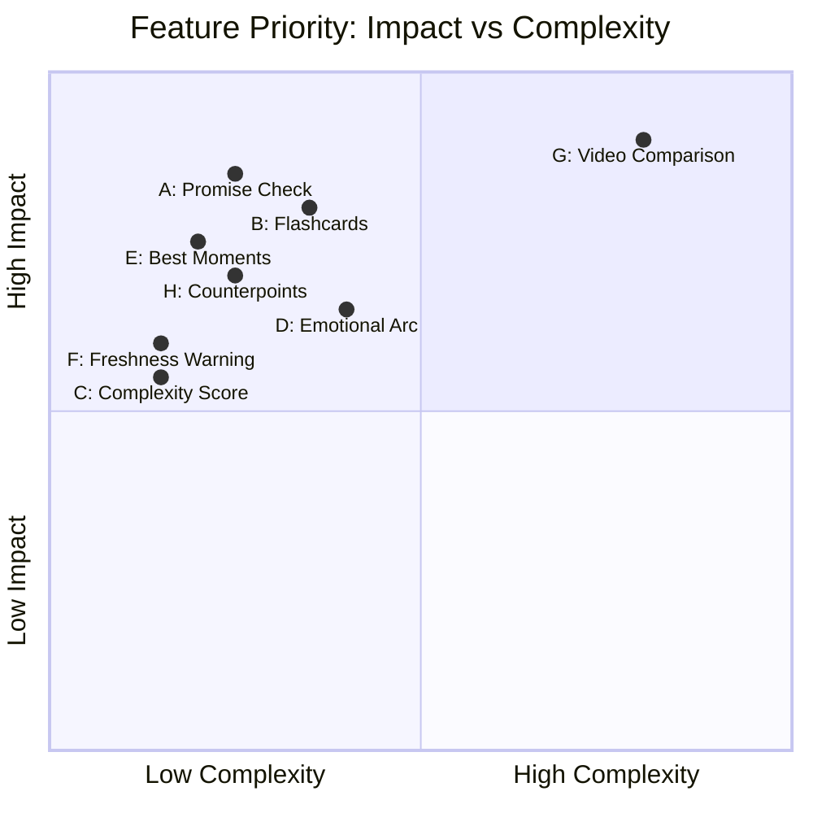

# New Feature Suggestions for YTTSCRB — Beyond the Existing Roadmap

> **Date:** 2026-05-24
> **Status:** Analysis
> **Context:** Deep analysis of the codebase, PRD, existing spec (22 features), and identification of genuinely new feature opportunities.

---

## What Already Exists

### Core Pipeline (DONE)
- YouTube URL → yt-dlp subs (zero-cost) → Groq Whisper API ($0.03/hr) → GPT-4o-mini summary
- Hexagonal Architecture (Ports & Adapters): Domain / Application / Infrastructure
- `durable-workflow/workflow` orchestration with Waterline UI
- Vue 3 SPA + TailwindCSS + Blade public transcript pages
- Public library, DMCA removal, Telegram feedback, History, Latest Video

### "Zero-Cost Triad" (IN PROGRESS)
These extend the single LLM call with additional output fields:
| # | Feature | Domain VO | Status |
|---|---------|-----------|--------|
| 1 | **Resource Catcher** | `ResourceItem` | Code done, UI pending |
| 2 | **Clickbait Reality Check** | `ClickbaitVerdict` | Code done, UI pending |
| 3 | **Tutorial Checklist** | `TutorialStep` | Code done, UI pending |

### Auto-Chapters (RECENTLY ADDED)
| # | Feature | Domain VO | Status |
|---|---------|-----------|--------|
| 4 | **Auto-Chapters + Timeline** | `SummaryChapter` | Code done, `TimelineBar.vue` pending |

---

## What's Already Planned (22 features in spec)

The [`docs/superpowers/spec`](docs/superpowers/spec) already covers:

| # | Feature | Complexity | Priority |
|---|---------|------------|----------|
| 5 | Readable Transcript (AI formatting) | Medium | ⭐⭐⭐⭐⭐ |
| 6 | Content Remix (LinkedIn/Twitter/Email/Blog) | Low | ⭐⭐⭐⭐⭐ |
| 7 | Full-Text Search (PostgreSQL tsvector) | Low | ⭐⭐⭐⭐ |
| 8 | Similar Videos (pg_trgm) | Low | ⭐⭐⭐⭐ |
| 9 | Cohort Analytics (user_events) | Low | ⭐⭐⭐⭐ |
| 10 | Dashboard Statistics | Low | ⭐⭐⭐⭐ |
| 11 | Export PDF/SRT | Low | ⭐⭐⭐⭐ |
| 12 | Public SEO Pages | Low | ✅ Partial |
| 13 | Chat with Video (RAG) | High | ⭐⭐⭐ |
| 14 | Telegram Bot | Low | ⭐⭐⭐ |
| 15 | Subscriptions (Stripe) | Medium | ⭐⭐⭐ |
| 16 | Batch Playlists | High | ⭐⭐⭐ |
| 17 | Export to Notion | Low | ⭐⭐⭐ |
| 18 | Speaker Diarization | High | ⭐⭐⭐ |
| 19 | Channel Monitoring | Medium | ⭐⭐⭐ |
| 20 | Webhooks / Public API | Medium | ⭐⭐ |
| 21 | Diff Transcripts | Low | ⭐⭐ |
| 22 | Browser Extension | High | ⭐⭐ |

---

## 8 Genuinely New Feature Suggestions

These are NOT variants of anything in the existing roadmap. Each suggestion follows the same architectural pattern already established in the project: extend `YoutubeSummarizerAgent` prompt + schema → new VO in `SummaryResult` → parse in adapter → serialize in resource → Vue component.

---

### Feature A: "Did They Deliver?" Promise Check

**What it does:** AI parses the video title for explicit promises/claims (e.g., "10 Ways to Boost Productivity", "How to Build X in 5 Minutes") and verifies whether the content actually delivers on them. This is deeper than clickbait detection — it's a structured checklist of promises vs. delivery.

**Why it's different from Clickbait:** Clickbait gives a single score (0-100) on overall title honesty. Promise Check gives an itemized report: "Title promised 10 tips, video delivered 7. Title claimed 'in 5 minutes' but explanation took 12 minutes."

**Example output:**
```json
{
  "promise_check": {
    "promises_extracted": [
      {"claim": "10 ways", "delivered": false, "actual": "only 7 distinct methods mentioned"},
      {"claim": "in 5 minutes", "delivered": false, "actual": "core explanation took 12 minutes"},
      {"claim": "boost productivity", "delivered": true, "comment": "Actionable techniques provided"}
    ],
    "honesty_score": 65,
    "verdict": "Title overpromises on quantity and timing but does deliver on the core topic."
  }
}
```

**Implementation:**
| Layer | Action |
|-------|--------|
| Domain | New VO `PromiseCheck` with `PromiseClaim[]` items |
| `SummaryResult` | Add `?PromiseCheck $promiseCheck = null` field |
| `YoutubeSummarizerAgent` | Add prompt section 6: PROMISE CHECK + schema |
| `LaravelAiSummaryAdapter` | Parse `promise_check` from AI response |
| `SummaryResource` | Serialize to API |
| Frontend | `PromiseCheckGauge.vue` — checklist with ✅/❌ per claim |

**Cost:** Zero extra API calls (extended single prompt).  
**Complexity:** Low — follows existing "Zero-Cost Triad" pattern exactly.

---

### Feature B: AI Flashcards Export (Anki-compatible)

**What it does:** AI extracts question-answer pairs from the transcript, suitable for study/flashcards. Export as Anki-compatible CSV or `.apkg`. Each card has: question (from key concept), answer (from transcript), source timecode.

**Target users:** Students watching lectures, conference talks, educational content.

**Example output:**
```json
{
  "flashcards": [
    {
      "question": "What are the three pillars of Clean Architecture according to the speaker?",
      "answer": "1. Separation of concerns, 2. Dependency Rule, 3. Testability",
      "source_timecode": "00:05:30",
      "difficulty": "medium"
    }
  ]
}
```

**Implementation:**
| Layer | Action |
|-------|--------|
| Domain | New VO `Flashcard` (question, answer, sourceTimecode, difficulty) |
| `SummaryResult` | Add `Flashcard[] $flashcards = []` field |
| `YoutubeSummarizerAgent` | Add prompt section: FLASHCARD GENERATION |
| New Controller | `GET /api/transcribe/{id}/export/anki` → CSV download |
| Frontend | `FlashcardViewer.vue` — flip cards + "Download Anki" button |

**Cost:** Zero extra API calls (one more output field).  
**Complexity:** Low for VO + AI output. Medium for Anki `.apkg` export (requires zip with SQLite). Start with CSV export for MVP.

**Monetization angle:** Free: 5 flashcards. Premium: unlimited.

---

### Feature C: Complexity Score + Time-to-Read

**What it does:** AI evaluates transcript complexity and returns: readability level (Beginner/Intermediate/Advanced/Expert), estimated reading time, jargon density, and a 1-sentence "who this is for" recommendation.

**This is NOT planned.** The existing "Readable Transcript" (spec #5) is about adding punctuation — it doesn't analyze complexity.

**Example output:**
```json
{
  "content_meta": {
    "complexity": "intermediate",
    "reading_time_minutes": 12,
    "jargon_density": "moderate",
    "target_audience": "Software developers with basic Kubernetes experience",
    "flesch_kincaid": 45.2
  }
}
```

**Implementation:**
| Layer | Action |
|-------|--------|
| Domain | New VO `ContentMeta` (complexity, readingTimeMinutes, jargonDensity, targetAudience) |
| `SummaryResult` | Add `?ContentMeta $contentMeta = null` |
| `YoutubeSummarizerAgent` | Add prompt section: CONTENT META |
| `SummaryResource` | Serialize |
| Frontend | `ContentMetaBadge.vue` — colored badge + reading time icon |

**Cost:** Zero extra API calls. Flesch-Kincaid can be computed locally in PHP as fallback if AI fails.  
**Complexity:** Low.

---

### Feature D: Sentiment Timeline / Emotional Arc

**What it does:** AI segments the transcript into time blocks and assigns emotional tone: positive 😊, negative 😞, neutral 😐, tense 😰, humorous 😂, inspirational 🌟. Frontend renders as a colored horizontal bar.

**This is unique and not planned.** The closest planned feature is "Speaker Diarization" (#18) which tags who speaks — not the emotional tone.

**Example output:**
```json
{
  "emotional_arc": [
    {"start_timecode": "00:00", "end_timecode": "02:30", "tone": "neutral", "intensity": 0.3},
    {"start_timecode": "02:30", "end_timecode": "05:00", "tone": "tense", "intensity": 0.8},
    {"start_timecode": "05:00", "end_timecode": "08:00", "tone": "positive", "intensity": 0.7},
    {"start_timecode": "08:00", "end_timecode": "10:00", "tone": "inspirational", "intensity": 0.9}
  ]
}
```

**Implementation:**
| Layer | Action |
|-------|--------|
| Domain | New VO `EmotionalArcSegment` (startTimecode, endTimecode, tone, intensity) |
| `SummaryResult` | Add `EmotionalArcSegment[] $emotionalArc = []` |
| `YoutubeSummarizerAgent` | Add prompt: EMOTIONAL ARC |
| Frontend | `EmotionalArcBar.vue` — horizontal colored bar, tooltip on hover |

**Cost:** Zero extra API calls.  
**Complexity:** Low for VO. Medium for good UI (color gradient, tooltips).  
**Caveat:** AI emotional analysis is approximate. Might not be accurate for all content types.

---

### Feature E: "Best Moments" Highlight Reel

**What it does:** AI picks the top 3-5 most impactful/interesting/funny moments from the video — separate from key_points. These are the "watch this if nothing else" snippets. Each has: timecode, title, why it's notable, and a "share this moment" link.

**Different from key_points:** Key points are structured learning takeaways. Best moments are emotional/entertainment peaks — the quote, the joke, the revelation.

**Example output:**
```json
{
  "highlights": [
    {
      "timecode": "00:12:34",
      "title": "The big reveal",
      "why_notable": "Speaker unexpectedly announces the company is going open-source",
      "category": "surprise",
      "share_url": "https://youtube.com/watch?v=xxx&t=754"
    }
  ]
}
```

**Implementation:**
| Layer | Action |
|-------|--------|
| Domain | New VO `HighlightMoment` (timecode, title, whyNotable, category) |
| `SummaryResult` | Add `HighlightMoment[] $highlights = []` |
| `YoutubeSummarizerAgent` | Add prompt: HIGHLIGHTS |
| Frontend | `HighlightReel.vue` — card carousel, "Share" button per moment |

**Cost:** Zero extra API calls.  
**Complexity:** Low.  
**Viral potential:** "Share this moment" links drive traffic back to the app.

---

### Feature F: Content Freshness Warning

**What it does:** For technical/news content, AI evaluates whether the information might be outdated. Especially important for: programming tutorials, security advice, "best tools in 202X", COVID-related, legal advice.

**Example output:**
```json
{
  "freshness_warning": {
    "is_potentially_outdated": true,
    "published_date_estimate": "2023",
    "warning": "This video mentions Kubernetes 1.27 features. As of 2026, Kubernetes is at 1.34+. Some API versions and CLI commands may have changed.",
    "confidence": 0.8
  }
}
```

**Implementation:**
| Layer | Action |
|-------|--------|
| Domain | New VO `FreshnessWarning` (isPotentiallyOutdated, publishedDateEstimate, warning, confidence) |
| `SummaryResult` | Add `?FreshnessWarning $freshnessWarning = null` |
| `YoutubeSummarizerAgent` | Add prompt: FRESHNESS CHECK |
| Frontend | `FreshnessBanner.vue` — yellow/red banner above transcript if outdated |

**Cost:** Zero extra API calls.  
**Complexity:** Low.  
**Note:** YouTube's `upload_date` from yt-dlp can supplement AI estimate.

---

### Feature G: Cross-Video Comparison Mode

**What it does:** User submits 2+ YouTube URLs on the same topic. AI processes both, then generates a comparison: agreements, disagreements, which video is more comprehensive, which is more beginner-friendly. Renders as a side-by-side diff view.

**This is genuinely new.** The planned "Similar Videos" (#8) finds semantically similar texts via pg_trgm. This feature actively compares content structure.

**Example API:** `POST /api/transcribe/compare` with `{"urls": ["...", "..."]}`

**Example output:**
```json
{
  "comparison": {
    "common_ground": ["Both agree that microservices add complexity", "Both recommend starting with monolith"],
    "disagreements": [
      {"topic": "Kubernetes vs Nomad", "video_a_position": "Kubernetes is overkill", "video_b_position": "Kubernetes is essential"}
    ],
    "recommendation": {
      "for_beginners": "video_b",
      "for_experts": "video_a",
      "more_comprehensive": "video_b"
    }
  }
}
```

**Implementation:**
| Layer | Action |
|-------|--------|
| New UseCase | `CompareVideosHandler` |
| New Port | Could use existing `SummaryProviderInterface` with a new `compare()` method |
| New Controller | `CompareVideosController` |
| Frontend | `VideoComparison.vue` — side-by-side panels with diff highlights |

**Cost:** Requires 2+ transcription workflows + 1 extra LLM call for comparison.  
**Complexity:** High — new use case, new endpoint, multi-workflow orchestration.  
**Priority:** For v1.2+ after batch playlists are stable.

---

### Feature H: AI "Counterpoints" / Devil's Advocate

**What it does:** AI generates a brief "other side of the argument" section. If the video argues strongly for position X, AI adds: "Consider this counterpoint: ..." This adds intellectual honesty and makes the tool valuable for critical thinkers.

**User value:** "I watched a persuasive video. What's the counter-argument?"

**Example output:**
```json
{
  "counterpoints": [
    {
      "claim_from_video": "Remote work increases productivity by 30%",
      "counterpoint": "Studies by Stanford and Microsoft show mixed results. Collaboration and innovation may suffer in fully remote teams.",
      "strength": "moderate"
    }
  ]
}
```

**Implementation:**
| Layer | Action |
|-------|--------|
| Domain | New VO `Counterpoint` (claimFromVideo, counterpoint, strength) |
| `SummaryResult` | Add `Counterpoint[] $counterpoints = []` |
| `YoutubeSummarizerAgent` | Add prompt: COUNTERPOINTS |
| Frontend | `CounterpointsPanel.vue` — collapsible "Other Perspectives" section |

**Cost:** Zero extra API calls.  
**Complexity:** Low.  
**Risk:** AI-generated counterpoints may hallucinate. Needs disclaimer: "AI-generated perspective, verify independently."

---

## Priority Matrix



---

## Decision After Review (2026-05-24)

### 🏆 Selected for Immediate Implementation

| Order | Feature | Rationale |
|-------|---------|-----------|
| **1** | **B: Flashcards (Anki Export)** | Gold mine for student audience. One-click `.csv` for Anki import = permanent bookmark + word-of-mouth. Retention driver. |
| **2** | **E: Best Moments (Highlight Reel)** | Virality engine. "Share this moment" with timecoded link → organic traffic. Nobody shares full transcripts; they share 3 highlights. |
| **3** | **C: Complexity Score** | Cheap bonus. "🧠 Intermediate | ⏱ 12 min read" badge adds instant context. Two lines in the system prompt. |

### 🛑 Rejected (Overlap / Risk / Over-engineering)

| Feature | Reason |
|---------|--------|
| **A: Promise Check** | Overlaps too heavily with existing Clickbait Reality Check. Redundant UI clutter. |
| **F: Freshness Warning** | AI has no temporal awareness. Would need to feed upload date + current date, still hallucination-prone. Risky. |
| **D: Emotional Arc** | Fun but low practical value. Complex UI for approximate data. |
| **G: Video Comparison** | High complexity (multi-workflow, new use case). v1.2+ at best. |
| **H: Counterpoints** | Intellectually honest but niche. Can revisit after core features ship. |

---

## Summary

Selected 3 features for implementation:

1. **Are NOT in the existing 22-item roadmap** — each is genuinely new
2. **Follow the established "Zero-Cost Triad" pattern** — extend `YoutubeSummarizerAgent` prompt + schema, add VO to `SummaryResult`, no extra API calls
3. **Respect the Hexagonal Architecture** — new VOs in Domain, parsing in Infrastructure adapter, serialization in Resource
4. **Target retention + virality** — Flashcards for student lock-in, Best Moments for organic sharing, Complexity Score for instant context

**Immediate next action:** Switch to Code mode. Implement all three features: B (Flashcards), E (Best Moments), C (Complexity Score).
