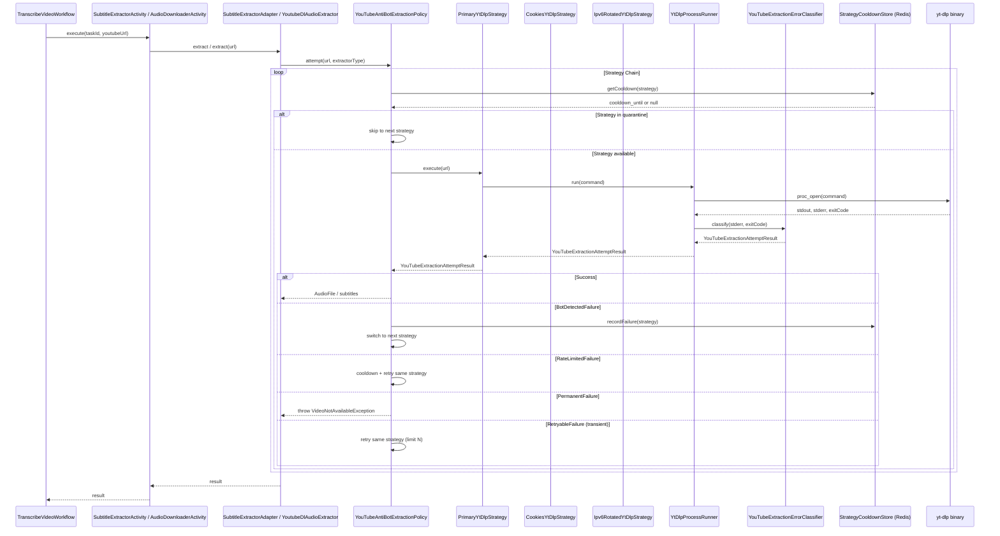

# YouTube Anti-Bot Extraction Policy — Implementation Plan

> **For agentic workers:** REQUIRED SUB-SKILL: Use superpowers:subagent-driven-development (recommended) or superpowers:executing-plans to implement this plan task-by-task. Steps use checkbox (`- [ ]`) syntax for tracking.

**Goal:** Replace scattered `str_contains()` error handling in `YoutubeDlAudioExtractor` and `SubtitleExtractorAdapter` with a unified, policy-driven strategy chain that classifies errors, switches strategies on bot detection, applies cooldown/quarantine via Redis, and provides structured observability — all within Infrastructure layer, without changing workflow contracts.

**Architecture:** Introduce a `YouTubeAntiBotExtractionPolicy` orchestrator in Infrastructure that iterates through an ordered list of `YouTubeExtractionStrategyInterface` implementations. Each strategy produces a typed `YouTubeExtractionAttemptResult` (Success / RetryableFailure / BotDetectedFailure / RateLimitedFailure / PermanentFailure). Policy decides whether to retry same strategy, switch to next, or abort. Strategy health is tracked in Redis via `StrategyCooldownStore`. Adapters (`YoutubeDlAudioExtractor`, `SubtitleExtractorAdapter`) become thin wrappers that call the policy.

**Tech Stack:** PHP 8.5, Laravel 13.x, Redis (for cooldown state), yt-dlp (for YouTube extraction), proc_open (unified process runner).

---

## File Structure Map

### New Files (all in `app/Infrastructure/Adapters/Output/YoutubeDl/`)

| File | Responsibility |
|------|---------------|
| `YouTubeExtractionStrategyInterface.php` | Contract for a single yt-dlp invocation strategy |
| `YouTubeExtractionAttemptResult.php` | Typed DTO: Success / RetryableFailure / BotDetectedFailure / RateLimitedFailure / PermanentFailure |
| `YouTubeExtractionErrorClassifier.php` | Classifies raw yt-dlp stderr/stdout into result types |
| `PrimaryYtDlpStrategy.php` | Default strategy: `player_client=android,ios,web`, no cookies, existing flags |
| `CookiesYtDlpStrategy.php` | Same as primary but with cookies file (only if configured) |
| `Ipv6RotatedYtDlpStrategy.php` | Same as primary but with random IPv6 source address (only if configured) |
| `YouTubeAntiBotExtractionPolicy.php` | Orchestrator: iterates strategies, applies retry/cooldown rules |
| `StrategyCooldownStore.php` | Redis-backed cooldown/quarantine state per strategy |
| `YtDlpProcessRunner.php` | Unified `proc_open` runner, replaces duplicated process code |

### Modified Files

| File | Changes |
|------|---------|
| `app/Infrastructure/Adapters/Output/YoutubeDl/YoutubeDlAudioExtractor.php` | Thin wrapper: calls policy instead of running yt-dlp directly |
| `app/Infrastructure/Adapters/Output/Transcription/SubtitleExtractorAdapter.php` | Thin wrapper: calls policy instead of running yt-dlp directly |
| `app/Providers/AppServiceProvider.php` | Wire new policy, strategies, and process runner into container |
| `config/services.php` | Add anti-bot policy config keys (thresholds, cooldown durations) |

### New Test Files

| File | Tests |
|------|-------|
| `tests/Unit/Infrastructure/Adapters/Output/YoutubeDl/YouTubeExtractionErrorClassifierTest.php` | Error classification unit tests |
| `tests/Unit/Infrastructure/Adapters/Output/YoutubeDl/YouTubeAntiBotExtractionPolicyTest.php` | Policy orchestration unit tests |
| `tests/Unit/Infrastructure/Adapters/Output/YoutubeDl/StrategyCooldownStoreTest.php` | Redis cooldown store unit tests |
| `tests/Unit/Infrastructure/Adapters/Output/YoutubeDl/PrimaryYtDlpStrategyTest.php` | Primary strategy unit test |
| `tests/Unit/Infrastructure/Adapters/Output/YoutubeDl/CookiesYtDlpStrategyTest.php` | Cookies strategy unit test |
| `tests/Unit/Infrastructure/Adapters/Output/YoutubeDl/Ipv6RotatedYtDlpStrategyTest.php` | IPv6 strategy unit test |
| `tests/Unit/Infrastructure/Adapters/Output/YoutubeDl/YtDlpProcessRunnerTest.php` | Process runner unit test |

### Modified Test Files

| File | Changes |
|------|---------|
| `tests/Unit/Infrastructure/Adapters/Output/YoutubeDl/YoutubeDlAudioExtractorTest.php` | Update to test thin wrapper behavior |
| `tests/Unit/Infrastructure/Adapters/Output/Transcription/SubtitleExtractorAdapterTest.php` | Update to test thin wrapper behavior |

---

## Architecture Diagram



---

## Task 1: YouTubeExtractionAttemptResult — Typed Result DTO

**Files:**
- Create: `app/Infrastructure/Adapters/Output/YoutubeDl/YouTubeExtractionAttemptResult.php`
- Create: `tests/Unit/Infrastructure/Adapters/Output/YoutubeDl/YouTubeExtractionAttemptResultTest.php`

- [ ] **Step 1: Write the test**

```php
<?php

declare(strict_types=1);

use App\Infrastructure\Adapters\Output\YoutubeDl\YouTubeExtractionAttemptResult;

test('success result has correct properties', function () {
    $result = YouTubeExtractionAttemptResult::success('raw stdout here', 1200);

    expect($result->isSuccess())->toBeTrue();
    expect($result->isFailure())->toBeFalse();
    expect($result->stdout)->toBe('raw stdout here');
    expect($result->durationMs)->toBe(1200);
    expect($result->resultType)->toBe('success');
});

test('bot detected failure', function () {
    $result = YouTubeExtractionAttemptResult::botDetected('Sign in to confirm you are not a bot', 800);

    expect($result->isSuccess())->toBeFalse();
    expect($result->isFailure())->toBeTrue();
    expect($result->isBotDetected())->toBeTrue();
    expect($result->isRateLimited())->toBeFalse();
    expect($result->isPermanent())->toBeFalse();
    expect($result->isRetryable())->toBeFalse();
    expect($result->stderr)->toBe('Sign in to confirm you are not a bot');
    expect($result->resultType)->toBe('bot_detected');
});

test('rate limited failure', function () {
    $result = YouTubeExtractionAttemptResult::rateLimited('HTTP Error 429', 500);

    expect($result->isRateLimited())->toBeTrue();
    expect($result->resultType)->toBe('rate_limited');
});

test('permanent failure', function () {
    $result = YouTubeExtractionAttemptResult::permanent('Video unavailable. This video is private', 300);

    expect($result->isPermanent())->toBeTrue();
    expect($result->resultType)->toBe('permanent');
});

test('transient infrastructure failure', function () {
    $result = YouTubeExtractionAttemptResult::retryableFailure('Connection timed out', 15000);

    expect($result->isRetryable())->toBeTrue();
    expect($result->resultType)->toBe('retryable_failure');
});
```

- [ ] **Step 2: Run test to verify it fails**

Run: `php vendor/bin/pest tests/Unit/Infrastructure/Adapters/Output/YoutubeDl/YouTubeExtractionAttemptResultTest.php`
Expected: FAIL — class not found.

- [ ] **Step 3: Write the DTO class**

```php
<?php

declare(strict_types=1);

namespace App\Infrastructure\Adapters\Output\YoutubeDl;

final class YouTubeExtractionAttemptResult
{
    private const TYPE_SUCCESS = 'success';
    private const TYPE_BOT_DETECTED = 'bot_detected';
    private const TYPE_RATE_LIMITED = 'rate_limited';
    private const TYPE_PERMANENT = 'permanent';
    private const TYPE_RETRYABLE_FAILURE = 'retryable_failure';

    private function __construct(
        public readonly string $resultType,
        public readonly string $stdout,
        public readonly string $stderr,
        public readonly int $durationMs,
        public readonly ?string $strategyName = null,
    ) {
    }

    public static function success(string $stdout, int $durationMs, ?string $strategyName = null): self
    {
        return new self(self::TYPE_SUCCESS, $stdout, '', $durationMs, $strategyName);
    }

    public static function botDetected(string $stderr, int $durationMs, ?string $strategyName = null): self
    {
        return new self(self::TYPE_BOT_DETECTED, '', $stderr, $durationMs, $strategyName);
    }

    public static function rateLimited(string $stderr, int $durationMs, ?string $strategyName = null): self
    {
        return new self(self::TYPE_RATE_LIMITED, '', $stderr, $durationMs, $strategyName);
    }

    public static function permanent(string $stderr, int $durationMs, ?string $strategyName = null): self
    {
        return new self(self::TYPE_PERMANENT, '', $stderr, $durationMs, $strategyName);
    }

    public static function retryableFailure(string $stderr, int $durationMs, ?string $strategyName = null): self
    {
        return new self(self::TYPE_RETRYABLE_FAILURE, '', $stderr, $durationMs, $strategyName);
    }

    public function isSuccess(): bool
    {
        return $this->resultType === self::TYPE_SUCCESS;
    }

    public function isFailure(): bool
    {
        return ! $this->isSuccess();
    }

    public function isBotDetected(): bool
    {
        return $this->resultType === self::TYPE_BOT_DETECTED;
    }

    public function isRateLimited(): bool
    {
        return $this->resultType === self::TYPE_RATE_LIMITED;
    }

    public function isPermanent(): bool
    {
        return $this->resultType === self::TYPE_PERMANENT;
    }

    public function isRetryable(): bool
    {
        return $this->resultType === self::TYPE_RETRYABLE_FAILURE;
    }
}
```

- [ ] **Step 4: Run test to verify it passes**

Run: `php vendor/bin/pest tests/Unit/Infrastructure/Adapters/Output/YoutubeDl/YouTubeExtractionAttemptResultTest.php`
Expected: PASS.

- [ ] **Step 5: Commit**

```bash
git add app/Infrastructure/Adapters/Output/YoutubeDl/YouTubeExtractionAttemptResult.php tests/Unit/Infrastructure/Adapters/Output/YoutubeDl/YouTubeExtractionAttemptResultTest.php
git commit -m "feat: add YouTubeExtractionAttemptResult typed DTO"
```

---

## Task 2: YouTubeExtractionErrorClassifier — Centralized Error Classification

**Files:**
- Create: `app/Infrastructure/Adapters/Output/YoutubeDl/YouTubeExtractionErrorClassifier.php`
- Create: `tests/Unit/Infrastructure/Adapters/Output/YoutubeDl/YouTubeExtractionErrorClassifierTest.php`

- [ ] **Step 1: Write the test**

```php
<?php

declare(strict_types=1);

use App\Infrastructure\Adapters\Output\YoutubeDl\YouTubeExtractionErrorClassifier;
use App\Infrastructure\Adapters\Output\YoutubeDl\YouTubeExtractionAttemptResult;

test('classifies HTTP 429 as rate limited', function () {
    $classifier = new YouTubeExtractionErrorClassifier();
    $result = $classifier->classify('', 'HTTP Error 429: Too Many Requests', 0, 1200, 'primary');

    expect($result->isRateLimited())->toBeTrue();
    expect($result->strategyName)->toBe('primary');
    expect($result->durationMs)->toBe(1200);
});

test('classifies Too Many Requests as rate limited', function () {
    $classifier = new YouTubeExtractionErrorClassifier();
    $result = $classifier->classify('', 'YouTube said: Too Many Requests', 0, 800, 'primary');

    expect($result->isRateLimited())->toBeTrue();
});

test('classifies bot detection sign-in message', function () {
    $classifier = new YouTubeExtractionErrorClassifier();
    $result = $classifier->classify('', "Sign in to confirm you're not a bot", 0, 500, 'primary');

    expect($result->isBotDetected())->toBeTrue();
});

test('classifies generic bot detection message', function () {
    $classifier = new YouTubeExtractionErrorClassifier();
    $result = $classifier->classify('', 'bot detection triggered', 0, 500, 'primary');

    expect($result->isBotDetected())->toBeTrue();
});

test('classifies Video unavailable as permanent', function () {
    $classifier = new YouTubeExtractionErrorClassifier();
    $result = $classifier->classify('', 'Video unavailable. This video has been removed', 0, 300, 'primary');

    expect($result->isPermanent())->toBeTrue();
});

test('classifies Private video as permanent', function () {
    $classifier = new YouTubeExtractionErrorClassifier();
    $result = $classifier->classify('', 'Private video. Sign in if you\'ve been granted access', 0, 300, 'primary');

    expect($result->isPermanent())->toBeTrue();
});

test('classifies members-only as permanent', function () {
    $classifier = new YouTubeExtractionErrorClassifier();
    $result = $classifier->classify('', 'This video is available to this channel\'s members', 0, 300, 'primary');

    expect($result->isPermanent())->toBeTrue();
});

test('classifies connection timeout as retryable', function () {
    $classifier = new YouTubeExtractionErrorClassifier();
    $result = $classifier->classify('', 'Connection timed out after 30000ms', 0, 15000, 'primary');

    expect($result->isRetryable())->toBeTrue();
});

test('classifies DNS resolution failure as retryable', function () {
    $classifier = new YouTubeExtractionErrorClassifier();
    $result = $classifier->classify('', 'Temporary failure in name resolution', 0, 5000, 'primary');

    expect($result->isRetryable())->toBeTrue();
});

test('classifies unknown error as retryable', function () {
    $classifier = new YouTubeExtractionErrorClassifier();
    $result = $classifier->classify('', 'Some unexpected yt-dlp crash', 1, 2000, 'primary');

    expect($result->isRetryable())->toBeTrue();
});

test('classifies success exit code 0', function () {
    $classifier = new YouTubeExtractionErrorClassifier();
    $result = $classifier->classify('output content', '', 0, 1000, 'primary');

    expect($result->isSuccess())->toBeTrue();
    expect($result->stdout)->toBe('output content');
});
```

- [ ] **Step 2: Run test to verify it fails**

Run: `php vendor/bin/pest tests/Unit/Infrastructure/Adapters/Output/YoutubeDl/YouTubeExtractionErrorClassifierTest.php`
Expected: FAIL — class not found.

- [ ] **Step 3: Write the classifier**

```php
<?php

declare(strict_types=1);

namespace App\Infrastructure\Adapters\Output\YoutubeDl;

final class YouTubeExtractionErrorClassifier
{
    /**
     * Classify yt-dlp output into a typed result.
     */
    public function classify(
        string $stdout,
        string $stderr,
        int $exitCode,
        int $durationMs,
        string $strategyName,
    ): YouTubeExtractionAttemptResult {
        if ($exitCode === 0) {
            return YouTubeExtractionAttemptResult::success($stdout, $durationMs, $strategyName);
        }

        $errorOutput = $stderr !== '' ? $stderr : $stdout;

        // Permanent failures — no fallback, no retry
        if ($this->matchesPermanent($errorOutput)) {
            return YouTubeExtractionAttemptResult::permanent($errorOutput, $durationMs, $strategyName);
        }

        // Rate limit — cooldown + retry same strategy
        if ($this->matchesRateLimit($errorOutput)) {
            return YouTubeExtractionAttemptResult::rateLimited($errorOutput, $durationMs, $strategyName);
        }

        // Bot detection — switch to next strategy
        if ($this->matchesBotDetection($errorOutput)) {
            return YouTubeExtractionAttemptResult::botDetected($errorOutput, $durationMs, $strategyName);
        }

        // Everything else is transient infrastructure failure — retry same strategy
        return YouTubeExtractionAttemptResult::retryableFailure($errorOutput, $durationMs, $strategyName);
    }

    private function matchesPermanent(string $output): bool
    {
        $patterns = [
            'Video unavailable',
            'Private video',
            'video is private',
            'This video is available to this channel\'s members',
            'This video is not available',
            'video has been removed',
            'removed by the uploader',
            'This video is age-restricted',
        ];

        foreach ($patterns as $pattern) {
            if (str_contains($output, $pattern)) {
                return true;
            }
        }

        return false;
    }

    private function matchesRateLimit(string $output): bool
    {
        $patterns = [
            'HTTP Error 429',
            'Too Many Requests',
            'rate limited',
            'Cooling down',
        ];

        foreach ($patterns as $pattern) {
            if (str_contains($output, $pattern)) {
                return true;
            }
        }

        return false;
    }

    private function matchesBotDetection(string $output): bool
    {
        $patterns = [
            'Sign in to confirm',
            'bot detection',
        ];

        foreach ($patterns as $pattern) {
            if (str_contains($output, $pattern)) {
                return true;
            }
        }

        return false;
    }
}
```

- [ ] **Step 4: Run test to verify it passes**

Run: `php vendor/bin/pest tests/Unit/Infrastructure/Adapters/Output/YoutubeDl/YouTubeExtractionErrorClassifierTest.php`
Expected: PASS.

- [ ] **Step 5: Commit**

```bash
git add app/Infrastructure/Adapters/Output/YoutubeDl/YouTubeExtractionErrorClassifier.php tests/Unit/Infrastructure/Adapters/Output/YoutubeDl/YouTubeExtractionErrorClassifierTest.php
git commit -m "feat: add YouTubeExtractionErrorClassifier"
```

---

## Task 3: YtDlpProcessRunner — Unified Process Runner

**Files:**
- Create: `app/Infrastructure/Adapters/Output/YoutubeDl/YtDlpProcessRunner.php`
- Create: `tests/Unit/Infrastructure/Adapters/Output/YoutubeDl/YtDlpProcessRunnerTest.php`

- [ ] **Step 1: Write the test**

```php
<?php

declare(strict_types=1);

use App\Infrastructure\Adapters\Output\YoutubeDl\YtDlpProcessRunner;

test('runner returns stdout on exit code 0', function () {
    $runner = new YtDlpProcessRunner();
    $result = $runner->run('echo "hello world"');

    expect($result['stdout'])->toContain('hello world');
    expect($result['exitCode'])->toBe(0);
});

test('runner captures stderr on exit code non-zero', function () {
    $runner = new YtDlpProcessRunner();
    $result = $runner->run('echo "error message" >&2 && exit 1');

    expect($result['exitCode'])->toBe(1);
    expect($result['stderr'])->toContain('error message');
});

test('runner enforces timeout', function () {
    $runner = new YtDlpProcessRunner(timeoutSec: 2);
    $result = $runner->run('sleep 10');

    expect($result['exitCode'])->not->toBe(0);
    expect($result['timedOut'])->toBeTrue();
});
```

- [ ] **Step 2: Run test to verify it fails**

Run: `php vendor/bin/pest tests/Unit/Infrastructure/Adapters/Output/YoutubeDl/YtDlpProcessRunnerTest.php`
Expected: FAIL.

- [ ] **Step 3: Write the process runner**

```php
<?php

declare(strict_types=1);

namespace App\Infrastructure\Adapters\Output\YoutubeDl;

use RuntimeException;

final class YtDlpProcessRunner
{
    public function __construct(
        private readonly int $timeoutSec = 300,
    ) {
    }

    /**
     * Run a shell command via proc_open and return stdout, stderr, exit code, and timeout flag.
     *
     * @return array{stdout: string, stderr: string, exitCode: int, timedOut: bool}
     */
    public function run(string $command): array
    {
        $descriptors = [
            0 => ['pipe', 'r'],  // stdin
            1 => ['pipe', 'w'],  // stdout
            2 => ['pipe', 'w'],  // stderr
        ];

        $process = proc_open($command, $descriptors, $pipes);

        if (! is_resource($process)) {
            throw new RuntimeException('Failed to start yt-dlp process.');
        }

        fclose($pipes[0]);

        $stdout = '';
        $stderr = '';
        $timedOut = false;

        // Set non-blocking streams
        stream_set_blocking($pipes[1], false);
        stream_set_blocking($pipes[2], false);

        $deadline = time() + $this->timeoutSec;

        while (time() < $deadline) {
            $status = proc_get_status($process);

            if (! $status['running']) {
                break;
            }

            $read = [$pipes[1], $pipes[2]];
            $write = null;
            $except = null;

            if (stream_select($read, $write, $except, 1) > 0) {
                foreach ($read as $pipe) {
                    $data = stream_get_contents($pipe);
                    if ($data !== false) {
                        if ($pipe === $pipes[1]) {
                            $stdout .= $data;
                        } else {
                            $stderr .= $data;
                        }
                    }
                }
            }
        }

        $status = proc_get_status($process);

        if ($status['running']) {
            // Timeout: kill the process
            proc_terminate($process, 9);
            $status = proc_get_status($process);
            $timedOut = true;
        }

        fclose($pipes[1]);
        fclose($pipes[2]);

        $exitCode = proc_close($process);

        // Read any remaining output
        $remainingOut = stream_get_contents($pipes[1] ?? null);
        $remainingErr = stream_get_contents($pipes[2] ?? null);

        if ($remainingOut !== false) {
            $stdout .= $remainingOut;
        }
        if ($remainingErr !== false) {
            $stderr .= $remainingErr;
        }

        return [
            'stdout' => $stdout,
            'stderr' => $stderr,
            'exitCode' => $timedOut ? ($status['exitcode'] ?? -1) : $exitCode,
            'timedOut' => $timedOut,
        ];
    }
}
```

- [ ] **Step 4: Run test to verify it passes**

Run: `php vendor/bin/pest tests/Unit/Infrastructure/Adapters/Output/YoutubeDl/YtDlpProcessRunnerTest.php`
Expected: PASS.

- [ ] **Step 5: Commit**

```bash
git add app/Infrastructure/Adapters/Output/YoutubeDl/YtDlpProcessRunner.php tests/Unit/Infrastructure/Adapters/Output/YoutubeDl/YtDlpProcessRunnerTest.php
git commit -m "feat: add YtDlpProcessRunner for unified proc_open execution"
```

---

## Task 4: StrategyCooldownStore — Redis-Backed Quarantine State

**Files:**
- Create: `app/Infrastructure/Adapters/Output/YoutubeDl/StrategyCooldownStore.php`
- Create: `tests/Unit/Infrastructure/Adapters/Output/YoutubeDl/StrategyCooldownStoreTest.php`

- [ ] **Step 1: Write the test**

```php
<?php

declare(strict_types=1);

use App\Infrastructure\Adapters\Output\YoutubeDl\StrategyCooldownStore;
use Illuminate\Support\Facades\Redis;

beforeEach(function () {
    Redis::flushall();
});

test('strategy is not in cooldown initially', function () {
    $store = new StrategyCooldownStore();
    expect($store->isInCooldown('primary'))->toBeFalse();
});

test('record failure puts strategy in cooldown after threshold', function () {
    $store = new StrategyCooldownStore(
        failureThreshold: 3,
        cooldownDurationSec: 600,
        failureWindowSec: 60,
    );

    $store->recordFailure('primary');
    expect($store->isInCooldown('primary'))->toBeFalse();

    $store->recordFailure('primary');
    expect($store->isInCooldown('primary'))->toBeFalse();

    $store->recordFailure('primary');
    expect($store->isInCooldown('primary'))->toBeTrue();
});

test('cooldown expires after duration', function () {
    $store = new StrategyCooldownStore(
        failureThreshold: 2,
        cooldownDurationSec: 2,
        failureWindowSec: 60,
    );

    $store->recordFailure('primary');
    $store->recordFailure('primary');
    expect($store->isInCooldown('primary'))->toBeTrue();

    sleep(3);
    expect($store->isInCooldown('primary'))->toBeFalse();
});

test('reset clears cooldown state', function () {
    $store = new StrategyCooldownStore(failureThreshold: 1, cooldownDurationSec: 600, failureWindowSec: 60);

    $store->recordFailure('primary');
    expect($store->isInCooldown('primary'))->toBeTrue();

    $store->reset('primary');
    expect($store->isInCooldown('primary'))->toBeFalse();
});

test('get cooldown remaining seconds', function () {
    $store = new StrategyCooldownStore(failureThreshold: 1, cooldownDurationSec: 600, failureWindowSec: 60);

    $store->recordFailure('primary');
    $remaining = $store->getCooldownRemainingSec('primary');

    expect($remaining)->toBeGreaterThan(0);
    expect($remaining)->toBeLessThanOrEqual(600);
});

test('different strategies have independent cooldowns', function () {
    $store = new StrategyCooldownStore(failureThreshold: 1, cooldownDurationSec: 600, failureWindowSec: 60);

    $store->recordFailure('primary');
    expect($store->isInCooldown('primary'))->toBeTrue();
    expect($store->isInCooldown('cookies'))->toBeFalse();
});
```

- [ ] **Step 2: Run test to verify it fails**

Run: `php vendor/bin/pest tests/Unit/Infrastructure/Adapters/Output/YoutubeDl/StrategyCooldownStoreTest.php`
Expected: FAIL.

- [ ] **Step 3: Write the cooldown store**

```php
<?php

declare(strict_types=1);

namespace App\Infrastructure\Adapters\Output\YoutubeDl;

use Illuminate\Support\Facades\Redis;

final class StrategyCooldownStore
{
    private const KEY_PREFIX = 'youtube-extractor:strategy';

    public function __construct(
        private readonly int $failureThreshold = 3,
        private readonly int $cooldownDurationSec = 600,
        private readonly int $failureWindowSec = 120,
    ) {
    }

    /**
     * Record a failure for a strategy. If threshold reached within the window, enter cooldown.
     */
    public function recordFailure(string $strategyName): void
    {
        $now = time();
        $windowKey = $this->windowKey($strategyName);
        $cooldownKey = $this->cooldownKey($strategyName);

        // Add current timestamp to the sorted set
        Redis::zadd($windowKey, $now, (string) $now);
        // Set TTL on the window key to auto-cleanup
        Redis::expire($windowKey, $this->failureWindowSec + 60);

        // Count failures within the window
        $windowStart = $now - $this->failureWindowSec;
        $failureCount = Redis::zcount($windowKey, $windowStart, $now);

        if ($failureCount >= $this->failureThreshold) {
            Redis::set($cooldownKey, (string) ($now + $this->cooldownDurationSec));
            Redis::expire($cooldownKey, $this->cooldownDurationSec + 60);
            // Clean up the window after triggering cooldown
            Redis::del($windowKey);
        }
    }

    /**
     * Check if a strategy is currently in cooldown.
     */
    public function isInCooldown(string $strategyName): bool
    {
        return $this->getCooldownRemainingSec($strategyName) > 0;
    }

    /**
     * Get remaining cooldown seconds for a strategy. 0 if not in cooldown.
     */
    public function getCooldownRemainingSec(string $strategyName): int
    {
        $cooldownKey = $this->cooldownKey($strategyName);
        $cooldownUntil = (int) Redis::get($cooldownKey);

        if ($cooldownUntil <= 0) {
            return 0;
        }

        $remaining = $cooldownUntil - time();

        return max(0, $remaining);
    }

    /**
     * Manually reset cooldown for a strategy.
     */
    public function reset(string $strategyName): void
    {
        Redis::del($this->cooldownKey($strategyName));
        Redis::del($this->windowKey($strategyName));
    }

    private function cooldownKey(string $strategyName): string
    {
        return self::KEY_PREFIX . ':' . $strategyName . ':cooldown_until';
    }

    private function windowKey(string $strategyName): string
    {
        return self::KEY_PREFIX . ':' . $strategyName . ':failure_window';
    }
}
```

- [ ] **Step 4: Run test to verify it passes**

Run: `php vendor/bin/pest tests/Unit/Infrastructure/Adapters/Output/YoutubeDl/StrategyCooldownStoreTest.php`
Expected: PASS.

- [ ] **Step 5: Commit**

```bash
git add app/Infrastructure/Adapters/Output/YoutubeDl/StrategyCooldownStore.php tests/Unit/Infrastructure/Adapters/Output/YoutubeDl/StrategyCooldownStoreTest.php
git commit -m "feat: add StrategyCooldownStore for Redis-backed quarantine"
```

---

## Task 5: YouTubeExtractionStrategyInterface + Concrete Strategies

**Files:**
- Create: `app/Infrastructure/Adapters/Output/YoutubeDl/YouTubeExtractionStrategyInterface.php`
- Create: `app/Infrastructure/Adapters/Output/YoutubeDl/PrimaryYtDlpStrategy.php`
- Create: `app/Infrastructure/Adapters/Output/YoutubeDl/CookiesYtDlpStrategy.php`
- Create: `app/Infrastructure/Adapters/Output/YoutubeDl/Ipv6RotatedYtDlpStrategy.php`
- Create: `tests/Unit/Infrastructure/Adapters/Output/YoutubeDl/PrimaryYtDlpStrategyTest.php`
- Create: `tests/Unit/Infrastructure/Adapters/Output/YoutubeDl/CookiesYtDlpStrategyTest.php`
- Create: `tests/Unit/Infrastructure/Adapters/Output/YoutubeDl/Ipv6RotatedYtDlpStrategyTest.php`

- [ ] **Step 1: Write the interface**

```php
<?php

declare(strict_types=1);

namespace App\Infrastructure\Adapters\Output\YoutubeDl;

interface YouTubeExtractionStrategyInterface
{
    /**
     * Human-readable name for logging/metrics (e.g. 'primary', 'cookies', 'ipv6').
     */
    public function name(): string;

    /**
     * Whether this strategy can be used (e.g., cookies file exists, IPv6 prefix configured).
     */
    public function isAvailable(): bool;

    /**
     * Execute the extraction and return a typed result.
     *
     * @param string $url The YouTube URL to extract from.
     * @param string $outputDir Directory where yt-dlp should write files.
     * @param string $outputTemplate yt-dlp output template (e.g. '%(id)s.%(ext)s').
     * @param array<string, string> $extraArgs Additional yt-dlp arguments specific to the caller
     *                                          (e.g. --write-auto-sub, -x --audio-format mp3).
     */
    public function execute(string $url, string $outputDir, string $outputTemplate, array $extraArgs): YouTubeExtractionAttemptResult;
}
```

- [ ] **Step 2: Write PrimaryYtDlpStrategy test**

```php
<?php

declare(strict_types=1);

use App\Infrastructure\Adapters\Output\YoutubeDl\PrimaryYtDlpStrategy;
use App\Infrastructure\Adapters\Output\YoutubeDl\YouTubeExtractionErrorClassifier;
use App\Infrastructure\Adapters\Output\YoutubeDl\YtDlpProcessRunner;
use App\Infrastructure\Adapters\Output\YoutubeDl\YtDlpRateLimiter;

test('primary strategy is always available', function () {
    $strategy = new PrimaryYtDlpStrategy(
        runner: new YtDlpProcessRunner(),
        classifier: new YouTubeExtractionErrorClassifier(),
        rateLimiter: new YtDlpRateLimiter(),
    );

    expect($strategy->isAvailable())->toBeTrue();
    expect($strategy->name())->toBe('primary');
});

test('primary strategy builds command with player_client args', function () {
    $strategy = new PrimaryYtDlpStrategy(
        runner: new YtDlpProcessRunner(),
        classifier: new YouTubeExtractionErrorClassifier(),
        rateLimiter: new YtDlpRateLimiter(),
    );

    // We test the command construction via a mock runner
    // In this unit test, we focus on behavior: command should include extractor-args
    // Integration test covers actual yt-dlp execution

    expect($strategy->name())->toBe('primary');
    expect($strategy->isAvailable())->toBeTrue();
});
```

- [ ] **Step 3: Write PrimaryYtDlpStrategy**

```php
<?php

declare(strict_types=1);

namespace App\Infrastructure\Adapters\Output\YoutubeDl;

final class PrimaryYtDlpStrategy implements YouTubeExtractionStrategyInterface
{
    private const SLEEP_INTERVAL = 5;
    private const MAX_SLEEP_INTERVAL = 15;
    private const SLEEP_REQUESTS = 2;

    public function __construct(
        private readonly YtDlpProcessRunner $runner,
        private readonly YouTubeExtractionErrorClassifier $classifier,
        private readonly YtDlpRateLimiter $rateLimiter,
        private readonly string $binaryPath = 'yt-dlp',
    ) {
    }

    public function name(): string
    {
        return 'primary';
    }

    public function isAvailable(): bool
    {
        return true;
    }

    public function execute(string $url, string $outputDir, string $outputTemplate, array $extraArgs): YouTubeExtractionAttemptResult
    {
        $extraArgsStr = implode(' ', array_map('escapeshellarg', $extraArgs));
        $extractorArgs = '--extractor-args "youtube:player_client=android,ios,web" ';

        $command = sprintf(
            '%s %s-f "bestaudio[ext=m4a]/bestaudio" --no-playlist --sleep-interval %d --max-sleep-interval %d --sleep-requests %d -o %s/%s %s %s 2>&1',
            escapeshellcmd($this->binaryPath),
            $extractorArgs,
            self::SLEEP_INTERVAL,
            self::MAX_SLEEP_INTERVAL,
            self::SLEEP_REQUESTS,
            escapeshellarg($outputDir),
            $outputTemplate,
            $extraArgsStr,
            escapeshellarg($url),
        );

        if (! $this->rateLimiter->tryAcquire(maxWaitSec: 30)) {
            return YouTubeExtractionAttemptResult::retryableFailure(
                'yt-dlp global lock busy',
                0,
                $this->name(),
            );
        }

        $startMs = (int) (microtime(true) * 1000);

        try {
            $result = $this->runner->run($command);
        } finally {
            $this->rateLimiter->release();
        }

        $durationMs = (int) (microtime(true) * 1000) - $startMs;

        return $this->classifier->classify(
            $result['stdout'],
            $result['stderr'],
            $result['exitCode'],
            $durationMs,
            $this->name(),
        );
    }
}
```

- [ ] **Step 4: Write CookiesYtDlpStrategy test**

```php
<?php

declare(strict_types=1);

use App\Infrastructure\Adapters\Output\YoutubeDl\CookiesYtDlpStrategy;
use App\Infrastructure\Adapters\Output\YoutubeDl\YouTubeExtractionErrorClassifier;
use App\Infrastructure\Adapters\Output\YoutubeDl\YtDlpProcessRunner;
use App\Infrastructure\Adapters\Output\YoutubeDl\YtDlpRateLimiter;

test('cookies strategy is unavailable when cookies path is null', function () {
    $strategy = new CookiesYtDlpStrategy(
        runner: new YtDlpProcessRunner(),
        classifier: new YouTubeExtractionErrorClassifier(),
        rateLimiter: new YtDlpRateLimiter(),
        cookiesPath: null,
    );

    expect($strategy->isAvailable())->toBeFalse();
});

test('cookies strategy is unavailable when cookies file does not exist', function () {
    $strategy = new CookiesYtDlpStrategy(
        runner: new YtDlpProcessRunner(),
        classifier: new YouTubeExtractionErrorClassifier(),
        rateLimiter: new YtDlpRateLimiter(),
        cookiesPath: '/nonexistent/path/cookies.txt',
    );

    expect($strategy->isAvailable())->toBeFalse();
});

test('cookies strategy is available when cookies file exists', function () {
    $tempFile = sys_get_temp_dir() . '/test-cookies-' . uniqid() . '.txt';
    file_put_contents($tempFile, '# Netscape HTTP Cookie File');

    try {
        $strategy = new CookiesYtDlpStrategy(
            runner: new YtDlpProcessRunner(),
            classifier: new YouTubeExtractionErrorClassifier(),
            rateLimiter: new YtDlpRateLimiter(),
            cookiesPath: $tempFile,
        );

        expect($strategy->isAvailable())->toBeTrue();
        expect($strategy->name())->toBe('cookies');
    } finally {
        unlink($tempFile);
    }
});
```

- [ ] **Step 5: Write CookiesYtDlpStrategy**

```php
<?php

declare(strict_types=1);

namespace App\Infrastructure\Adapters\Output\YoutubeDl;

final class CookiesYtDlpStrategy implements YouTubeExtractionStrategyInterface
{
    private const SLEEP_INTERVAL = 5;
    private const MAX_SLEEP_INTERVAL = 15;
    private const SLEEP_REQUESTS = 2;

    public function __construct(
        private readonly YtDlpProcessRunner $runner,
        private readonly YouTubeExtractionErrorClassifier $classifier,
        private readonly YtDlpRateLimiter $rateLimiter,
        private readonly ?string $cookiesPath = null,
        private readonly string $binaryPath = 'yt-dlp',
    ) {
    }

    public function name(): string
    {
        return 'cookies';
    }

    public function isAvailable(): bool
    {
        return $this->cookiesPath !== null
            && $this->cookiesPath !== ''
            && file_exists($this->cookiesPath);
    }

    public function execute(string $url, string $outputDir, string $outputTemplate, array $extraArgs): YouTubeExtractionAttemptResult
    {
        $extraArgsStr = implode(' ', array_map('escapeshellarg', $extraArgs));
        $extractorArgs = '--extractor-args "youtube:player_client=android,ios,web" ';
        $cookiesArg = sprintf('--cookies %s ', escapeshellarg($this->cookiesPath));

        $command = sprintf(
            '%s %s%s%s-f "bestaudio[ext=m4a]/bestaudio" --no-playlist --sleep-interval %d --max-sleep-interval %d --sleep-requests %d -o %s/%s %s %s 2>&1',
            escapeshellcmd($this->binaryPath),
            $cookiesArg,
            $extractorArgs,
            self::SLEEP_INTERVAL,
            self::MAX_SLEEP_INTERVAL,
            self::SLEEP_REQUESTS,
            escapeshellarg($outputDir),
            $outputTemplate,
            $extraArgsStr,
            escapeshellarg($url),
        );

        if (! $this->rateLimiter->tryAcquire(maxWaitSec: 30)) {
            return YouTubeExtractionAttemptResult::retryableFailure(
                'yt-dlp global lock busy',
                0,
                $this->name(),
            );
        }

        $startMs = (int) (microtime(true) * 1000);

        try {
            $result = $this->runner->run($command);
        } finally {
            $this->rateLimiter->release();
        }

        $durationMs = (int) (microtime(true) * 1000) - $startMs;

        return $this->classifier->classify(
            $result['stdout'],
            $result['stderr'],
            $result['exitCode'],
            $durationMs,
            $this->name(),
        );
    }
}
```

- [ ] **Step 6: Write Ipv6RotatedYtDlpStrategy test**

```php
<?php

declare(strict_types=1);

use App\Infrastructure\Adapters\Output\YoutubeDl\Ipv6RotatedYtDlpStrategy;
use App\Infrastructure\Adapters\Output\YoutubeDl\Ipv6Rotator;
use App\Infrastructure\Adapters\Output\YoutubeDl\YouTubeExtractionErrorClassifier;
use App\Infrastructure\Adapters\Output\YoutubeDl\YtDlpProcessRunner;
use App\Infrastructure\Adapters\Output\YoutubeDl\YtDlpRateLimiter;

test('ipv6 strategy is unavailable when prefix is null', function () {
    $strategy = new Ipv6RotatedYtDlpStrategy(
        runner: new YtDlpProcessRunner(),
        classifier: new YouTubeExtractionErrorClassifier(),
        rateLimiter: new YtDlpRateLimiter(),
        ipv6Prefix: null,
        ipv6Rotator: new Ipv6Rotator(),
    );

    expect($strategy->isAvailable())->toBeFalse();
});

test('ipv6 strategy is available when prefix is configured', function () {
    $strategy = new Ipv6RotatedYtDlpStrategy(
        runner: new YtDlpProcessRunner(),
        classifier: new YouTubeExtractionErrorClassifier(),
        rateLimiter: new YtDlpRateLimiter(),
        ipv6Prefix: '2a01:4f8:1c1b:1234',
        ipv6Rotator: new Ipv6Rotator(),
    );

    expect($strategy->isAvailable())->toBeTrue();
    expect($strategy->name())->toBe('ipv6');
});
```

- [ ] **Step 7: Write Ipv6RotatedYtDlpStrategy**

```php
<?php

declare(strict_types=1);

namespace App\Infrastructure\Adapters\Output\YoutubeDl;

final class Ipv6RotatedYtDlpStrategy implements YouTubeExtractionStrategyInterface
{
    private const SLEEP_INTERVAL = 5;
    private const MAX_SLEEP_INTERVAL = 15;
    private const SLEEP_REQUESTS = 2;

    public function __construct(
        private readonly YtDlpProcessRunner $runner,
        private readonly YouTubeExtractionErrorClassifier $classifier,
        private readonly YtDlpRateLimiter $rateLimiter,
        private readonly ?string $ipv6Prefix = null,
        private readonly Ipv6Rotator $ipv6Rotator = new Ipv6Rotator(),
        private readonly string $binaryPath = 'yt-dlp',
    ) {
    }

    public function name(): string
    {
        return 'ipv6';
    }

    public function isAvailable(): bool
    {
        return $this->ipv6Prefix !== null && $this->ipv6Prefix !== '';
    }

    public function execute(string $url, string $outputDir, string $outputTemplate, array $extraArgs): YouTubeExtractionAttemptResult
    {
        $extraArgsStr = implode(' ', array_map('escapeshellarg', $extraArgs));
        $extractorArgs = '--extractor-args "youtube:player_client=android,ios,web" ';

        $ipv6Args = $this->ipv6Rotator->buildYtDlpArgs($this->ipv6Prefix);
        $sourceAddr = $ipv6Args !== [] ? implode(' ', $ipv6Args) . ' ' : '';

        $command = sprintf(
            '%s %s%s-f "bestaudio[ext=m4a]/bestaudio" --no-playlist --sleep-interval %d --max-sleep-interval %d --sleep-requests %d -o %s/%s %s %s 2>&1',
            escapeshellcmd($this->binaryPath),
            $sourceAddr,
            $extractorArgs,
            self::SLEEP_INTERVAL,
            self::MAX_SLEEP_INTERVAL,
            self::SLEEP_REQUESTS,
            escapeshellarg($outputDir),
            $outputTemplate,
            $extraArgsStr,
            escapeshellarg($url),
        );

        if (! $this->rateLimiter->tryAcquire(maxWaitSec: 30)) {
            return YouTubeExtractionAttemptResult::retryableFailure(
                'yt-dlp global lock busy',
                0,
                $this->name(),
            );
        }

        $startMs = (int) (microtime(true) * 1000);

        try {
            $result = $this->runner->run($command);
        } finally {
            $this->rateLimiter->release();
        }

        $durationMs = (int) (microtime(true) * 1000) - $startMs;

        return $this->classifier->classify(
            $result['stdout'],
            $result['stderr'],
            $result['exitCode'],
            $durationMs,
            $this->name(),
        );
    }
}
```

- [ ] **Step 8: Run all strategy tests**

Run: `php vendor/bin/pest tests/Unit/Infrastructure/Adapters/Output/YoutubeDl/PrimaryYtDlpStrategyTest.php tests/Unit/Infrastructure/Adapters/Output/YoutubeDl/CookiesYtDlpStrategyTest.php tests/Unit/Infrastructure/Adapters/Output/YoutubeDl/Ipv6RotatedYtDlpStrategyTest.php`
Expected: PASS for all.

- [ ] **Step 9: Commit**

```bash
git add app/Infrastructure/Adapters/Output/YoutubeDl/YouTubeExtractionStrategyInterface.php app/Infrastructure/Adapters/Output/YoutubeDl/PrimaryYtDlpStrategy.php app/Infrastructure/Adapters/Output/YoutubeDl/CookiesYtDlpStrategy.php app/Infrastructure/Adapters/Output/YoutubeDl/Ipv6RotatedYtDlpStrategy.php tests/Unit/Infrastructure/Adapters/Output/YoutubeDl/PrimaryYtDlpStrategyTest.php tests/Unit/Infrastructure/Adapters/Output/YoutubeDl/CookiesYtDlpStrategyTest.php tests/Unit/Infrastructure/Adapters/Output/YoutubeDl/Ipv6RotatedYtDlpStrategyTest.php
git commit -m "feat: add extraction strategy interface and concrete strategies"
```

---

## Task 6: YouTubeAntiBotExtractionPolicy — Orchestrator

**Files:**
- Create: `app/Infrastructure/Adapters/Output/YoutubeDl/YouTubeAntiBotExtractionPolicy.php`
- Create: `tests/Unit/Infrastructure/Adapters/Output/YoutubeDl/YouTubeAntiBotExtractionPolicyTest.php`

- [ ] **Step 1: Write the policy test**

```php
<?php

declare(strict_types=1);

use App\Infrastructure\Adapters\Output\YoutubeDl\StrategyCooldownStore;
use App\Infrastructure\Adapters\Output\YoutubeDl\YouTubeAntiBotExtractionPolicy;
use App\Infrastructure\Adapters\Output\YoutubeDl\YouTubeExtractionAttemptResult;
use App\Infrastructure\Adapters\Output\YoutubeDl\YouTubeExtractionStrategyInterface;
use Mockery;

beforeEach(function () {
    // Ensure Redis is clean for cooldown tests
    \Illuminate\Support\Facades\Redis::flushall();
});

test('policy returns success from first strategy', function () {
    $successResult = YouTubeExtractionAttemptResult::success('output', 1000, 'primary');

    $strategy = Mockery::mock(YouTubeExtractionStrategyInterface::class);
    $strategy->shouldReceive('name')->andReturn('primary');
    $strategy->shouldReceive('isAvailable')->andReturn(true);
    $strategy->shouldReceive('execute')->once()->andReturn($successResult);

    $policy = new YouTubeAntiBotExtractionPolicy(
        strategies: [$strategy],
        cooldownStore: new StrategyCooldownStore(),
    );

    $result = $policy->attempt('https://youtube.com/watch?v=abc123', '/tmp', '%(id)s.%(ext)s', []);

    expect($result->isSuccess())->toBeTrue();
    expect($result->strategyName)->toBe('primary');
});

test('policy switches to next strategy on bot detection', function () {
    $botResult = YouTubeExtractionAttemptResult::botDetected('bot', 500, 'primary');
    $successResult = YouTubeExtractionAttemptResult::success('output', 800, 'cookies');

    $primary = Mockery::mock(YouTubeExtractionStrategyInterface::class);
    $primary->shouldReceive('name')->andReturn('primary');
    $primary->shouldReceive('isAvailable')->andReturn(true);
    $primary->shouldReceive('execute')->once()->andReturn($botResult);

    $cookies = Mockery::mock(YouTubeExtractionStrategyInterface::class);
    $cookies->shouldReceive('name')->andReturn('cookies');
    $cookies->shouldReceive('isAvailable')->andReturn(true);
    $cookies->shouldReceive('execute')->once()->andReturn($successResult);

    $policy = new YouTubeAntiBotExtractionPolicy(
        strategies: [$primary, $cookies],
        cooldownStore: new StrategyCooldownStore(),
    );

    $result = $policy->attempt('https://youtube.com/watch?v=abc123', '/tmp', '%(id)s.%(ext)s', []);

    expect($result->isSuccess())->toBeTrue();
    expect($result->strategyName)->toBe('cookies');
});

test('policy retries same strategy on rate limit', function () {
    $rateLimitedResult = YouTubeExtractionAttemptResult::rateLimited('429', 500, 'primary');
    $successResult = YouTubeExtractionAttemptResult::success('output', 800, 'primary');

    $primary = Mockery::mock(YouTubeExtractionStrategyInterface::class);
    $primary->shouldReceive('name')->andReturn('primary');
    $primary->shouldReceive('isAvailable')->andReturn(true);
    $primary->shouldReceive('execute')->times(2)->andReturn($rateLimitedResult, $successResult);

    $policy = new YouTubeAntiBotExtractionPolicy(
        strategies: [$primary],
        cooldownStore: new StrategyCooldownStore(),
        maxRetriesPerStrategy: 2,
    );

    $result = $policy->attempt('https://youtube.com/watch?v=abc123', '/tmp', '%(id)s.%(ext)s', []);

    expect($result->isSuccess())->toBeTrue();
});

test('policy throws on permanent failure', function () {
    $permanentResult = YouTubeExtractionAttemptResult::permanent('Video unavailable', 300, 'primary');

    $primary = Mockery::mock(YouTubeExtractionStrategyInterface::class);
    $primary->shouldReceive('name')->andReturn('primary');
    $primary->shouldReceive('isAvailable')->andReturn(true);
    $primary->shouldReceive('execute')->once()->andReturn($permanentResult);

    $policy = new YouTubeAntiBotExtractionPolicy(
        strategies: [$primary],
        cooldownStore: new StrategyCooldownStore(),
    );

    expect(fn () => $policy->attempt('https://youtube.com/watch?v=abc123', '/tmp', '%(id)s.%(ext)s', []))
        ->toThrow(\RuntimeException::class, 'Video unavailable');
});

test('policy skips quarantined strategy', function () {
    $store = new StrategyCooldownStore(failureThreshold: 1, cooldownDurationSec: 600, failureWindowSec: 60);
    $store->recordFailure('primary');

    $successResult = YouTubeExtractionAttemptResult::success('output', 800, 'cookies');

    $primary = Mockery::mock(YouTubeExtractionStrategyInterface::class);
    $primary->shouldReceive('name')->andReturn('primary');
    $primary->shouldReceive('isAvailable')->andReturn(true);
    $primary->shouldNotReceive('execute'); // Should be skipped

    $cookies = Mockery::mock(YouTubeExtractionStrategyInterface::class);
    $cookies->shouldReceive('name')->andReturn('cookies');
    $cookies->shouldReceive('isAvailable')->andReturn(true);
    $cookies->shouldReceive('execute')->once()->andReturn($successResult);

    $policy = new YouTubeAntiBotExtractionPolicy(
        strategies: [$primary, $cookies],
        cooldownStore: $store,
    );

    $result = $policy->attempt('https://youtube.com/watch?v=abc123', '/tmp', '%(id)s.%(ext)s', []);

    expect($result->isSuccess())->toBeTrue();
    expect($result->strategyName)->toBe('cookies');
});

test('policy throws when all strategies exhausted', function () {
    $botResult = YouTubeExtractionAttemptResult::botDetected('bot', 500, 'primary');

    $primary = Mockery::mock(YouTubeExtractionStrategyInterface::class);
    $primary->shouldReceive('name')->andReturn('primary');
    $primary->shouldReceive('isAvailable')->andReturn(true);
    $primary->shouldReceive('execute')->once()->andReturn($botResult);

    $policy = new YouTubeAntiBotExtractionPolicy(
        strategies: [$primary],
        cooldownStore: new StrategyCooldownStore(),
    );

    expect(fn () => $policy->attempt('https://youtube.com/watch?v=abc123', '/tmp', '%(id)s.%(ext)s', []))
        ->toThrow(\RuntimeException::class);
});

test('policy skips unavailable strategies', function () {
    $successResult = YouTubeExtractionAttemptResult::success('output', 800, 'ipv6');

    $cookies = Mockery::mock(YouTubeExtractionStrategyInterface::class);
    $cookies->shouldReceive('name')->andReturn('cookies');
    $cookies->shouldReceive('isAvailable')->andReturn(false);
    $cookies->shouldNotReceive('execute');

    $ipv6 = Mockery::mock(YouTubeExtractionStrategyInterface::class);
    $ipv6->shouldReceive('name')->andReturn('ipv6');
    $ipv6->shouldReceive('isAvailable')->andReturn(true);
    $ipv6->shouldReceive('execute')->once()->andReturn($successResult);

    $policy = new YouTubeAntiBotExtractionPolicy(
        strategies: [$cookies, $ipv6],
        cooldownStore: new StrategyCooldownStore(),
    );

    $result = $policy->attempt('https://youtube.com/watch?v=abc123', '/tmp', '%(id)s.%(ext)s', []);

    expect($result->strategyName)->toBe('ipv6');
});
```

- [ ] **Step 2: Run test to verify it fails**

Run: `php vendor/bin/pest tests/Unit/Infrastructure/Adapters/Output/YoutubeDl/YouTubeAntiBotExtractionPolicyTest.php`
Expected: FAIL.

- [ ] **Step 3: Write the policy**

```php
<?php

declare(strict_types=1);

namespace App\Infrastructure\Adapters\Output\YoutubeDl;

use Illuminate\Support\Facades\Log;
use RuntimeException;

final class YouTubeAntiBotExtractionPolicy
{
    /**
     * @param YouTubeExtractionStrategyInterface[] $strategies Ordered list of strategies to try.
     * @param int $maxRetriesPerStrategy Max retries for RateLimited and Retryable failures per strategy.
     * @param int $retryCooldownSec Cooldown between retries for RateLimited failures.
     * @param int $transientRetryCooldownSec Cooldown between retries for transient failures.
     */
    public function __construct(
        private readonly array $strategies,
        private readonly StrategyCooldownStore $cooldownStore,
        private readonly int $maxRetriesPerStrategy = 2,
        private readonly int $retryCooldownSec = 90,
        private readonly int $transientRetryCooldownSec = 10,
    ) {
    }

    /**
     * Attempt extraction through the strategy chain.
     *
     * @param string $url YouTube URL.
     * @param string $outputDir Directory for output files.
     * @param string $outputTemplate yt-dlp output template.
     * @param array<string, string> $extraArgs Additional yt-dlp args (e.g., --write-auto-sub).
     * @return YouTubeExtractionAttemptResult Success result.
     * @throws RuntimeException When all strategies are exhausted or permanent failure.
     */
    public function attempt(
        string $url,
        string $outputDir,
        string $outputTemplate,
        array $extraArgs,
    ): YouTubeExtractionAttemptResult {
        $availableStrategies = array_filter(
            $this->strategies,
            fn (YouTubeExtractionStrategyInterface $s) => $s->isAvailable(),
        );

        foreach ($availableStrategies as $strategy) {
            // Skip quarantined strategies
            if ($this->cooldownStore->isInCooldown($strategy->name())) {
                Log::info('YouTube extraction: strategy in cooldown, skipping', [
                    'strategy' => $strategy->name(),
                    'cooldown_remaining_sec' => $this->cooldownStore->getCooldownRemainingSec($strategy->name()),
                ]);
                continue;
            }

            $result = $this->executeWithRetries(
                $strategy,
                $url,
                $outputDir,
                $outputTemplate,
                $extraArgs,
            );

            if ($result->isSuccess()) {
                return $result;
            }

            // Permanent failure — stop immediately, no fallback
            if ($result->isPermanent()) {
                throw new RuntimeException($result->stderr);
            }

            // Bot detection — record failure for cooldown and try next strategy
            if ($result->isBotDetected()) {
                $this->cooldownStore->recordFailure($strategy->name());
                Log::warning('YouTube extraction: bot detected, switching strategy', [
                    'failed_strategy' => $strategy->name(),
                    'url' => $url,
                ]);
                continue;
            }

            // Rate limited or transient — we already retried in executeWithRetries, fall through to next
            Log::warning('YouTube extraction: strategy failed after retries', [
                'strategy' => $strategy->name(),
                'result_type' => $result->resultType,
                'url' => $url,
            ]);
        }

        throw new RuntimeException(
            'All YouTube extraction strategies exhausted or quarantined. Cannot process URL.',
        );
    }

    /**
     * Execute a single strategy with internal retries for rate-limit and transient failures.
     */
    private function executeWithRetries(
        YouTubeExtractionStrategyInterface $strategy,
        string $url,
        string $outputDir,
        string $outputTemplate,
        array $extraArgs,
    ): YouTubeExtractionAttemptResult {
        $lastResult = null;

        for ($attempt = 0; $attempt <= $this->maxRetriesPerStrategy; $attempt++) {
            $result = $strategy->execute($url, $outputDir, $outputTemplate, $extraArgs);

            // Log structured attempt info
            Log::info('YouTube extraction attempt', [
                'strategy' => $strategy->name(),
                'attempt' => $attempt + 1,
                'result_type' => $result->resultType,
                'duration_ms' => $result->durationMs,
                'url' => $url,
            ]);

            // Success or permanent failure — return immediately
            if ($result->isSuccess() || $result->isPermanent()) {
                return $result;
            }

            // Bot detection — do not retry same strategy, return for fallback
            if ($result->isBotDetected()) {
                return $result;
            }

            // Rate limit — cooldown and retry
            if ($result->isRateLimited() && $attempt < $this->maxRetriesPerStrategy) {
                Log::info('YouTube extraction: rate limited, cooling down', [
                    'strategy' => $strategy->name(),
                    'cooldown_sec' => $this->retryCooldownSec * ($attempt + 1),
                    'attempt' => $attempt + 1,
                ]);
                sleep($this->retryCooldownSec * ($attempt + 1));
                $lastResult = $result;
                continue;
            }

            // Transient failure — short cooldown and retry
            if ($result->isRetryable() && $attempt < $this->maxRetriesPerStrategy) {
                Log::info('YouTube extraction: transient failure, retrying', [
                    'strategy' => $strategy->name(),
                    'cooldown_sec' => $this->transientRetryCooldownSec,
                    'attempt' => $attempt + 1,
                ]);
                sleep($this->transientRetryCooldownSec);
                $lastResult = $result;
                continue;
            }

            $lastResult = $result;
        }

        return $lastResult ?? YouTubeExtractionAttemptResult::retryableFailure(
            'Max retries exhausted',
            0,
            $strategy->name(),
        );
    }
}
```

- [ ] **Step 4: Run test to verify it passes**

Run: `php vendor/bin/pest tests/Unit/Infrastructure/Adapters/Output/YoutubeDl/YouTubeAntiBotExtractionPolicyTest.php`
Expected: PASS.

- [ ] **Step 5: Commit**

```bash
git add app/Infrastructure/Adapters/Output/YoutubeDl/YouTubeAntiBotExtractionPolicy.php tests/Unit/Infrastructure/Adapters/Output/YoutubeDl/YouTubeAntiBotExtractionPolicyTest.php
git commit -m "feat: add YouTubeAntiBotExtractionPolicy orchestrator"
```

---

## Task 7: Refactor YoutubeDlAudioExtractor to Use Policy

**Files:**
- Modify: `app/Infrastructure/Adapters/Output/YoutubeDl/YoutubeDlAudioExtractor.php`
- Modify: `tests/Unit/Infrastructure/Adapters/Output/YoutubeDl/YoutubeDlAudioExtractorTest.php`

- [ ] **Step 1: Update the test**

```php
<?php

declare(strict_types=1);

use App\Domain\ValueObjects\YouTubeUrl;
use App\Infrastructure\Adapters\Output\YoutubeDl\YouTubeAntiBotExtractionPolicy;
use App\Infrastructure\Adapters\Output\YoutubeDl\YouTubeExtractionAttemptResult;
use App\Infrastructure\Adapters\Output\YoutubeDl\YoutubeDlAudioExtractor;
use Mockery;

test('extract delegates to policy and returns AudioFile on success', function () {
    $policy = Mockery::mock(YouTubeAntiBotExtractionPolicy::class);
    $outputDir = sys_get_temp_dir();

    // Create a dummy output file to simulate successful extraction
    $videoId = 'abc123';
    $outputFile = $outputDir . '/' . $videoId . '.mp3';
    file_put_contents($outputFile, 'fake audio data');

    try {
        $successResult = YouTubeExtractionAttemptResult::success('yt-dlp output', 1000, 'primary');

        $policy->shouldReceive('attempt')
            ->once()
            ->withArgs(function (string $url, string $dir, string $template, array $extraArgs) use ($outputDir) {
                return $dir === $outputDir
                    && $template === '%(id)s.%(ext)s'
                    && in_array('-x', $extraArgs, true)
                    && in_array('--audio-format', $extraArgs, true);
            })
            ->andReturn($successResult);

        $extractor = new YoutubeDlAudioExtractor(
            policy: $policy,
            outputDir: $outputDir,
        );

        $audioFile = $extractor->extract(new YouTubeUrl('https://youtube.com/watch?v=' . $videoId));

        expect($audioFile->path())->toBe($outputFile);
    } finally {
        if (file_exists($outputFile)) {
            unlink($outputFile);
        }
    }
});

test('extract skips download if file already exists', function () {
    $policy = Mockery::mock(YouTubeAntiBotExtractionPolicy::class);
    $outputDir = sys_get_temp_dir();

    $videoId = 'existing123';
    $outputFile = $outputDir . '/' . $videoId . '.mp3';
    file_put_contents($outputFile, 'cached audio');

    try {
        // Policy should NOT be called because file already exists
        $policy->shouldNotReceive('attempt');

        $extractor = new YoutubeDlAudioExtractor(
            policy: $policy,
            outputDir: $outputDir,
        );

        $audioFile = $extractor->extract(new YouTubeUrl('https://youtube.com/watch?v=' . $videoId));

        expect($audioFile->path())->toBe($outputFile);
    } finally {
        if (file_exists($outputFile)) {
            unlink($outputFile);
        }
    }
});

test('extract throws when policy fails and no output file', function () {
    $policy = Mockery::mock(YouTubeAntiBotExtractionPolicy::class);
    $outputDir = sys_get_temp_dir();

    $successResult = YouTubeExtractionAttemptResult::success('yt-dlp output', 1000, 'primary');

    $policy->shouldReceive('attempt')
        ->once()
        ->andReturn($successResult);

    $extractor = new YoutubeDlAudioExtractor(
        policy: $policy,
        outputDir: $outputDir,
    );

    // File was not created by policy — should throw
    expect(fn () => $extractor->extract(new YouTubeUrl('https://youtube.com/watch?v=nonexistent')))
        ->toThrow(RuntimeException::class, 'yt-dlp completed but output file not found');
});
```

- [ ] **Step 2: Run test to verify it fails**

Run: `php vendor/bin/pest tests/Unit/Infrastructure/Adapters/Output/YoutubeDl/YoutubeDlAudioExtractorTest.php`
Expected: FAIL — constructor signature changed.

- [ ] **Step 3: Rewrite YoutubeDlAudioExtractor as thin wrapper**

```php
<?php

declare(strict_types=1);

namespace App\Infrastructure\Adapters\Output\YoutubeDl;

use App\Application\Ports\Output\AudioExtractorInterface;
use App\Domain\ValueObjects\AudioFile;
use App\Domain\ValueObjects\YouTubeUrl;
use RuntimeException;

final class YoutubeDlAudioExtractor implements AudioExtractorInterface
{
    private const OUTPUT_TEMPLATE = '%(id)s.%(ext)s';

    public function __construct(
        private readonly YouTubeAntiBotExtractionPolicy $policy,
        private readonly string $outputDir = '/tmp',
    ) {
    }

    public function extract(YouTubeUrl $youtubeUrl): AudioFile
    {
        $videoId = $youtubeUrl->videoId()->value();
        $outputPath = $this->outputDir . '/' . $videoId . '.mp3';

        if (file_exists($outputPath)) {
            return new AudioFile($outputPath);
        }

        $extraArgs = [
            '-x',
            '--audio-format',
            'mp3',
        ];

        $this->policy->attempt(
            $youtubeUrl->value(),
            $this->outputDir,
            self::OUTPUT_TEMPLATE,
            $extraArgs,
        );

        // Policy succeeded (didn't throw), check for output file
        if (file_exists($outputPath)) {
            return new AudioFile($outputPath);
        }

        throw new RuntimeException(sprintf(
            'yt-dlp completed but output file not found for %s. Expected: %s',
            $youtubeUrl->value(),
            $outputPath,
        ));
    }
}
```

- [ ] **Step 4: Run test to verify it passes**

Run: `php vendor/bin/pest tests/Unit/Infrastructure/Adapters/Output/YoutubeDl/YoutubeDlAudioExtractorTest.php`
Expected: PASS.

- [ ] **Step 5: Commit**

```bash
git add app/Infrastructure/Adapters/Output/YoutubeDl/YoutubeDlAudioExtractor.php tests/Unit/Infrastructure/Adapters/Output/YoutubeDl/YoutubeDlAudioExtractorTest.php
git commit -m "refactor: thin YoutubeDlAudioExtractor delegating to anti-bot policy"
```

---

## Task 8: Refactor SubtitleExtractorAdapter to Use Policy

**Files:**
- Modify: `app/Infrastructure/Adapters/Output/Transcription/SubtitleExtractorAdapter.php`
- Modify: `tests/Unit/Infrastructure/Adapters/Output/Transcription/SubtitleExtractorAdapterTest.php`

- [ ] **Step 1: Update the test**

```php
<?php

declare(strict_types=1);

use App\Infrastructure\Adapters\Output\Transcription\SrtParser;
use App\Infrastructure\Adapters\Output\Transcription\SubtitleExtractorAdapter;
use App\Infrastructure\Adapters\Output\YoutubeDl\YouTubeAntiBotExtractionPolicy;
use App\Infrastructure\Adapters\Output\YoutubeDl\YouTubeExtractionAttemptResult;
use Mockery;

test('extract returns subtitles when policy succeeds and srt file exists', function () {
    $policy = Mockery::mock(YouTubeAntiBotExtractionPolicy::class);
    $srtParser = new SrtParser();

    $outputDir = sys_get_temp_dir() . '/subs-test-' . uniqid();
    mkdir($outputDir, 0755, true);

    // Create a fake SRT file that the adapter would find
    $srtContent = "1\n00:00:01,000 --> 00:00:04,000\nHello world\n";
    file_put_contents($outputDir . '/subs.en.srt', $srtContent);

    // Policy returns success with title and duration in stdout
    $stdout = "Test Video Title\n123.456\n";
    $successResult = YouTubeExtractionAttemptResult::success($stdout, 800, 'primary');

    $policy->shouldReceive('attempt')
        ->once()
        ->andReturn($successResult);

    $adapter = new SubtitleExtractorAdapter(
        policy: $policy,
        srtParser: $srtParser,
        outputDir: $outputDir,
    );

    $subtitles = $adapter->extract('https://youtube.com/watch?v=abc123');

    expect($subtitles)->toBe('Hello world');
});

test('extract returns null when policy fails', function () {
    $policy = Mockery::mock(YouTubeAntiBotExtractionPolicy::class);
    $srtParser = new SrtParser();
    $outputDir = sys_get_temp_dir() . '/subs-test-' . uniqid();
    mkdir($outputDir, 0755, true);

    $policy->shouldReceive('attempt')
        ->once()
        ->andThrow(new RuntimeException('Video unavailable'));

    $adapter = new SubtitleExtractorAdapter(
        policy: $policy,
        srtParser: $srtParser,
        outputDir: $outputDir,
    );

    $subtitles = $adapter->extract('https://youtube.com/watch?v=abc123');

    expect($subtitles)->toBeNull();
});

test('extractTitle returns title from policy stdout', function () {
    $policy = Mockery::mock(YouTubeAntiBotExtractionPolicy::class);
    $srtParser = new SrtParser();
    $outputDir = sys_get_temp_dir() . '/subs-test-' . uniqid();
    mkdir($outputDir, 0755, true);

    $stdout = "My Amazing Title\n\n\n3600\n";
    $successResult = YouTubeExtractionAttemptResult::success($stdout, 800, 'primary');

    $policy->shouldReceive('attempt')
        ->once()
        ->andReturn($successResult);

    $adapter = new SubtitleExtractorAdapter(
        policy: $policy,
        srtParser: $srtParser,
        outputDir: $outputDir,
    );

    $title = $adapter->extractTitle('https://youtube.com/watch?v=abc123');

    expect($title)->toBe('My Amazing Title');
});

test('extractDuration returns duration from policy stdout', function () {
    $policy = Mockery::mock(YouTubeAntiBotExtractionPolicy::class);
    $srtParser = new SrtParser();
    $outputDir = sys_get_temp_dir() . '/subs-test-' . uniqid();
    mkdir($outputDir, 0755, true);

    $stdout = "Title\n3600\n";
    $successResult = YouTubeExtractionAttemptResult::success($stdout, 800, 'primary');

    $policy->shouldReceive('attempt')
        ->once()
        ->andReturn($successResult);

    $adapter = new SubtitleExtractorAdapter(
        policy: $policy,
        srtParser: $srtParser,
        outputDir: $outputDir,
    );

    $duration = $adapter->extractDuration('https://youtube.com/watch?v=abc123');

    expect($duration)->toBe(3600);
});
```

- [ ] **Step 2: Run test to verify it fails**

Run: `php vendor/bin/pest tests/Unit/Infrastructure/Adapters/Output/Transcription/SubtitleExtractorAdapterTest.php`
Expected: FAIL.

- [ ] **Step 3: Rewrite SubtitleExtractorAdapter as thin wrapper**

```php
<?php

declare(strict_types=1);

namespace App\Infrastructure\Adapters\Output\Transcription;

use App\Application\Ports\Output\SubtitleProviderInterface;
use App\Infrastructure\Adapters\Output\YoutubeDl\YouTubeAntiBotExtractionPolicy;
use Illuminate\Support\Facades\Log;
use RuntimeException;

final class SubtitleExtractorAdapter implements SubtitleProviderInterface
{
    /** @var array{subtitles: string|null, title: string|null, duration_sec: int|null}|null */
    private ?array $cachedMetadata = null;
    private bool $metadataFetched = false;

    public function __construct(
        private readonly YouTubeAntiBotExtractionPolicy $policy,
        private readonly SrtParser $srtParser = new SrtParser(),
        private readonly string $outputDir = '',
    ) {
    }

    public function extract(string $youtubeUrl): ?string
    {
        $this->fetchMetadata($youtubeUrl);

        return $this->cachedMetadata['subtitles'] ?? null;
    }

    public function extractTitle(string $youtubeUrl): ?string
    {
        $this->fetchMetadata($youtubeUrl);

        return $this->cachedMetadata['title'] ?? null;
    }

    public function extractDuration(string $youtubeUrl): ?int
    {
        $this->fetchMetadata($youtubeUrl);

        return $this->cachedMetadata['duration_sec'] ?? null;
    }

    private function fetchMetadata(string $youtubeUrl): void
    {
        if ($this->metadataFetched) {
            return;
        }

        $this->metadataFetched = true;
        $this->cachedMetadata = [
            'subtitles' => null,
            'title' => null,
            'duration_sec' => null,
        ];

        $outputDir = $this->outputDir !== '' ? $this->outputDir : storage_path('app/temp/subs');
        if (! is_dir($outputDir)) {
            mkdir($outputDir, 0755, true);
        }

        $extraArgs = [
            '--write-auto-sub',
            '--skip-download',
            '--sub-lang',
            'en',
            '--convert-subs',
            'srt',
            '--print',
            'title',
            '--print',
            'duration',
        ];

        try {
            $result = $this->policy->attempt(
                $youtubeUrl,
                $outputDir,
                'subs',
                $extraArgs,
            );

            $stdout = $result->stdout;

            // Parse title and duration from stdout
            $lines = array_map('trim', explode("\n", $stdout));
            $lines = array_values(array_filter($lines, fn (string $l) => $l !== ''));

            // Duration is the last numeric line
            for ($i = count($lines) - 1; $i >= 0; $i--) {
                if (is_numeric($lines[$i])) {
                    $this->cachedMetadata['duration_sec'] = (int) floor((float) $lines[$i]);
                    $titleLines = array_slice($lines, 0, $i);
                    $title = implode(' ', $titleLines);
                    if ($title !== '') {
                        if (mb_strlen($title) > 500) {
                            $title = mb_substr($title, 0, 497) . '...';
                        }
                        $this->cachedMetadata['title'] = $title;
                    }
                    break;
                }
            }

            if ($this->cachedMetadata['title'] === null && $lines !== []) {
                $title = implode(' ', $lines);
                if ($title !== '' && mb_strlen($title) <= 500) {
                    $this->cachedMetadata['title'] = $title;
                }
            }

            // Look for subtitle file
            $files = glob($outputDir . '/subs*.en.srt') ?: glob($outputDir . '/subs*.en.vtt') ?: [];
            if ($files === []) {
                $files = glob($outputDir . '/subs*.srt') ?: glob($outputDir . '/subs*.vtt') ?: [];
            }

            if ($files !== []) {
                $content = file_get_contents($files[0]);
                foreach ($files as $file) {
                    unlink($file);
                }
                if ($content !== false && trim($content) !== '') {
                    $this->cachedMetadata['subtitles'] = $this->srtParser->parse($content);
                }
            }
        } catch (RuntimeException $e) {
            Log::warning('Subtitle extraction failed via policy', [
                'error' => $e->getMessage(),
                'url' => $youtubeUrl,
            ]);
        }
    }
}
```

- [ ] **Step 4: Run test to verify it passes**

Run: `php vendor/bin/pest tests/Unit/Infrastructure/Adapters/Output/Transcription/SubtitleExtractorAdapterTest.php`
Expected: PASS.

- [ ] **Step 5: Commit**

```bash
git add app/Infrastructure/Adapters/Output/Transcription/SubtitleExtractorAdapter.php tests/Unit/Infrastructure/Adapters/Output/Transcription/SubtitleExtractorAdapterTest.php
git commit -m "refactor: thin SubtitleExtractorAdapter delegating to anti-bot policy"
```

---

## Task 9: Update AppServiceProvider Wiring

**Files:**
- Modify: `app/Providers/AppServiceProvider.php`

- [ ] **Step 1: Update the service provider to wire new classes**

Replace the existing `register()` method:

```php
<?php

declare(strict_types=1);

namespace App\Providers;

use App\Application\Ports\Output\AudioExtractorInterface;
use App\Application\Ports\Output\MediaTaskRepositoryInterface;
use App\Application\Ports\Output\SubtitleProviderInterface;
use App\Application\Ports\Output\SummaryProviderInterface;
use App\Application\Ports\Output\TaxonomyRepositoryInterface;
use App\Application\Ports\Output\TranscriptionProviderInterface;
use App\Application\Ports\Output\FeedbackNotifierInterface;
use App\Application\Ports\Output\ViewTrackerInterface;
use App\Application\Ports\Output\WorkflowDispatcherInterface;
use App\Infrastructure\Adapters\Output\Persistence\MediaTaskEloquentRepository;
use App\Infrastructure\Adapters\Output\Persistence\TaxonomyEloquentRepository;
use App\Infrastructure\Adapters\Output\Summary\LaravelAiSummaryAdapter;
use App\Infrastructure\Adapters\Output\Telegram\TelegramFeedbackNotifier;
use App\Infrastructure\Adapters\Output\Transcription\GroqWhisperAdapter;
use App\Infrastructure\Adapters\Output\Transcription\SubtitleExtractorAdapter;
use App\Infrastructure\Adapters\Output\Views\RedisViewTracker;
use App\Infrastructure\Adapters\Output\Workflow\WorkflowDispatcher;
use App\Infrastructure\Adapters\Output\YoutubeDl\CookiesYtDlpStrategy;
use App\Infrastructure\Adapters\Output\YoutubeDl\Ipv6RotatedYtDlpStrategy;
use App\Infrastructure\Adapters\Output\YoutubeDl\Ipv6Rotator;
use App\Infrastructure\Adapters\Output\YoutubeDl\PrimaryYtDlpStrategy;
use App\Infrastructure\Adapters\Output\YoutubeDl\StrategyCooldownStore;
use App\Infrastructure\Adapters\Output\YoutubeDl\YouTubeAntiBotExtractionPolicy;
use App\Infrastructure\Adapters\Output\YoutubeDl\YouTubeExtractionErrorClassifier;
use App\Infrastructure\Adapters\Output\YoutubeDl\YoutubeDlAudioExtractor;
use App\Infrastructure\Adapters\Output\YoutubeDl\YtDlpProcessRunner;
use App\Infrastructure\Adapters\Output\YoutubeDl\YtDlpRateLimiter;
use App\Infrastructure\Workflow\WorkflowStarter;
use App\Infrastructure\Workflow\DurableWorkflowStarter;
use Illuminate\Support\ServiceProvider;

class AppServiceProvider extends ServiceProvider
{
    public function register(): void
    {
        // Shared dependencies for anti-bot policy
        $this->app->singleton(YtDlpProcessRunner::class, function () {
            return new YtDlpProcessRunner(
                timeoutSec: (int) config('services.youtube.yt_dlp_timeout', 300),
            );
        });

        $this->app->singleton(YouTubeExtractionErrorClassifier::class);

        $this->app->singleton(YtDlpRateLimiter::class);

        $this->app->singleton(Ipv6Rotator::class);

        $this->app->singleton(StrategyCooldownStore::class, function () {
            return new StrategyCooldownStore(
                failureThreshold: (int) config('services.youtube.cooldown_failure_threshold', 3),
                cooldownDurationSec: (int) config('services.youtube.cooldown_duration_sec', 600),
                failureWindowSec: (int) config('services.youtube.cooldown_failure_window_sec', 120),
            );
        });

        // Build the strategy chain
        $this->app->singleton(YouTubeAntiBotExtractionPolicy::class, function ($app) {
            $ytDlpBinary = config('services.yt_dlp_binary', 'yt-dlp');
            $binaryPath = is_string($ytDlpBinary) && $ytDlpBinary !== '' ? $ytDlpBinary : 'yt-dlp';

            $ipv6Prefix = config('services.youtube.ipv6_prefix');
            $ipv6Prefix = is_string($ipv6Prefix) && $ipv6Prefix !== '' ? $ipv6Prefix : null;

            $cookiesPath = config('services.youtube.cookies_path');
            $cookiesPath = is_string($cookiesPath) && $cookiesPath !== '' && file_exists($cookiesPath) ? $cookiesPath : null;

            $strategies = [
                $app->make(PrimaryYtDlpStrategy::class, [
                    'binaryPath' => $binaryPath,
                ]),
            ];

            // Add cookies strategy only if configured
            if ($cookiesPath !== null) {
                $strategies[] = $app->make(CookiesYtDlpStrategy::class, [
                    'binaryPath' => $binaryPath,
                    'cookiesPath' => $cookiesPath,
                ]);
            }

            // Add IPv6 strategy only if configured
            if ($ipv6Prefix !== null) {
                $strategies[] = $app->make(Ipv6RotatedYtDlpStrategy::class, [
                    'binaryPath' => $binaryPath,
                    'ipv6Prefix' => $ipv6Prefix,
                ]);
            }

            return new YouTubeAntiBotExtractionPolicy(
                strategies: $strategies,
                cooldownStore: $app->make(StrategyCooldownStore::class),
                maxRetriesPerStrategy: (int) config('services.youtube.retry_max_per_strategy', 2),
                retryCooldownSec: (int) config('services.youtube.retry_cooldown_sec', 90),
                transientRetryCooldownSec: (int) config('services.youtube.transient_retry_cooldown_sec', 10),
            );
        });

        // Audio extractor — now thin wrapper around policy
        $this->app->bind(AudioExtractorInterface::class, function ($app) {
            return new YoutubeDlAudioExtractor(
                policy: $app->make(YouTubeAntiBotExtractionPolicy::class),
                outputDir: storage_path('app/temp'),
            );
        });

        // Subtitle extractor — now thin wrapper around policy
        $this->app->bind(SubtitleProviderInterface::class, function ($app) {
            return new SubtitleExtractorAdapter(
                policy: $app->make(YouTubeAntiBotExtractionPolicy::class),
                outputDir: storage_path('app/temp/subs'),
            );
        });

        $this->app->bind(MediaTaskRepositoryInterface::class, MediaTaskEloquentRepository::class);
        $this->app->bind(TranscriptionProviderInterface::class, GroqWhisperAdapter::class);
        $this->app->bind(SummaryProviderInterface::class, LaravelAiSummaryAdapter::class);
        $this->app->bind(WorkflowDispatcherInterface::class, WorkflowDispatcher::class);
        $this->app->bind(WorkflowStarter::class, DurableWorkflowStarter::class);
        $this->app->bind(FeedbackNotifierInterface::class, TelegramFeedbackNotifier::class);
        $this->app->bind(TaxonomyRepositoryInterface::class, TaxonomyEloquentRepository::class);
        $this->app->bind(ViewTrackerInterface::class, RedisViewTracker::class);
    }

    public function boot(): void
    {
        //
    }
}
```

- [ ] **Step 2: Add new config keys to config/services.php**

Add these keys to the `'youtube'` array in `config/services.php`:

```php
'youtube' => [
    'ipv6_prefix' => env('SERVICES_YOUTUBE_IPV6_PREFIX'),
    'cookies_path' => env('YT_DLP_COOKIES_PATH'),
    'yt_dlp_timeout' => (int) env('YT_DLP_TIMEOUT_SEC', 300),
    'cooldown_failure_threshold' => (int) env('YT_DLP_COOLDOWN_FAILURE_THRESHOLD', 3),
    'cooldown_duration_sec' => (int) env('YT_DLP_COOLDOWN_DURATION_SEC', 600),
    'cooldown_failure_window_sec' => (int) env('YT_DLP_COOLDOWN_FAILURE_WINDOW_SEC', 120),
    'retry_max_per_strategy' => (int) env('YT_DLP_RETRY_MAX_PER_STRATEGY', 2),
    'retry_cooldown_sec' => (int) env('YT_DLP_RETRY_COOLDOWN_SEC', 90),
    'transient_retry_cooldown_sec' => (int) env('YT_DLP_TRANSIENT_RETRY_COOLDOWN_SEC', 10),
],
```

- [ ] **Step 3: Verify no other code calls old constructors directly**

Run: `php vendor/bin/phpstan analyse --level=9 --no-progress`
Expected: PASS (or only pre-existing ignored errors).

- [ ] **Step 4: Run deptrac**

Run: `php vendor/bin/deptrac analyze`
Expected: PASS — no new architecture violations.

- [ ] **Step 5: Run all tests**

Run: `php vendor/bin/pest --compact`
Expected: All tests pass.

- [ ] **Step 6: Commit**

```bash
git add app/Providers/AppServiceProvider.php config/services.php
git commit -m "feat: wire anti-bot policy into container and add config keys"
```

---

## Task 10: Final Verification — composer check

- [ ] **Step 1: Run full composer check**

```bash
composer check
```

Expected: All checks pass (phpstan level 9, phpcs PSR12, deptrac, pest).

- [ ] **Step 2: Fix any issues**

If phpstan reports errors about new classes, fix them. Common issues:
- Missing `declare(strict_types=1)` — ensure all new PHP files have it.
- Type mismatches — verify all return types and parameter types match.
- Unused imports — clean up.

- [ ] **Step 3: Commit any fixes**

```bash
git add -A
git commit -m "chore: fix composer check issues after anti-bot policy refactor"
```

---

## Self-Review Checklist

### 1. Spec Coverage

| Spec Requirement | Task(s) |
|------------------|---------|
| YouTubeExtractionAttemptResult typed DTO | Task 1 |
| YouTubeExtractionErrorClassifier | Task 2 |
| YtDlpProcessRunner unified runner | Task 3 |
| StrategyCooldownStore (Redis quarantine) | Task 4 |
| Strategy interface + Primary/Cookies/IPv6 | Task 5 |
| YouTubeAntiBotExtractionPolicy orchestrator | Task 6 |
| Thin YoutubeDlAudioExtractor | Task 7 |
| Thin SubtitleExtractorAdapter | Task 8 |
| AppServiceProvider wiring | Task 9 |
| Anti-bot stays in Infrastructure | All tasks — no Application/Domain changes |
| Workflow contract unchanged | Verified — TranscribeVideoWorkflow untouched |
| Structured logging | Built into Policy (Log::info with context) |
| Permanent → immediate stop | Task 6 (policy throws on permanent) |
| RateLimited → cooldown + retry | Task 6 (executeWithRetries) |
| BotDetected → switch strategy | Task 6 (recordFailure + continue) |
| Transient → limited retry then next | Task 6 (executeWithRetries) |
| Quarantine after N failures | Task 4 (StrategyCooldownStore) |
| composer check must pass | Task 10 |

### 2. Placeholder Scan

No TBD, TODO, "implement later", "add validation", or "write tests" without actual code. Every step has concrete code.

### 3. Type Consistency

- `YouTubeExtractionAttemptResult::success()` — same signature everywhere: `success(string $stdout, int $durationMs, ?string $strategyName)`
- `YouTubeExtractionStrategyInterface::execute()` — returns `YouTubeExtractionAttemptResult` consistently
- `YouTubeAntiBotExtractionPolicy::attempt()` — returns `YouTubeExtractionAttemptResult`, throws `RuntimeException`
- All constructors use `?string` for optional paths
- `StrategyCooldownStore` methods use `string $strategyName` consistently
